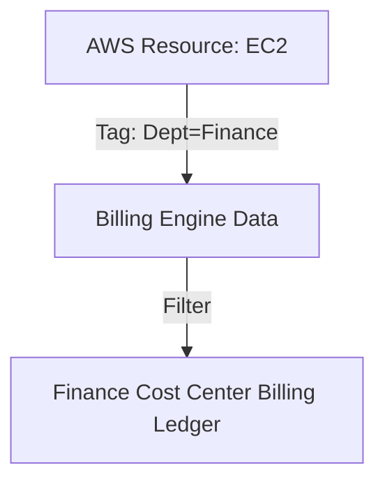

# Cost Allocation Tags

## 1. Overview & Real-World Analogy

**Real-World Analogy:** Sticking color-coded label tags on office boxes: red for marketing department, blue for engineering, and green for HR, so the finance clerk can bill each team.

AWS Cost Allocation Tags organize and track your AWS costs. AWS uses these tags to group costs on your cost allocation report, making it easier to categorize and track spend.

---

## 2. Architecture & Flow Diagram

---

## 3. Comparison & Decision Guidance

| Tag Type | AWS Generated Tags | User-Defined Tags |
| :--- | :--- | :--- |
| **Creation** | Automatically created by AWS | Created by users / terraform |
| **Example** | `aws:createdBy` | `Project`, `CostCenter`, `Owner` |
| **Activation** | Must be activated in Billing Console | Must be activated in Billing Console |

### When to use
- When designing high-scale, production-ready solutions on AWS.
- To enforce operational excellence and follow security best practices.

### When not to use
- For basic prototyping where native defaults are sufficient.

---

## 4. Key Performance, Cost & Security Considerations

### Performance Impact
No runtime performance impact on active cloud compute architectures.

### Cost Impact
Using and tracking cost allocation tags is free of charge.

### Security Implications
Use SCPs and IAM boundary policies to enforce that resources cannot be launched without standard tags.

---

## 5. Exam tips & Traps

:::tip
**Exam Clues:** cost allocation tags, activate tags billing, resource categorization, cost center tracking

Remember that tags must be explicitly activated in the Billing Console to appear in Cost Explorer.
:::

:::warning
**Common Exam Traps:** Untagged resources fall into an "unallocated cost" bucket, obscuring team expenditures.
:::

---

## Prerequisites

- [Amazon OpenSearch](../Analytics/Visualization & Search/Amazon OpenSearch.md)

## Recommended Next Topics

- [AWS Local Zones](../Compute/local-zones.md)

## Related Topics

- [AWS Cost & Usage Report (CUR)](cost-and-usage-reports.md)
- [Savings Plans Modeling & Purchase](savings-plans-modeling.md)
- [Reserved Instance (RI) Strategy](reserved-instance-strategy.md)
