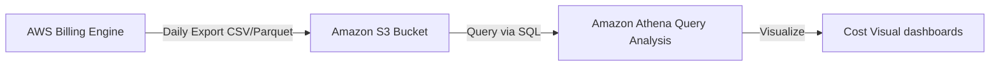

# AWS Cost & Usage Report (CUR)

## 1. Overview & Real-World Analogy

**Real-World Analogy:** An itemized telephone bill listing every call duration, rate, timestamp, and destination down to the millisecond, exported as a spreadsheet for database review.

The AWS Cost & Usage Report (CUR) contains the most comprehensive set of cost and usage data available. It lists usage at the account, resource, and tag level.

---

## 2. Architecture & Flow Diagram

---

## 3. Comparison & Decision Guidance

| Tool | Cost Explorer | Cost & Usage Report (CUR) |
| :--- | :--- | :--- |
| **Data Granularity**| High-level summary visuals | Itemized row-by-row data logs |
| **Format** | Interactive web GUI | CSV or Parquet files in S3 |
| **Query Method** | Console filters | SQL Queries (Athena, Redshift) |

### When to use
- When designing high-scale, production-ready solutions on AWS.
- To enforce operational excellence and follow security best practices.

### When not to use
- For basic prototyping where native defaults are sufficient.

---

## 4. Key Performance, Cost & Security Considerations

### Performance Impact
Athena queries against Parquet CUR data run in seconds, minimizing query runtimes.

### Cost Impact
CUR reports are free; standard S3 storage and Athena search query scan charges apply.

### Security Implications
Secure S3 buckets storing CUR reports using bucket policies and KMS keys to protect billing data.

---

## 5. Exam tips & Traps

:::tip
**Exam Clues:** cost and usage report, cur, query cur athena, detailed billing log s3

Use CUR with Athena to write custom SQL statements that check for billing anomalies at the resource level.
:::

:::warning
**Common Exam Traps:** CUR files can grow to multi-gigabyte sizes; configure compression (GZIP or Parquet) to save S3 storage costs.
:::

---

## Prerequisites

- [Savings Plans](Cost Allocation & Savings/Savings Plans.md)

## Recommended Next Topics

- [Savings Plans Modeling & Purchase](savings-plans-modeling.md)

## Related Topics

- [Savings Plans Modeling & Purchase](savings-plans-modeling.md)
- [Reserved Instance (RI) Strategy](reserved-instance-strategy.md)
- [Chargeback & Showback Methodologies](chargeback-showback.md)
