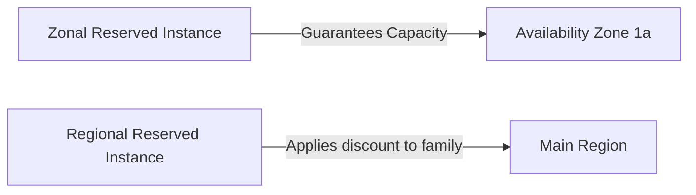

# Reserved Instance (RI) Strategy

## 1. Overview & Real-World Analogy

**Real-World Analogy:** Signing a 3-year lease on an office suite: you get a massive discount on rent compared to renting by the day, but you are locked in to that specific location.

Amazon EC2 Reserved Instances (RIs) provide a discount compared to On-Demand pricing and can provide a capacity reservation when launched in a specific Availability Zone.

---

## 2. Architecture & Flow Diagram

---

## 3. Comparison & Decision Guidance

| Feature | Zonal RI | Regional RI | Savings Plans |
| :--- | :--- | :--- | :--- |
| **Capacity Guarantee**| Yes | No | No |
| **Billing Discount** | Yes | Yes | Yes |
| **Scope** | Zone-specific instance | Region-wide instance family | Any compute across region |

### When to use
- When designing high-scale, production-ready solutions on AWS.
- To enforce operational excellence and follow security best practices.

### When not to use
- For basic prototyping where native defaults are sufficient.

---

## 4. Key Performance, Cost & Security Considerations

### Performance Impact
Zonal RIs guarantee instance capacity in the target AZ, preventing resource constraint errors during recovery events.

### Cost Impact
Saves up to 72% compared to standard On-Demand rates. Standard RIs can be resold on the RI Marketplace.

### Security Implications
Managed centrally via billing tools, allocating discounts automatically to matching instance types.

---

## 5. Exam tips & Traps

:::tip
**Exam Clues:** reserved instance, zonal ri capacity, convertible ri, standard ri marketplace

Use Convertible RIs if you anticipate changing instance types or operating systems during the 3-year term.
:::

:::warning
**Common Exam Traps:** Regional RIs do NOT guarantee capacity. Only zonal configurations guarantee resource capacity in a specific zone.
:::

---

## Prerequisites

- [Savings Plans Modeling & Purchase](savings-plans-modeling.md)

## Recommended Next Topics

- [Chargeback & Showback Methodologies](chargeback-showback.md)

## Related Topics

- [AWS Cost & Usage Report (CUR)](cost-and-usage-reports.md)
- [Savings Plans Modeling & Purchase](savings-plans-modeling.md)
- [Chargeback & Showback Methodologies](chargeback-showback.md)
