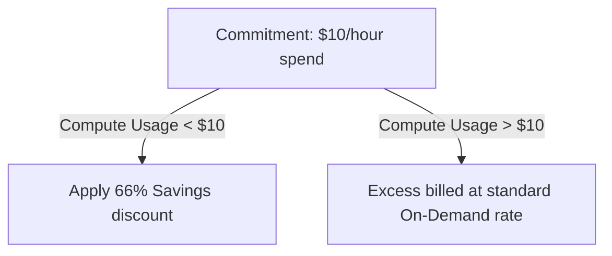

# Savings Plans Modeling & Purchase

## 1. Overview & Real-World Analogy

**Real-World Analogy:** Buying a season pass for a railway line: you commit to spending $10/hour on travel for the year, receiving a massive discount compared to paying per ticket.

AWS Savings Plans offer significant savings over On-Demand pricing in exchange for a commitment to a consistent amount of usage (measured in $/hour) for a 1 or 3-year term.

---

## 2. Architecture & Flow Diagram

---

## 3. Comparison & Decision Guidance

| Plan Type | Compute Savings Plans | EC2 Instance Savings Plans | SageMaker Savings Plans |
| :--- | :--- | :--- | :--- |
| **Flexibility** | Highest (EC2, Fargate, Lambda) | Restricted to family in specific region | SageMaker compute instances only |
| **Discount Rate** | Up to 66% | Up to 72% | Up to 64% |

### When to use
- When designing high-scale, production-ready solutions on AWS.
- To enforce operational excellence and follow security best practices.

### When not to use
- For basic prototyping where native defaults are sufficient.

---

## 4. Key Performance, Cost & Security Considerations

### Performance Impact
No performance latency impact; Savings Plans are purely billing and discount constructs.

### Cost Impact
Allows organizations to save up to 72% compared to standard On-Demand hourly compute costs.

### Security Implications
Managed centrally in the Management Account of AWS Organizations, sharing discounts across member accounts.

---

## 5. Exam tips & Traps

:::tip
**Exam Clues:** savings plans, compute commitment, hourly spend discount, savings plan recommendation

Use Cost Explorer recommendations to choose the optimal hourly commitment amount based on historical usage.
:::

:::warning
**Common Exam Traps:** Savings Plans cannot be cancelled or modified once purchased; ensure compute commitments are accurate.
:::

---

## Prerequisites

- [AWS Cost & Usage Report (CUR)](cost-and-usage-reports.md)

## Recommended Next Topics

- [Reserved Instance (RI) Strategy](reserved-instance-strategy.md)

## Related Topics

- [AWS Cost & Usage Report (CUR)](cost-and-usage-reports.md)
- [Reserved Instance (RI) Strategy](reserved-instance-strategy.md)
- [Chargeback & Showback Methodologies](chargeback-showback.md)
