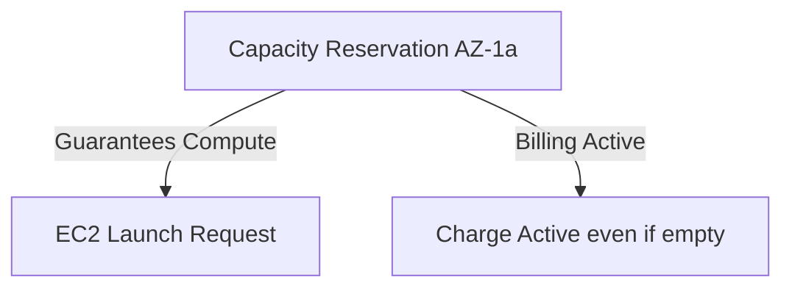

# On-Demand Capacity Reservations

## 1. Overview & Real-World Analogy

**Real-World Analogy:** Booking a hotel room in advance with a non-refundable deposit: the room is guaranteed to be vacant for you, even if you do not show up, and you pay for it regardless of occupancy.

On-Demand Capacity Reservations enable you to reserve compute capacity for your EC2 instances in a specific Availability Zone. This ensures that you have access to EC2 capacity when needed, mitigating resource constraints during scaling events.

---

## 2. Architecture & Flow Diagram

---

## 3. Comparison & Decision Guidance

| Metric | Capacity Reservations | Reserved Instances | Spot Instances |
| :--- | :--- | :--- | :--- |
| **Capacity Guarantee**| Yes (Zone-specific) | Yes (Only if Zonal RI, not Regional) | No (Subject to termination) |
| **Commitment Length** | None (Can be deleted instantly) | 1 or 3 Years | None |
| **Billing Model** | Charged standard On-Demand rate | Discounted rate | Market pricing |

### When to use
- When designing high-scale, production-ready solutions on AWS.
- To enforce operational excellence and follow security best practices.

### When not to use
- For basic prototyping where native defaults are sufficient.

---

## 4. Key Performance, Cost & Security Considerations

### Performance Impact
Reduces the risk of "insufficient capacity" errors during critical auto-scaling events or disaster recovery failovers.

### Cost Impact
Charged at the standard On-Demand rate when the reservation is active, whether instances are running in it or not.

### Security Implications
Managed via standard IAM resource policies and tags. Cross-account capacity sharing is supported via AWS RAM.

---

## 5. Exam tips & Traps

:::tip
**Exam Clues:** capacity reservation, insufficient capacity error, zonal capacity guarantee, resource constraint prevention

Use Capacity Reservations for disaster recovery environments where compute capacity must be absolutely guaranteed in the target region.
:::

:::warning
**Common Exam Traps:** Regional Reserved Instances do NOT guarantee capacity; they only provide billing discounts. You must use zonal configuration or On-Demand Capacity Reservations for capacity guarantees.
:::

---

## Prerequisites

- [Dedicated Hosts](dedicated-hosts.md)

## Recommended Next Topics

- [Spot Fleet](spot-fleet.md)

## Related Topics

- [EC2 Placement Groups](placement-groups.md)
- [Dedicated Hosts](dedicated-hosts.md)
- [Spot Fleet](spot-fleet.md)
