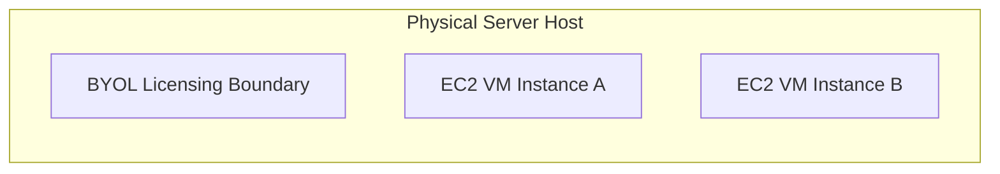

# Dedicated Hosts

## 1. Overview & Real-World Analogy

**Real-World Analogy:** Renting a whole physical building (Dedicated Host) where you can paint and modify individual apartments (VMs) and bring your own locks, vs renting a private room in a shared apartment (Dedicated Instance).

An Amazon EC2 Dedicated Host is a physical server fully dedicated to your use. It allows you to use your existing software licenses (BYOL) like Windows Server or SQL Server, and helps satisfy regulatory compliance requirements.

---

## 2. Architecture & Flow Diagram

---

## 3. Comparison & Decision Guidance

| Feature | Dedicated Hosts | Dedicated Instances | Shared Instances |
| :--- | :--- | :--- | :--- |
| **Hardware Dedicated?** | Yes (Physical server level) | Yes (Instance level, physical host shared with same account only) | No (Multi-tenant hosting) |
| **BYOL Support?** | Yes (Core/Socket based) | No | No |
| **Host Visibility?** | Yes (Socket/Core count visible) | No | No |

### When to use
- When designing high-scale, production-ready solutions on AWS.
- To enforce operational excellence and follow security best practices.

### When not to use
- For basic prototyping where native defaults are sufficient.

---

## 4. Key Performance, Cost & Security Considerations

### Performance Impact
Guarantees hardware resources are not shared with other AWS customers (no noisy neighbors), maintaining consistent raw physical host performance.

### Cost Impact
Billed per physical host hour, regardless of the number of EC2 instances running on it. Offers Savings Plans options.

### Security Implications
Ideal for strict regulatory environments requiring physical server isolation. Supports host-level affinity to keep instances on the same hardware during restarts.

---

## 5. Exam tips & Traps

:::tip
**Exam Clues:** dedicated host, software license, compliance constraint, physical server host, socket cores, byol

Look for "Bring Your Own License (BYOL)", core/socket-based licensing compliance, and physical isolation requirements in the exam.
:::

:::warning
**Common Exam Traps:** Dedicated Hosts do not support automatic scaling across multiple hosts without careful management of instance placement affinity.
:::

---

## Prerequisites

- [EC2 Placement Groups](placement-groups.md)

## Recommended Next Topics

- [On-Demand Capacity Reservations](capacity-reservations.md)

## Related Topics

- [EC2 Placement Groups](placement-groups.md)
- [On-Demand Capacity Reservations](capacity-reservations.md)
- [Spot Fleet](spot-fleet.md)
