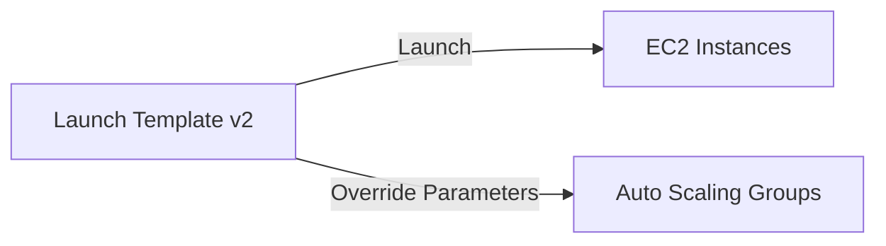

# EC2 Launch Templates

## 1. Overview & Real-World Analogy

**Real-World Analogy:** A standard operating recipe sheet that can be versioned (v1: 2 eggs, v2: 3 eggs with cheese) and cloned to quickly replicate the exact same dish at multiple restaurant chains.

An EC2 Launch Template specifies instance configuration information, including AMI IDs, instance types, network settings, security groups, and user data. It supports versioning and parameter overrides, replacing legacy Launch Configurations.

---

## 2. Architecture & Flow Diagram

---

## 3. Comparison & Decision Guidance

| Feature | Launch Templates | Launch Configurations (Legacy) |
| :--- | :--- | :--- |
| **Versioning** | Yes | No (Must create a new configuration) |
| **Parameter Overrides**| Yes | No |
| **Spot/On-Demand Mixed**| Yes | No |

### When to use
- When designing high-scale, production-ready solutions on AWS.
- To enforce operational excellence and follow security best practices.

### When not to use
- For basic prototyping where native defaults are sufficient.

---

## 4. Key Performance, Cost & Security Considerations

### Performance Impact
Reduces launch errors by standardizing boot templates, enabling faster auto-scaling execution times.

### Cost Impact
Launch templates are stored free of charge; standard EC2 resource billing applies at instance launch.

### Security Implications
Enforces least privilege by allowing users to launch instances only if they use a sanctioned and secured Launch Template.

---

## 5. Exam tips & Traps

:::tip
**Exam Clues:** launch template, versioning launch, instance settings overrides, template parameter inheritance

Always use Launch Templates instead of Launch Configurations in modern designs. Versioning allows easy rollbacks of AMI updates.
:::

:::warning
**Common Exam Traps:** A launch configuration cannot be modified or versioned. Do not build new architectures using launch configurations.
:::

---

## Prerequisites

- [Spot Fleet](spot-fleet.md)

## Recommended Next Topics

- [Auto Scaling Warm Pools](warm-pools.md)

## Related Topics

- [EC2 Placement Groups](placement-groups.md)
- [Dedicated Hosts](dedicated-hosts.md)
- [On-Demand Capacity Reservations](capacity-reservations.md)
