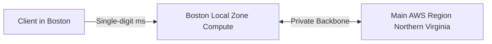

# AWS Local Zones

## 1. Overview & Real-World Analogy

**Real-World Analogy:** A satellite AWS outpost positioned right inside a major metropolitan city: you rent resources there to serve city customers with single-digit millisecond latency.

AWS Local Zones place compute, storage, database, and other select AWS services closer to large population, industry, and IT centers, providing low-latency access.

---

## 2. Architecture & Flow Diagram

---

## 3. Comparison & Decision Guidance

| Edge Type | Local Zones | AWS Outposts | Wavelength |
| :--- | :--- | :--- | :--- |
| **Location** | Metropolitan city center | Customer data center | Telecom carrier 5G network |
| **Ownership** | AWS-owned hardware | Customer-owned building space | Telecom partner building |
| **Setup** | Enabled with a console click | Requires physical delivery | Enabled with a console click |

### When to use
- When designing high-scale, production-ready solutions on AWS.
- To enforce operational excellence and follow security best practices.

### When not to use
- For basic prototyping where native defaults are sufficient.

---

## 4. Key Performance, Cost & Security Considerations

### Performance Impact
Reduces latency for heavy web traffic and real-time interactive apps inside target metropolitan cities.

### Cost Impact
Standard resource pricing applies, featuring slight regional premium rates depending on the city.

### Security Implications
Maintains standard IAM permissions, VPC routing tables, and KMS encryption boundary rules.

---

## 5. Exam tips & Traps

:::tip
**Exam Clues:** local zones, metropolitan latency, single-digit millisecond routing, edge compute city

Use Local Zones for applications requiring real-time updates (e.g. gaming, live media broadcasting) in specific cities.
:::

:::warning
**Common Exam Traps:** Not every AWS service is available in every Local Zone; verify service matrices before designing architecture.
:::

---

## Prerequisites

- [Cost Allocation Tags](../Cloud Financial Management/cost-allocation-tags.md)

## Recommended Next Topics

- [AWS Transfer Family](../Migration & Transfer/File Transfer/AWS Transfer Family.md)

## Related Topics

- [EC2 Placement Groups](placement-groups.md)
- [Dedicated Hosts](dedicated-hosts.md)
- [On-Demand Capacity Reservations](capacity-reservations.md)
