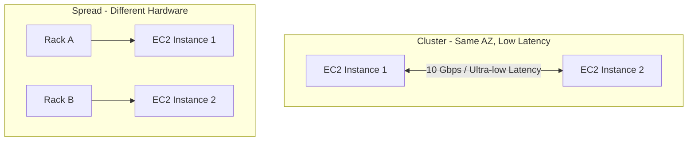

# EC2 Placement Groups

## 1. Overview & Real-World Analogy

**Real-World Analogy:** A theater seating plan: Cluster is a group of friends sitting adjacent in the same row to talk instantly; Spread is putting guests in different rows and aisles so if one gets sick, the others are unaffected; Partition is group ticketing where blocks of seats are isolated.

EC2 Placement Groups determine how instances are placed on physical hardware. Cluster placement groups place instances close together inside an Availability Zone for low-latency network performance. Spread placement groups place instances on separate physical racks to reduce correlated failures. Partition placement groups split instances into logical partitions across different racks.

---

## 2. Architecture & Flow Diagram

---

## 3. Comparison & Decision Guidance

| Placement Type | Core Benefit | Network Performance | Instance Limits |
| :--- | :--- | :--- | :--- |
| **Cluster** | Ultra-low latency | Up to 100 Gbps network speed | AZ-restricted |
| **Spread** | Max high availability | Standard network | 7 instances per AZ |
| **Partition** | Scale-out distributed workloads | Rack-separated standard | Hundreds of instances |

### When to use
- When designing high-scale, production-ready solutions on AWS.
- To enforce operational excellence and follow security best practices.

### When not to use
- For basic prototyping where native defaults are sufficient.

---

## 4. Key Performance, Cost & Security Considerations

### Performance Impact
Cluster placement groups support up to 100 Gbps network throughput. For maximum throughput, use Enhanced Networking (ENA) and matching instance types.

### Cost Impact
Placement groups are free to configure; you only pay for the launched EC2 instances.

### Security Implications
IAM control over `ec2:CreatePlacementGroup` is recommended. Network security is maintained via standard security groups.

---

## 5. Exam tips & Traps

:::tip
**Exam Clues:** placement group, cluster placement group, low latency node communication, rack-level isolation, partition

Use Cluster for HPC and distributed databases requiring low-latency node-to-node communication. Use Spread for critical nodes like database primary/secondary.
:::

:::warning
**Common Exam Traps:** You cannot merge existing EC2 instances into a placement group. You must create the group and launch new instances into it.
:::

---

## Prerequisites

- [EC2 Image Builder](Virtual Machines & Infrastructure/EC2 Image Builder.md)

## Recommended Next Topics

- [Dedicated Hosts](dedicated-hosts.md)

## Related Topics

- [Dedicated Hosts](dedicated-hosts.md)
- [On-Demand Capacity Reservations](capacity-reservations.md)
- [Spot Fleet](spot-fleet.md)
