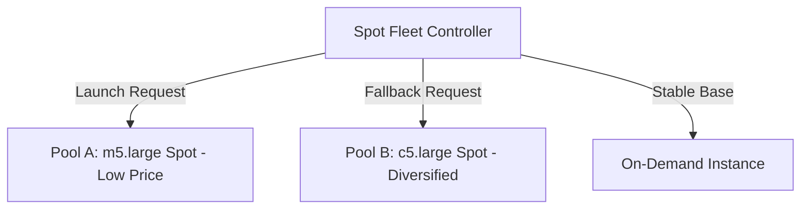

# Spot Fleet

## 1. Overview & Real-World Analogy

**Real-World Analogy:** A taxi service aggregator that rents out cars based on varying market price bids, automatically switching to a cheaper car type or route if the price of one model spikes.

A Spot Fleet is a collection of Spot Instances (and optionally On-Demand Instances) launched based on criteria you define. It attempts to meet a target capacity by dynamically selecting from diverse instance pools.

---

## 2. Architecture & Flow Diagram

---

## 3. Comparison & Decision Guidance

| Strategy | lowestPrice | diversified | capacityOptimized |
| :--- | :--- | :--- | :--- |
| **Allocation goal** | Selects cheapest instance pool | Spreads instances across all pools | Selects pool with deepest capacity |
| **Interruption Risk**| High (if pool price spikes) | Low (isolated to single pool) | Lowest |

### When to use
- When designing high-scale, production-ready solutions on AWS.
- To enforce operational excellence and follow security best practices.

### When not to use
- For basic prototyping where native defaults are sufficient.

---

## 4. Key Performance, Cost & Security Considerations

### Performance Impact
Optimized by diversifying instance types to prevent simultaneous termination when Spot prices spike in a single pool.

### Cost Impact
Saves up to 90% compared to standard On-Demand costs. Set maximum bid price limits to control budget bounds.

### Security Implications
Requires standard Spot Fleet IAM Service-Linked Roles to manage the dynamic launch and termination of EC2 instances on your behalf.

---

## 5. Exam tips & Traps

:::tip
**Exam Clues:** spot fleet, spot instance pool, allocation strategy, diversified, lowestPrice, bid price

Spot Fleet can launch instance types specified in a launch template. Use the "diversified" allocation strategy to maintain high availability.
:::

:::warning
**Common Exam Traps:** Spot Fleet is a legacy API; prefer EC2 Auto Scaling groups with mixed instance policies for modern architectures.
:::

---

## Prerequisites

- [On-Demand Capacity Reservations](capacity-reservations.md)

## Recommended Next Topics

- [EC2 Launch Templates](launch-templates.md)

## Related Topics

- [EC2 Placement Groups](placement-groups.md)
- [Dedicated Hosts](dedicated-hosts.md)
- [On-Demand Capacity Reservations](capacity-reservations.md)
