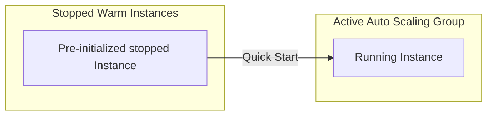

# Auto Scaling Warm Pools

## 1. Overview & Real-World Analogy

**Real-World Analogy:** Pre-cooking food at a buffet and keeping it under warm lamps: when a surge of hungry customers arrives, you serve the pre-warmed dishes instantly instead of cooking from scratch.

Warm Pools for EC2 Auto Scaling allow you to decrease the scale-out latency of applications by maintaining a pool of pre-initialized, stopped, or running EC2 instances ready to join the active ASG.

---

## 2. Architecture & Flow Diagram

---

## 3. Comparison & Decision Guidance

| Instance State | Boot Latency | Hourly Compute Cost | Storage Cost |
| :--- | :--- | :--- | :--- |
| **Stopped Pool** | Medium (Requires VM startup) | Zero (Only pay for EBS) | EBS Volumes standard billing |
| **Running Pool** | Ultra-low (Ready instantly) | Full hourly compute cost | EBS Volumes standard billing |

### When to use
- When designing high-scale, production-ready solutions on AWS.
- To enforce operational excellence and follow security best practices.

### When not to use
- For basic prototyping where native defaults are sufficient.

---

## 4. Key Performance, Cost & Security Considerations

### Performance Impact
Drastically reduces the time needed for scale-out, from 5-10 minutes (cold boot + heavy app setup scripts) to under a minute.

### Cost Impact
Saves money compared to keeping instances constantly running by allowing pre-initialized instances to exist in a `Stopped` state.

### Security Implications
Instances in a warm pool execute lifecycle hooks in isolation before being added to the load balancer target group.

---

## 5. Exam tips & Traps

:::tip
**Exam Clues:** warm pool, boot latency scale-out, stopped state instances, pre-initialized scaling, lifecycle hooks

Use warm pools for heavy applications with long boot/initialization sequences (e.g. Java/WebLogic apps).
:::

:::warning
**Common Exam Traps:** Instances in the warm pool do not receive traffic from ELB target groups until they are transitioned to the Active pool.
:::

---

## Prerequisites

- [EC2 Launch Templates](launch-templates.md)

## Recommended Next Topics

- [AWS Lambda](Serverless & Managed Compute/AWS Lambda.md)

## Related Topics

- [EC2 Placement Groups](placement-groups.md)
- [Dedicated Hosts](dedicated-hosts.md)
- [On-Demand Capacity Reservations](capacity-reservations.md)
