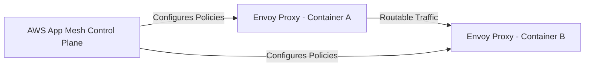

# AWS App Mesh

## 1. Overview & Real-World Analogy

**Real-World Analogy:** A central command tower that manages flight paths, speeds, and communications for planes (Microservices) globally, without requiring pilots (Application Code) to change how they fly.

AWS App Mesh is a managed service mesh that provides application-level networking, making it easy to manage communication, monitor traffic, and configure routing policies across microservices.

---

## 2. Architecture & Flow Diagram

---

## 3. Comparison & Decision Guidance

| Metric | Service Mesh (App Mesh) | Client-Side Library | Application Load Balancer |
| :--- | :--- | :--- | :--- |
| **Routing Layer** | Layer 7 (Service-to-service) | Layer 7 (Code dependency) | Layer 7 (Edge-to-service) |
| **Encryption** | mTLS automatically managed | Manual coding required | Standard TLS termination |
| **Overhead** | Low latency proxy sidecars | High code maintainability | Higher latency hops |

### When to use
- When designing high-scale, production-ready solutions on AWS.
- To enforce operational excellence and follow security best practices.

### When not to use
- For basic prototyping where native defaults are sufficient.

---

## 4. Key Performance, Cost & Security Considerations

### Performance Impact
App Mesh configures Envoy proxies running as sidecars, introducing a sub-millisecond network latency overhead per hop.

### Cost Impact
AWS App Mesh is a free service; you only pay for the underlying ECS, EKS, or EC2 resources that execute Envoy proxies.

### Security Implications
Supports Mutual TLS (mTLS) for secure, encrypted communication between service nodes, with certificate integration via ACM.

---

## 5. Exam tips & Traps

:::tip
**Exam Clues:** app mesh, service mesh, envoy proxy, sidecar container, mtls routing, canary deployment

Use App Mesh for microservices patterns requiring canary routing, service discovery, and tracing without modifying application source code.
:::

:::warning
**Common Exam Traps:** App Mesh requires applications to route traffic through local Envoy proxy containers; ensure ECS task definitions have sidecars registered.
:::

---

## Prerequisites

- [EKS Security & IRSA](eks-security.md)

## Recommended Next Topics

- [EKS Ingress Controllers](ingress-controllers.md)

## Related Topics

- [EKS Control Plane & Worker Nodes](eks-architecture.md)
- [EKS Pod Networking (VPC CNI)](eks-networking.md)
- [EKS Security & IRSA](eks-security.md)
