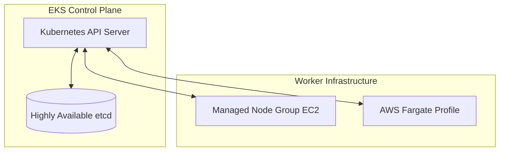

# EKS Control Plane & Worker Nodes

## 1. Overview & Real-World Analogy

**Real-World Analogy:** A shipyard company: EKS Control Plane is the board of directors that manages container positions and schedules shipments, while EKS Worker Nodes are the physical crane systems lifting the boxes.

Amazon Elastic Kubernetes Service (EKS) manages the Kubernetes control plane across multiple Availability Zones for high availability. Worker nodes run on EC2 instances or AWS Fargate, executing the actual Kubernetes Pods.

---

## 2. Architecture & Flow Diagram

---

## 3. Comparison & Decision Guidance

| Compute Type | Managed Node Groups | AWS Fargate (Serverless) | Self-Managed Nodes |
| :--- | :--- | :--- | :--- |
| **OS Management** | Semi-managed (AWS patches AMI) | Fully managed (Zero OS) | Customer responsibility |
| **Configuration** | Easy scaling via ASG | Pod-level configuration | Complex configuration |
| **Pricing** | Standard EC2/EBS billing | Per vCPU/Memory runtime | Standard EC2/EBS billing |

### When to use
- When designing high-scale, production-ready solutions on AWS.
- To enforce operational excellence and follow security best practices.

### When not to use
- For basic prototyping where native defaults are sufficient.

---

## 4. Key Performance, Cost & Security Considerations

### Performance Impact
Control plane scaling is managed automatically by AWS based on resource load, ensuring etcd write speeds are maintained.

### Cost Impact
AWS charges a flat rate of $0.10/hour per EKS cluster, plus underlying EC2 compute and EBS storage rates.

### Security Implications
EKS control plane communicates with worker nodes over a secured VPC private endpoint or public endpoint with IP restrictions.

---

## 5. Exam tips & Traps

:::tip
**Exam Clues:** eks cluster, kubernetes control plane, etcd replication, managed node group, fargate profile

Ensure control plane endpoints are configured as private-only for enterprise setups to prevent internet-facing attack vectors.
:::

:::warning
**Common Exam Traps:** Do not manage Kubernetes etcd backups manually; AWS guarantees etcd availability and replication across 3 AZs.
:::

---

## Prerequisites

- [Amazon EKS](Container Orchestration/Amazon EKS.md)

## Recommended Next Topics

- [EKS Pod Networking (VPC CNI)](eks-networking.md)

## Related Topics

- [EKS Pod Networking (VPC CNI)](eks-networking.md)
- [EKS Security & IRSA](eks-security.md)
- [AWS App Mesh](app-mesh.md)
