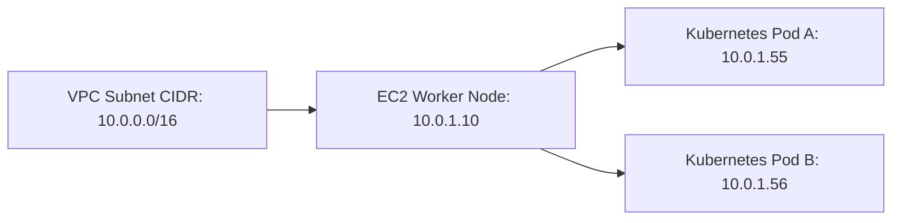

# EKS Pod Networking (VPC CNI)

## 1. Overview & Real-World Analogy

**Real-World Analogy:** Giving every single desk in a massive corporate office its own direct, unique physical landline phone number connected directly to the building main telephone system, instead of sharing a line.

Amazon EKS uses the AWS VPC Container Network Interface (CNI) plugin. This CNI allows Kubernetes pods to receive native, private IPv4/IPv6 addresses from the surrounding VPC subnet range.

---

## 2. Architecture & Flow Diagram

---

## 3. Comparison & Decision Guidance

| Networking Mode | AWS VPC CNI | Standard Kubenet overlay |
| :--- | :--- | :--- |
| **IP Assignment** | Native VPC IP (from Subnet) | Virtual cluster IP (Private overlay) |
| **Performance** | Line-rate performance (No overlay overhead) | Lower throughput due to routing encapsulation |
| **Routing** | Directly routable within VPC | Requires NAT/routing tables to cross VPC |

### When to use
- When designing high-scale, production-ready solutions on AWS.
- To enforce operational excellence and follow security best practices.

### When not to use
- For basic prototyping where native defaults are sufficient.

---

## 4. Key Performance, Cost & Security Considerations

### Performance Impact
VPC CNI provides line-rate networking throughput equivalent to native EC2 ENIs, eliminating packet overlay encapsulation latency.

### Cost Impact
No charge for CNI plugin; however, pods consume IP addresses, which can lead to subnet IP exhaustion.

### Security Implications
Supports standard security groups for pods, allowing direct security group assignment to individual Kubernetes workloads.

---

## 5. Exam tips & Traps

:::tip
**Exam Clues:** vpc cni, pod networking, subnet ip exhaustion, secondary cidr, maximum pod limits, line-rate

Avoid IP exhaustion by sizing subnets correctly or using the custom networking feature to assign pods to a separate secondary CIDR block.
:::

:::warning
**Common Exam Traps:** Each EC2 instance type supports a maximum number of ENIs and IP addresses. Small instance types limit the maximum number of pods you can run.
:::

---

## Prerequisites

- [EKS Control Plane & Worker Nodes](eks-architecture.md)

## Recommended Next Topics

- [EKS Security & IRSA](eks-security.md)

## Related Topics

- [EKS Control Plane & Worker Nodes](eks-architecture.md)
- [EKS Security & IRSA](eks-security.md)
- [AWS App Mesh](app-mesh.md)
