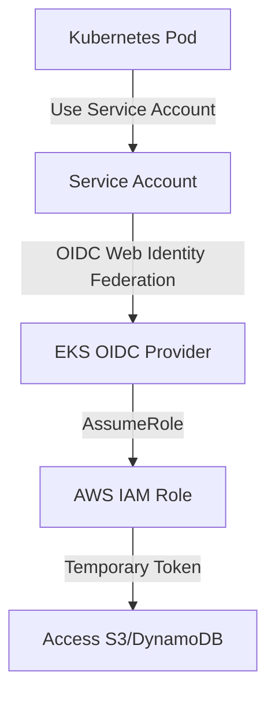

# EKS Security & IRSA

## 1. Overview & Real-World Analogy

**Real-World Analogy:** Giving a bank employee a custom, single-use access code that matches only their specific current transaction, rather than sharing the keys to the entire bank vault.

EKS Security utilizes IAM Roles for Service Accounts (IRSA) to associate IAM roles with Kubernetes service accounts. This provides least-privilege AWS API access directly to pods, replacing node-level instance profiles.

---

## 2. Architecture & Flow Diagram

---

## 3. Comparison & Decision Guidance

| Authorization Method | IRSA (IAM OIDC) | Node Instance Profile (Legacy) |
| :--- | :--- | :--- |
| **Isolation level** | Pod-specific | Node-wide (All pods on node share permissions) |
| **Token lifecycle** | Short-lived temp tokens | Persistent VM credentials |
| **Security risk** | Lowest | High (compromised pod gains all node permissions) |

### When to use
- When designing high-scale, production-ready solutions on AWS.
- To enforce operational excellence and follow security best practices.

### When not to use
- For basic prototyping where native defaults are sufficient.

---

## 4. Key Performance, Cost & Security Considerations

### Performance Impact
IAM credentials are cached by the AWS SDK inside the container, resulting in negligible API request overhead.

### Cost Impact
No charge for EKS OIDC identity provider integration.

### Security Implications
Ensures strict compliance and tenant isolation in multi-tenant Kubernetes clusters.

---

## 5. Exam tips & Traps

:::tip
**Exam Clues:** irsa, iam roles for service accounts, oidc provider eks, pod security context, least privilege pods

Look for IAM Roles for Service Accounts (IRSA) and OIDC integration when the exam asks for secure pod authentication to AWS services.
:::

:::warning
**Common Exam Traps:** Do not use hardcoded access keys in secret manifests. Always map application configurations to IRSA.
:::

---

## Prerequisites

- [EKS Pod Networking (VPC CNI)](eks-networking.md)

## Recommended Next Topics

- [AWS App Mesh](app-mesh.md)

## Related Topics

- [EKS Control Plane & Worker Nodes](eks-architecture.md)
- [EKS Pod Networking (VPC CNI)](eks-networking.md)
- [AWS App Mesh](app-mesh.md)
