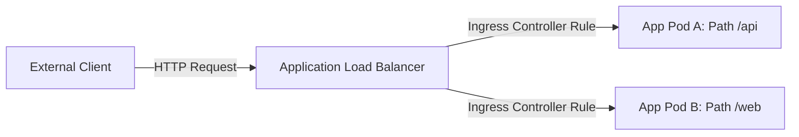

# EKS Ingress Controllers

## 1. Overview & Real-World Analogy

**Real-World Analogy:** A security desk at the lobby of a skyscraper that inspects guest IDs and directs them to specific office floors and rooms depending on the floor directory.

An EKS Ingress Controller manages external access to services in a Kubernetes cluster, typically routing HTTP/HTTPS traffic to backend pods by deploying AWS Application Load Balancers.

---

## 2. Architecture & Flow Diagram

---

## 3. Comparison & Decision Guidance

| Controller Type | AWS Load Balancer Controller | NGINX Ingress Controller |
| :--- | :--- | :--- |
| **AWS Integration** | Directly provisions ALB/NLB instances | Provisions NLB to route to backend NGINX pods |
| **Routing Engine** | AWS ALB routing engine | In-cluster NGINX proxy container |
| **Pricing** | Standard ALB pricing per LCU | Compute node costs + NLB pricing |

### When to use
- When designing high-scale, production-ready solutions on AWS.
- To enforce operational excellence and follow security best practices.

### When not to use
- For basic prototyping where native defaults are sufficient.

---

## 4. Key Performance, Cost & Security Considerations

### Performance Impact
ALB Target Group binding can target pods directly using their IP addresses, bypassing NodePort hopping overhead for faster latency.

### Cost Impact
Billed based on standard AWS Application Load Balancer LCU usage and active instances.

### Security Implications
Supports ACM SSL/TLS termination at the load balancer level, and integrates with AWS WAF for Layer 7 web security filters.

---

## 5. Exam tips & Traps

:::tip
**Exam Clues:** ingress controller, aws load balancer controller, alb target group binding, subnet tagging ELB

Use the AWS Load Balancer Controller to dynamically provision ALBs from Kubernetes ingress resource YAML specifications.
:::

:::warning
**Common Exam Traps:** Ensure target subnets are tagged correctly (`kubernetes.io/role/elb` for public, `internal-elb` for private) or the controller will fail to provision.
:::

---

## Prerequisites

- [AWS App Mesh](app-mesh.md)

## Recommended Next Topics

- [Amazon ECR](Container Registry/Amazon ECR.md)

## Related Topics

- [EKS Control Plane & Worker Nodes](eks-architecture.md)
- [EKS Pod Networking (VPC CNI)](eks-networking.md)
- [EKS Security & IRSA](eks-security.md)
