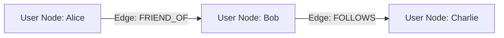

# Amazon Neptune

:::note
**Real-World Analogy:** A family tree chart: instead of searching tables to find who is married to whom (complex SQL joins), you follow the lines (vertices and edges) directly on the paper.
:::

## Architecture Flow Diagram

---

## 1. Introduction

Amazon Neptune is a fully managed graph database service from AWS designed to store and query highly connected datasets with low latency. It supports two primary graph models:

- **Property Graphs** using Apache TinkerPop Gremlin and openCypher
- **RDF Graphs** using the W3C-standard SPARQL query language

Neptune is purpose-built to address use cases that involve complex relationships and rapid query traversals—such as social networking, recommendation engines, fraud detection, and knowledge graphs. Fully managed by AWS, it frees you from routine maintenance tasks (patching, backups, and failover management) so that you can focus on building applications.

## 2. Features and Capabilities

**Multi-Model Support:**

- **Property Graphs:** Utilize Apache TinkerPop Gremlin and openCypher to interact with vertices, edges, and their properties.
- **RDF Graphs:** Use SPARQL to query RDF data, adhering to W3C standards.  
    These models let you choose the one best suited to your data and use case, with the flexibility to support both on a single Neptune instance.

**Performance and Scalability:**
- Designed to handle billions of relationships while delivering millisecond query latency.
- Supports high throughput by scaling read capacity with up to 15 replicas per cluster and automatic failover across multiple Availability Zones.
- Uses a dynamic cluster volume based on SSD storage, scaling storage as needed up to 64 TB.

**High Availability and Durability:**
- Runs within your Amazon Virtual Private Cloud (VPC) for secure isolation and network control.
- Data is automatically replicated across multiple Availability Zones, ensuring durability and resilience.
- Offers point-in-time recovery, continuous backups, and fast, automatic failover.

**Security:**
- Fully integrated with AWS Identity and Access Management (IAM) to control access.
- Provides encryption at rest via AWS Key Management Service (KMS) and in transit using TLS.
- Deployed in a VPC, letting you configure firewall rules and network access controls as needed.

**Additional Capabilities:**
- **Neptune Streams:** Capture change data for near real-time analytics or integration with other services.
- **Neptune ML & Neptune Analytics:** Integrate machine learning and in-memory graph analytics for advanced use cases.
- Seamless integration with the AWS ecosystem (e.g., Amazon S3, CloudWatch) simplifies operational management.

## 3. Use Cases

Amazon Neptune is ideal for applications that require rapid, complex traversal of connected data. Common use cases include:

- **Social Networks & Identity Graphs:**  
    Enable real-time analysis of relationships between users, supporting friend recommendations and community detection.
    
- **Fraud Detection:**  
    Quickly identify unusual patterns across transactions, devices, or accounts by modeling complex relationships.
    
- **Recommendation Engines:**  
    Power personalized recommendations by efficiently traversing relationships among products, users, and interactions.
    
- **Knowledge Graphs & Customer 360:**  
    Integrate and relate diverse data sources for enriched customer insights or enhanced data discovery.
    
- **Network Security & IT Operations:**  
    Map and analyze relationships between devices, users, and applications to detect potential security threats.

Neptune’s compliance with HIPAA, PCI DSS, and various ISO standards further supports its use in regulated industries such as healthcare and finance.

## 4. Conclusion

Amazon Neptune offers a robust, fully managed graph database service that addresses the growing need to model and query complex, highly connected data. With support for both property graphs and RDF, it provides the flexibility required for a wide range of applications—from social networking and fraud detection to recommendation systems and knowledge management. Its design ensures high performance, scalability, and security, all integrated within the AWS ecosystem. Whether you’re building a customer 360 view, detecting fraudulent patterns, or leveraging machine learning for predictive analytics, Amazon Neptune is built to support modern graph-driven applications backed by comprehensive official documentation and prescriptive guidance.

## Comparison & Decision Guidance

| Parameter | Amazon Neptune (Graph) | Relational RDS (SQL) |
| :--- | :--- | :--- |
| **Data Relationship** | First-class entities (Edges/Nodes) | Linked tables (Foreign key joins) |
| **Query Language** | Gremlin, SPARQL | SQL |
| **Typical Use Case** | Fraud detection, social graphs, identity | Transaction processing (ERP, billing) |

### When to use
- When designing high-scale, production-ready solutions on AWS.
- To enforce operational excellence and follow security best practices.

### When not to use
- For basic prototyping where native defaults are sufficient.

---

---

## Exam Tips & Traps

:::tip
**Exam Clues:** neptune, graph database, gremlin sparql, social network graph, relationship mapping

Look for graph databases, social network relationships, fraud pattern detection, or network topology maps in the exam.
:::

:::warning
**Common Exam Traps:** Neptune is not a general-purpose transactional database; do not use it for standard document or relational workloads.
:::

---

## Prerequisites

- [Amazon ElastiCache](Amazon ElastiCache.md)

## Recommended Next Topics

- [Amazon Timestream](Amazon Timestream.md)

## Related Topics

- [Amazon ElastiCache](Amazon ElastiCache.md)
- [Amazon Timestream](Amazon Timestream.md)
