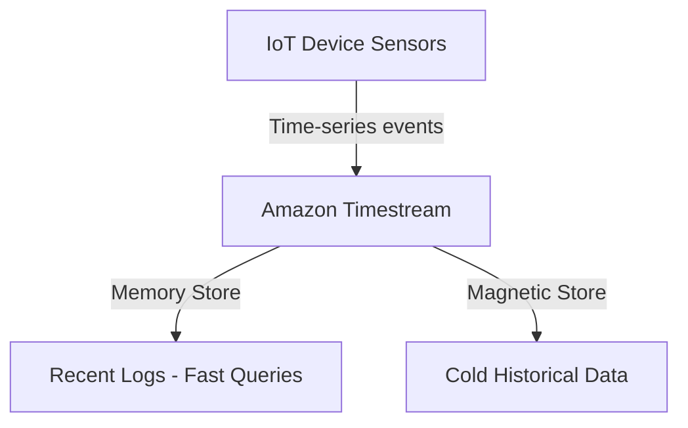

# Amazon Timestream

:::note
**Real-World Analogy:** A medical monitor chart logging heartbeat data over time: you record millions of ticks a day, query them chronologically, and throw out old charts after 30 days.
:::

## Architecture Flow Diagram

---

## 1. Introduction

Amazon Timestream is a fully managed, serverless database service specially designed for time series data. Time series data typically involves a sequence of data points recorded at regular intervals—for example, tracking temperature or performance metrics over time. Timestream is optimized to handle massive volumes of such data in a cost-effective and highly scalable manner, making it an excellent fit for Internet of Things (IoT) telemetry, operational monitoring, and real-time analytics scenarios.

Unlike generic relational databases, Timestream focuses on efficiently ingesting and querying time-referenced data. It automatically scales storage and compute resources on demand, thereby simplifying capacity planning. When recent data arrives, Timestream stores it in memory for quick access. As data ages, Timestream transparently transitions it to cost-optimized, durable storage.

## 2. Architecture

Amazon Timestream is built on a modern, decoupled architecture that separates ingestion, storage, and query processing:

- **Write Architecture:**  
    Incoming data is ingested into a fault‑tolerant memory store optimized for high throughput. The service then replicates data across three Availability Zones (AZs) to ensure durability and high availability. Lower-throughput or late‑arriving data can also be written directly to the magnetic store.
    
- **Storage Architecture:**  
    Data is automatically partitioned and indexed. Timestream uses a “tile” approach to partition data in two dimensions—by time and by contextual attributes (for example, device IDs or locations). This design enables the system to scale to petabytes of data while efficiently pruning data during queries.
    
- **Query Architecture:**  
    Timestream supports SQL queries enhanced with time series‑specific functions (such as interpolation, smoothing, and windowing). Its adaptive, distributed query engine processes queries in parallel over massive datasets, ensuring low‑latency performance even when querying terabytes or petabytes of data.
    
- **Cellular Architecture:**  
    To achieve 99.99% availability and limit the impact of failures, Timestream segments its infrastructure into independent “cells.” A discovery layer routes requests to the appropriate cell, isolating issues and ensuring that failures in one cell don’t affect the overall service.

## 3. Data Lifecycle and Storage Tiers

Amazon Timestream automatically manages data lifecycle using two storage tiers:

- **Memory Store:**  
    Designed for fast, near real‑time queries (ideal for dashboards and alerts), it stores the most recent data. You can configure the retention period for how long data remains in the memory store.
    
- **Magnetic Store:**  
    Offers cost‑effective, long‑term storage for historical data. Data is automatically migrated from the memory store to the magnetic store based on retention policies, and it is organized for high‑performance analytical queries.

## 4. Query Capabilities

Timestream supports a SQL-like query language with extensions tailored for time series data. Key features include:

- **Time Series Functions:**  
    Built‑in functions for smoothing, interpolation, window functions, and advanced aggregations simplify time‑series analysis.
    
- **Massive Parallelism:**  
    The distributed query engine dynamically allocates compute resources based on query complexity and data volume, enabling rapid processing even over large datasets.
    
- **Ease of Use:**  
    Developers familiar with SQL can quickly adopt Timestream to run queries without needing to learn a new query language.

## 5. Integration and Ecosystem

Amazon Timestream is designed to integrate seamlessly with other AWS services and third‑party tools:

- **AWS Integration:**  
    It integrates with services like AWS IoT Core, Amazon Kinesis, AWS Lambda, and Amazon CloudWatch, making it easier to ingest, process, and visualize time series data.
    
- **Visualization and Analytics:**  
    Many customers use Amazon QuickSight, Grafana, or other BI tools (via JDBC/ODBC drivers) to build dashboards and perform ad hoc analysis on Timestream data.
    
- **Data Migration:**  
    AWS Database Migration Service (DMS) supports Timestream as a target database, enabling you to migrate existing time series data to Timestream seamlessly.

## 6. Timestream for InfluxDB

In addition to its native interface, Amazon Timestream also offers **Amazon Timestream for InfluxDB**. This service provides a managed InfluxDB experience on AWS, allowing you to use the familiar InfluxDB 2.x APIs and tools while benefiting from Timestream’s scalable, serverless infrastructure. It is ideal for teams that already use InfluxDB but wish to offload management and scaling concerns to AWS.

## 7. Conclusion

Amazon Timestream provides an efficient and practical solution for storing and analyzing time series data on AWS. Its fully managed, serverless approach allows you to begin ingesting and querying data without provisioning or tuning infrastructure. By leveraging specialized time series functions, Timestream offers built-in analytics, making it a strong candidate for IoT telemetry, operational metrics tracking, and real-time dashboards. 

For more information, please refer to the [official documentation](https://docs.aws.amazon.com/timestream/latest/developerguide/what-is-timestream.html).

## Comparison & Decision Guidance

| Parameter | Timestream | Relational DB (RDS) |
| :--- | :--- | :--- |
| **Data Order** | Time-series sequences | Any relational sequence |
| **Scaling** | Serverless automatic scale | Manual cluster partitioning |
| **Retention** | Auto data tiering | Manual pruning scripts |

### When to use
- When designing high-scale, production-ready solutions on AWS.
- To enforce operational excellence and follow security best practices.

### When not to use
- For basic prototyping where native defaults are sufficient.

---

---

## Exam Tips & Traps

:::tip
**Exam Clues:** timestream, time-series database, iot telemetry, magnetic storage tier, append-only records

Use Timestream for IoT telemetry logs, clickstream sequences, server performance metrics, or financial tick data.
:::

:::warning
**Common Exam Traps:** Timestream data is append-only; it does not support updating historical records in-place.
:::

---

## Prerequisites

- [Amazon Neptune](Amazon Neptune.md)

## Recommended Next Topics

- [Amazon MemoryDB for Redis](../memorydb.md)

## Related Topics

- [Amazon ElastiCache](Amazon ElastiCache.md)
- [Amazon Neptune](Amazon Neptune.md)
