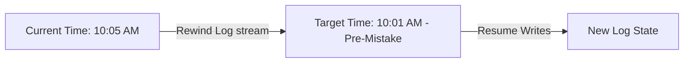

# Amazon Aurora Backtracking

## 1. Overview & Real-World Analogy

**Real-World Analogy:** An "Undo" (Ctrl+Z) button for database transactions: if an engineer runs a bad script and corrupts data, you rewind the entire database to the exact second before the mistake occurred.

Amazon Aurora Backtracking allows you to rewind an Aurora DB cluster to a specific point in time without restoring data from backups. It record changes as a continuous log stream.

---

## 2. Architecture & Flow Diagram

---

## 3. Comparison & Decision Guidance

| Feature | Backtrack | Point-in-Time Restore (PITR) |
| :--- | :--- | :--- |
| **Duration** | Seconds to minutes | Hours (provisions new DB cluster) |
| **Target DB** | Same cluster (rewound in-place) | New database cluster instance |
| **State Loss** | Discards transactions after target time | Preserves source cluster state intact |

### When to use
- When designing high-scale, production-ready solutions on AWS.
- To enforce operational excellence and follow security best practices.

### When not to use
- For basic prototyping where native defaults are sufficient.

---

## 4. Key Performance, Cost & Security Considerations

### Performance Impact
In-place rewinds occur within minutes, minimizing recovery time objectives (RTO) during operational emergencies.

### Cost Impact
Billed based on the volume of backtrack change logs stored for the defined backtrack window.

### Security Implications
KMS customer managed keys encrypt the backtrack change logs, maintaining encryption compliance.

---

## 5. Exam tips & Traps

:::tip
**Exam Clues:** aurora backtrack, rewind database in-place, rto optimization database, ctrl-z db execution

Use backtrack to quickly recover from destructive database script deployments or user entry errors.
:::

:::warning
**Common Exam Traps:** Backtracking must be enabled at database creation; you cannot enable backtracking on an existing database cluster.
:::

---

## Prerequisites

- [Amazon Aurora Fast Database Cloning](aurora-cloning.md)

## Recommended Next Topics

- [Amazon RDS](Relational & Data Warehouse/Amazon RDS.md)

## Related Topics

- [Amazon Aurora Serverless v2](aurora-serverless.md)
- [Amazon Aurora Fast Database Cloning](aurora-cloning.md)
- [Amazon RDS Proxy](rds-proxy.md)
