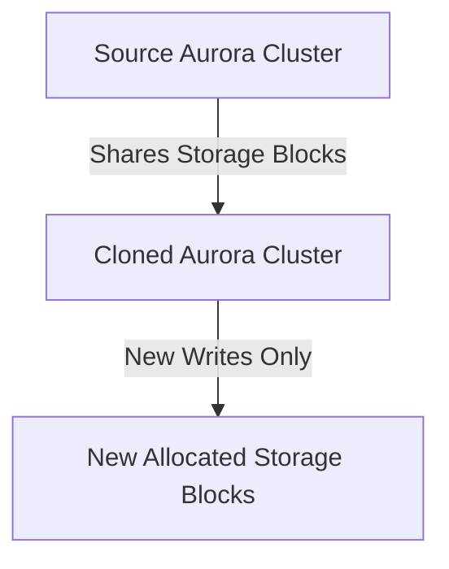

# Amazon Aurora Fast Database Cloning

## 1. Overview & Real-World Analogy

**Real-World Analogy:** Creating a reference link to a book chapter: you read the pages instantly without buying a new copy, and only pay for a new page if you scribble notes on it (Copy-on-Write).

Amazon Aurora Fast Database Cloning creates a new clone of an Aurora database cluster. It uses a Copy-on-Write protocol, meaning it shares the storage blocks of the original database until changes are made.

---

## 2. Architecture & Flow Diagram

---

## 3. Comparison & Decision Guidance

| Metric | Fast Database Cloning | Standard Snapshot Restore |
| :--- | :--- | :--- |
| **Creation Speed** | Instant (seconds) | Hours (depends on database size) |
| **Storage Cost** | Zero initially (only pay for changes) | Full database storage size cost |
| **Impact on Source** | None | I/O degradation during snapshot generation |

### When to use
- When designing high-scale, production-ready solutions on AWS.
- To enforce operational excellence and follow security best practices.

### When not to use
- For basic prototyping where native defaults are sufficient.

---

## 4. Key Performance, Cost & Security Considerations

### Performance Impact
Clones are created in seconds regardless of the multi-terabyte size of the database, with zero impact on production performance.

### Cost Impact
Saves storage costs by using shared pointer blocks, charging only for modified data blocks.

### Security Implications
Clones can be created across accounts within the same AWS Organization using resource permissions.

---

## 5. Exam tips & Traps

:::tip
**Exam Clues:** aurora database clone, fast cloning, copy-on-write database, test database refresh

Use database cloning to spin up isolated test environments with real production data sizes instantly.
:::

:::warning
**Common Exam Traps:** You cannot clone database clusters across different AWS regions; cloning is restricted to within the same region.
:::

---

## Prerequisites

- [Amazon Aurora Serverless v2](aurora-serverless.md)

## Recommended Next Topics

- [Amazon Aurora Backtracking](aurora-backtracking.md)

## Related Topics

- [Amazon Aurora Serverless v2](aurora-serverless.md)
- [Amazon Aurora Backtracking](aurora-backtracking.md)
- [Amazon RDS Proxy](rds-proxy.md)
