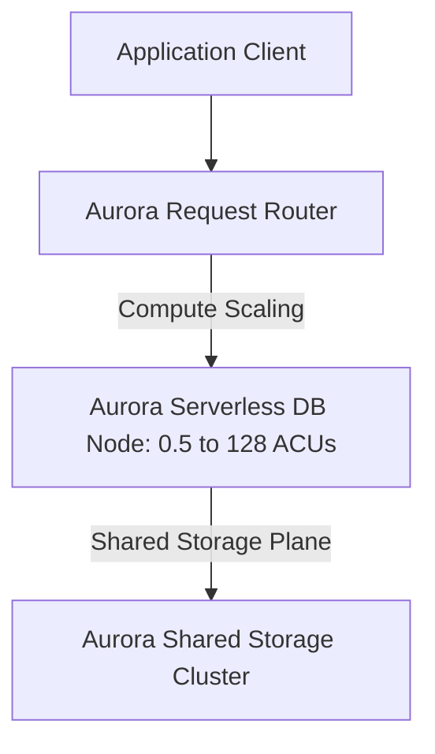

# Amazon Aurora Serverless v2

## 1. Overview & Real-World Analogy

**Real-World Analogy:** An accordion database: it expands its size and compute resources instantly during rush hour scaling, then contracts to a single core at night to save resources.

Amazon Aurora Serverless v2 is an on-demand, auto-scaling configuration for Amazon Aurora. It automatically starts up, shuts down, and scales capacity up or down based on your application needs.

---

## 2. Architecture & Flow Diagram

---

## 3. Comparison & Decision Guidance

| Provisioning Mode | Aurora Serverless v2 | Aurora Provisioned |
| :--- | :--- | :--- |
| **Scaling latency** | Sub-second scaling (Instant) | Minutes (Requires launching new VM node) |
| **Billing Increment**| Per Aurora Capacity Unit (ACU) per second | Fixed hourly rate per instance size |
| **Management** | Zero server sizing management | Manual instance scaling and DB replicas |

### When to use
- When designing high-scale, production-ready solutions on AWS.
- To enforce operational excellence and follow security best practices.

### When not to use
- For basic prototyping where native defaults are sufficient.

---

## 4. Key Performance, Cost & Security Considerations

### Performance Impact
Scales database capacity in fractions of a second without service interruptions or connection drops.

### Cost Impact
Charged per ACU-hour. Set minimum and maximum capacity ranges to prevent budget overruns.

### Security Implications
Supports standard IAM database authentication, KMS encryption at rest, and VPC subnet security groups.

---

## 5. Exam tips & Traps

:::tip
**Exam Clues:** aurora serverless v2, acu capacity, sub-second scale, variable workload db, auto-scaling database

Use Aurora Serverless v2 for workloads with unpredictable or variable traffic peaks to ensure performance scaling.
:::

:::warning
**Common Exam Traps:** Unlike v1, Serverless v2 does not scale down to 0 ACUs. The minimum capacity is typically 0.5 ACUs, so it is not completely free when idle.
:::

---

## Prerequisites

- [Amazon Aurora](Relational & Data Warehouse/Amazon Aurora.md)

## Recommended Next Topics

- [Amazon Aurora Fast Database Cloning](aurora-cloning.md)

## Related Topics

- [Amazon Aurora Fast Database Cloning](aurora-cloning.md)
- [Amazon Aurora Backtracking](aurora-backtracking.md)
- [Amazon RDS Proxy](rds-proxy.md)
