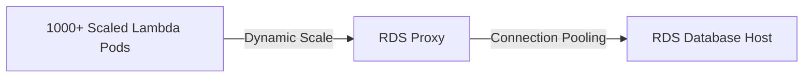

# Amazon RDS Proxy

## 1. Overview & Real-World Analogy

**Real-World Analogy:** A professional bouncer at a busy club who manages the queue: instead of letting 1,000 visitors (Lambda connections) crowd the bar, they route traffic through a pool of 50 active channels.

Amazon RDS Proxy is a fully managed, highly available database proxy for Amazon RDS that makes applications more scalable, resilient to database failures, and secure.

---

## 2. Architecture & Flow Diagram

---

## 3. Comparison & Decision Guidance

| Feature | RDS Proxy | Direct Connection |
| :--- | :--- | :--- |
| **Connection Limits** | Scales to thousands | Restricted by DB memory (max_connections) |
| **Failover Speed** | Up to 66% faster (Maintains proxy sessions) | Requires client DNS resolution lookup |
| **Authentication** | IAM database credentials to Proxy | Plaintext credentials to RDS |

### When to use
- When designing high-scale, production-ready solutions on AWS.
- To enforce operational excellence and follow security best practices.

### When not to use
- For basic prototyping where native defaults are sufficient.

---

## 4. Key Performance, Cost & Security Considerations

### Performance Impact
Reduces database memory and CPU consumption by pooling and sharing database connections.

### Cost Impact
Billed per vCPU hour of the underlying database instances. Highly cost-effective compared to sizing up DB instances for connections.

### Security Implications
Enforces IAM authentication to the proxy, retrieving DB passwords securely from AWS Secrets Manager.

---

## 5. Exam tips & Traps

:::tip
**Exam Clues:** rds proxy, database connection pooling, lambda database connections, connection pinning

Use RDS Proxy in serverless architectures where scaled Lambda functions trigger database connection limits.
:::

:::warning
**Common Exam Traps:** RDS Proxy introduces database connection pinning if you use prepared statements; ensure applications release connections correctly.
:::

---

## Prerequisites

- [Amazon RDS](Relational & Data Warehouse/Amazon RDS.md)

## Recommended Next Topics

- [Amazon Redshift](Relational & Data Warehouse/Amazon Redshift.md)

## Related Topics

- [Amazon Aurora Serverless v2](aurora-serverless.md)
- [Amazon Aurora Fast Database Cloning](aurora-cloning.md)
- [Amazon Aurora Backtracking](aurora-backtracking.md)
