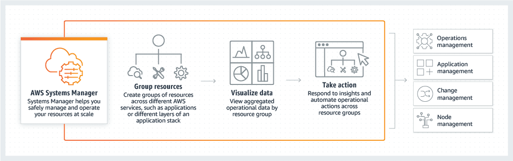
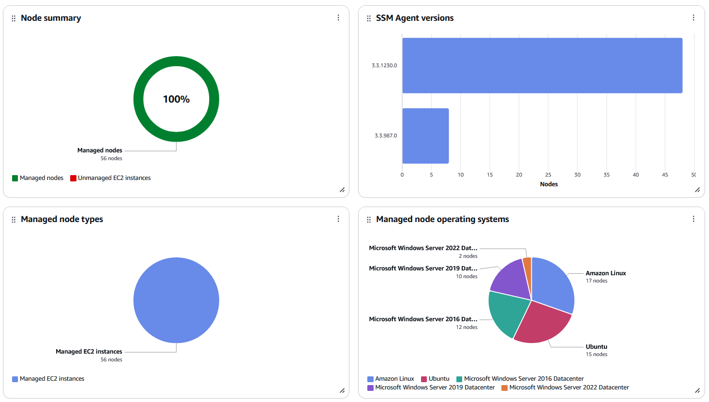
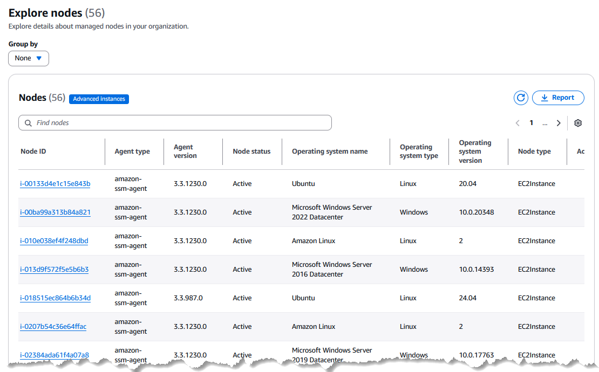
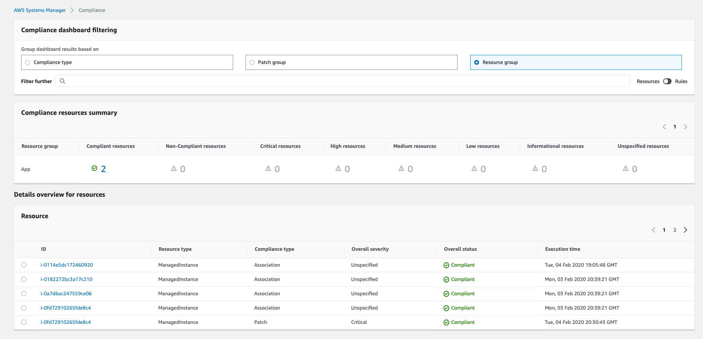
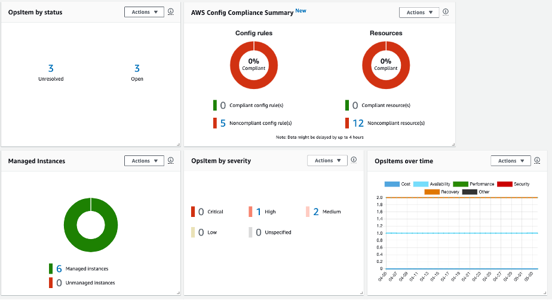

# AWS Systems Manager
## 1. Introduction

AWS Systems Manager provides a centralized way to view, manage, and operate your nodes—whether they run on AWS, on‑premises, or in multicloud environments. With its unified console experience, you gain access to a comprehensive suite of tools that simplify common node tasks across AWS accounts and Regions.

For Systems Manager to work, your nodes must be _managed_. This means the SSM Agent must be installed and able to communicate with the Systems Manager service. To assist you in diagnosing and fixing connectivity issues, Systems Manager offers a one‑click agent diagnosis and remediation runbook. This automated feature identifies why nodes aren’t reporting as managed—such as due to networking misconfigurations—and provides recommended runbooks to resolve these issues on a schedule you define.

The unified console also includes a powerful dashboard that offers a high‑level overview of your nodes. You can drill down to view detailed insights—such as outdated operating system versions—and use advanced filters based on metadata (like OS, OS version, AWS Region, account, and SSM Agent version). This capability lets you quickly retrieve relevant information at both an account and application level across your organization.

## 2. How Can Systems Manager Benefit My Operations?

AWS Systems Manager delivers several operational advantages that streamline and secure your infrastructure management:

- **Enhanced Visibility Across Your Infrastructure**  
    Gain a centralized view of your nodes across all AWS accounts and Regions. Instantly access detailed instance information—such as IDs, names, OS details, and agent versions. For example, a global operations team can quickly identify instances running outdated software, allowing them to proactively remediate vulnerabilities.
    
- **Increased Operational Efficiency Through Automation**  
    Automate routine administrative tasks to save time and reduce errors. With Systems Manager, you can securely manage nodes at scale without the need for bastion hosts, SSH, or remote PowerShell sessions. Imagine automating registry updates, user management, or patch installations across hundreds of instances with just a few clicks.
    
- **Simplified Node Management Across Diverse Environments**  
    Whether your nodes reside on AWS, on‑premises, or across multicloud environments, Systems Manager streamlines management. It can automatically diagnose SSM Agent issues and remediate them using one‑click runbooks. Once nodes are configured as managed, you can remotely execute critical tasks—such as applying security patches or initiating logged sessions—without the complexity of traditional remote management methods.

## 3. Who Should Use Systems Manager?

AWS Systems Manager is designed for IT operations managers, DevOps engineers, security and compliance professionals, and executive leaders like IT directors and CIOs. It is ideal for organizations that:

- **Need to Enhance Management and Security at Scale:**  
    Organizations looking to improve the oversight and protection of their infrastructure can benefit from Systems Manager’s centralized, automated tools.
    
- **Desire Greater Visibility and Operational Agility:**  
    If you require real‑time insights and the ability to quickly respond to operational issues across a diverse environment, Systems Manager’s dashboard and reporting capabilities are indispensable.
    
- **Aim to Boost Operational Efficiency:**  
    For companies seeking to automate routine tasks and reduce manual intervention, Systems Manager streamlines processes and minimizes the risks associated with human error.

## 4. Systems Manager Service Name History

AWS Systems Manager was formerly known as "Amazon Simple Systems Manager (SSM)" and "Amazon EC2 Systems Manager (SSM)". Despite the evolution of the service’s name, the abbreviation "SSM" continues to appear in various AWS resources and service consoles. For example:

- **Systems Manager Agent:** Referred to as SSM Agent
- **Systems Manager Parameters:** Commonly known as SSM parameters
- **Service Endpoints:** Formatted as `ssm.<region>.amazonaws.com`
- **CloudFormation Resource Types:** Identified as `AWS::SSM::Document`
- **AWS Config Rule Identifier:** Such as `EC2_INSTANCE_MANAGED_BY_SSM`
- **CLI Commands:** For instance, `aws ssm describe-patch-baselines`
- **IAM Managed Policies:** For example, `AmazonSSMReadOnlyAccess`
- **Resource ARNs:** Formatted like `arn:aws:ssm:<region>:<account-id>:patchbaseline/pb-07d8884178EXAMPLE`

This legacy naming underscores the deep integration of SSM across AWS services.

## 5. What Is the Unified Console?

The unified Systems Manager console is a consolidated interface that brings together a variety of tools to help you perform common node management tasks across multiple AWS accounts and Regions—or within a single account and Region. Whether your nodes are EC2 instances, hybrid servers, or part of a multicloud environment, the unified console provides comprehensive insights and management capabilities.

Within the console, you can:

- Generate detailed reports on node health and configuration.
- Diagnose and remediate issues—such as connectivity problems that prevent nodes from being recognized as managed.
- View specific details like software inventories and patching statuses.

For example, a company operating across several Regions can use the unified console to quickly drill down into problematic instances, filter nodes based on criteria like OS version or SSM Agent version, and execute corrective actions—all from a single, cohesive dashboard. As AWS continues to enhance the unified console, more node management tasks are being integrated, making it the recommended interface for efficient and effective infrastructure management.

## 6. AWS Systems Manager Resource Groups

Resource Groups allow you to logically organize multiple AWS resources (such as EC2 instances, S3 buckets, or RDS databases) based on common criteria.

Imagine an organization that runs a web application across 50 EC2 instances. By tagging these instances (for example, with `Environment=Production` and `App=WebPortal`), you create a dynamic resource group. When it comes time to run a batch update or patch operation, you can target the entire group with a single command. If a new EC2 instance is launched and automatically tagged, it’s added to the group and—provided the SSM Agent is installed—it will immediately receive the same updates.

### 6.1. Creating Resource Groups

You can create resource groups using either tag‑based or CloudFormation‑based methods. Tag‑based grouping is dynamic—when new resources are tagged, they join the group automatically—while CloudFormation‑based grouping pulls from a defined stack.

A company might use a CloudFormation stack to deploy its microservices architecture. Grouping all resources from that stack lets the operations team quickly run maintenance tasks across the entire application. This ensures consistency and minimizes manual intervention.

### 6.2. Dynamic vs. Static Resource Groups

Dynamic groups update automatically based on tags, reducing overhead and ensuring that every new instance with the SSM Agent installed is included without manual updates.  By contrast, you can also create “static” groups by manually listing specific resource ARNs (using the CLI or a CloudFormation template) – but tag-based (dynamic) groups are easier to maintain as your environment grows.

## 7. Systems Manager Documents (SSM Documents)

SSM Documents are JSON or YAML files that define a series of actions—often referred to as runbooks—to execute on managed instances. Documents can encapsulate everything from simple shell commands to complex multi‑step workflows.

AWS supplies over 100 pre-created **Amazon-owned documents** (named with prefixes like `AWS-RunShellScript`, `AWS-RunPatchBaseline`, etc.) which cover common scenarios. You can also create **custom SSM documents** tailored to your needs. 

Consider a scenario where a developer needs to update a configuration file on a fleet of instances. By creating a custom SSM Document that runs a shell script to update the file, and ensuring the SSM Agent is installed on every instance, the operations team can execute this change across 100 instances simultaneously with minimal risk.

### 7.1. Types of SSM Documents

The main types of documents include:

- **Command documents:** Used with **Run Command**, State Manager, and Maintenance Windows to execute commands or scripts on instances. Example: `AWS-RunShellScript` is a command document that runs shell commands on Linux instances. Command documents are often simple one-step or multi-step instructions for configuration or automation tasks on one or more targets.

- **Automation runbooks (Automation documents):** Used with **Systems Manager Automation** (and can be invoked via State Manager or Maintenance Windows as well) for multi-step workflows. Automation documents allow complex sequences with branching, error handling, and integration with AWS APIs. For example, `AWS-CreateImage` (an automation runbook) orchestrates steps to stop an instance, create an AMI, and restart the instance. These runbooks can apply to one or many resources and often serve for maintenance and deployment tasks.

- **Policy documents:** A lesser-used type, historically for **Inventory collection or configuration policies**. For instance, `AWS-GatherSoftwareInventory` is a policy document used by Inventory; State Manager can apply it to collect data. In general, AWS now encourages using Command or Automation docs to enforce policy, but policy-type documents still exist for certain purposes (they typically ensure a certain state or gather info).

- **Session documents:** Used by **Session Manager** to define the parameters for sessions. For example, `AWS-StartSSHSession` or `AWS-StartPortForwardingSession` are session documents controlling what kind of Session Manager connection is established. They aren’t usually edited by users; AWS provides these to support features like port forwarding, interactive shell, etc.

- **Package (Distributor) documents:** Represent packages in **Distributor**, which include installation and uninstallation instructions and are associated with software payloads. For example, a package document might be created to deploy an in-house agent, and it includes the commands to install/uninstall that software on different OS platforms.

- **Automation & Change Calendar, CloudFormation template, and others:** Incident Manager’s **post-incident analysis** template is another type, and AWS AppConfig uses specialized document types (`ApplicationConfiguration` and `ApplicationConfigurationSchema`) to store application config data. AWS provides predefined documents for these use cases (e.g., Change Calendar documents for scheduled events, CloudFormation template as SSM document to version control them.

### 7.2. Creating and Versioning Documents

You can create a custom SSM document through the console (using the _Documents_ editor), the AWS CLI (`aws ssm create-document`), or Infrastructure as Code (CloudFormation supports creating SSM documents). Each update to a document creates a new version, enabling testing and rollback if necessary.

When updating a critical automation for database backup procedures, you might release version 2 of the document while keeping version 1 as the production default. After thorough testing on non‑production systems, you can switch production to version 2, ensuring minimal disruption.

### 7.3. Sharing Documents Across Accounts

By default, custom SSM documents are private to your AWS account. However, you may share documents with other AWS accounts or even make them public. To **share an SSM document** with specific accounts, you modify its permissions and specify the AWS account IDs allowed to access it.

## 8. AWS Systems Manager Parameter Store

Parameter Store is a secure, hierarchical storage for configuration data and secrets, provided by AWS Systems Manager. It allows you to store key-value pairs such as plain text configuration strings, database connection strings, license keys, passwords, and other secrets, and retrieve them at runtime in your applications or scripts

### 8.1. Parameter Types and Hierarchies

Parameter Store parameters have **tiers** and **types**. There are two tiers of parameters:

* **Standard parameters:** Are free to use, support up to 10,000 values per account, with values up to 4 KB, and have higher throughput limits by default.
* **Advanced parameters:** Allow larger values (up to 8 KB) and support additional features like parameter policies (for example, auto-expiring or rotating values). Advanced parameters incur a small cost per parameter per month and can be useful if you need more than 10,000 parameters or want to attach metadata like TTLs. You can configure the default tier or specify it per parameter; note that once a parameter is advanced, it cannot be reverted to standard if its size or features exceed standard limits.

In terms of parameter **type**, you have three main types when creating a param:

- **String:** Plain text value.
- **StringList:** A comma-separated list of strings (useful for things like lists of IPs, or any array-like config).
- **SecureString:** An encrypted value intended for sensitive data.

Parameters can be arranged in a **hierarchy** by using slash (`/`) delimiters in their names. This effectively creates a directory-like structure for your parameters. For example, you might have `/Prod/DB/Password` and `/Dev/DB/Password` as two parameters. Hierarchies help with organizing parameters and controlling access. You can do bulk operations like retrieving all parameters under a path.

Hierarchies enforce some limits (max 15 levels deep, each level is separated by a slash). They significantly reduce the chances of naming collisions and make it easier to apply IAM policies – you can allow a role to read only parameters prefixed with `/Dev/` for example, effectively scoping access by path.
### 8.2. SecureString Parameters

A **SecureString** parameter is used to store sensitive data (passwords, secrets) in an encrypted form. Parameter Store uses AWS Key Management Service (KMS) to encrypt SecureString values at rest. When you create a SecureString, you can either use the default AWS managed key for Systems Manager (which is automatically created in your account, typically known as the `aws/ssm` KMS key), or specify your own customer-managed KMS key for encryption.

Under the hood, Parameter Store calls KMS to encrypt the value when you put a SecureString, and to decrypt on retrieval. Standard-tier SecureStrings (`<=4KB`) are encrypted directly with the KMS key per request, whereas Advanced-tier SecureStrings use an envelope encryption mechanism via the AWS Encryption SDK (for handling larger sizes and tracking key usage).

AWS **does not store the plaintext**; it only stores the ciphertext and metadata. This means the security of SecureStrings is tied to KMS – you should ensure that only appropriate roles have access to use the KMS key for decryption.

There is no automatic secret rotation in Parameter Store (for that, AWS Secrets Manager might be used, or you implement rotation via Lambda and parameter policies). However, you can attach a parameter policy to a SecureString to mark it as expired after a certain time, which can be part of a rotation strategy (like have a Lambda generate a new secret, update the parameter, and the old one shows as expired). Also note, while Parameter Store itself is free for standard, using a **SecureString does incur KMS costs** for API calls to encrypt/decrypt (each GetParameter with decryption is a KMS decrypt call).
### 8.3. Integration with Other Services

Parameter Store integrates with Lambda, CloudFormation, CodeBuild, and more, letting you reference parameters dynamically.

**Example:**  
In a CloudFormation template, you can reference a parameter value stored in Parameter Store using the `{{resolve:ssm:parameter-name:version}}` syntax. This allows the template to deploy with the most current configuration without manual updates.

## 9. AWS Systems Manager Run Command

**Run Command** is a feature of AWS Systems Manager that lets you remotely execute commands or scripts on your managed instances (which can be EC2 instances or on-premises servers enrolled in SSM) without needing to log in via SSH or RDP. It provides a central, secure way to run ad-hoc tasks. For example, you might use Run Command to restart a service on a fleet of instances, pull logs, or apply a quick configuration change. 

Since Run Command operates through the SSM Agent on each instance, you don’t need any open inbound ports – commands are sent through the SSM service and agent's secure channels. This is especially valuable for managed instances in private subnets or behind firewalls. You can execute **ad-hoc scripts** (shell commands for Linux, PowerShell for Windows, etc.) or use predefined SSM documents that encapsulate a series of commands.

This capability is not limited to EC2 – you can also target on-premises servers or VMs that are configured as _hybrid managed instances_ in Systems Manager. Those instances, once they have the SSM agent and have been activated in your account, can receive Run Command tasks just like EC2 instances. This makes Run Command a hybrid-cloud administrative tool.

### 9.1. Targeting Instances

Run Command offers flexible targeting. You can target specific managed nodes by **instance ID**, by **tags**, or by **resource groups**. The simplest case is specifying a list of instance IDs to run the command on (useful for a small number of known instances). However, for large-scale or dynamic environments, you can target by **tags** – for example, run a command on all instances with `App=WebServer` tag.

### 9.2. Working with SSM Documents

When running commands, you often will use pre-existing SSM **Documents**. A common built-in document for ad-hoc tasks is `AWS-RunShellScript` (for Linux) or `AWS-RunPowerShellScript` (for Windows). These are Command-type SSM documents provided by AWS that simply execute the given shell or PowerShell commands on the instance. For example, to gather disk usage on all Linux servers, you could invoke Run Command with the document `AWS-RunShellScript`, passing the commands: `df -h > /tmp/diskusage.txt`.

### 9.3. Monitoring and Logging

Run Command provides detailed feedback for each command execution. In the Systems Manager console, you can view the status of the command invocation for each target instance (e.g., In Progress, Success, Failed). You can also view the output of the commands (stdout and stderr) for each instance up to a certain size limit. For longer running commands or larger output, it’s common to enable S3 or CloudWatch logging. When sending a command, you have the option to specify an S3 bucket name and prefix where outputs will be uploaded, and/or a CloudWatch Logs group to stream output. If configured, Systems Manager will deliver each instance’s command output to the S3 path or CloudWatch log in near real time.

## 10. AWS Systems Manager Session Manager

Session Manager is a component of AWS Systems Manager that provides secure, interactive shell access to EC2 instances (and on-prem managed instances) **without requiring SSH keys or open inbound ports**. With Session Manager, you can start a session from the AWS console or CLI and get a shell on the instance through the SSM Agent. There’s no need to open port 22 (SSH) or RDP ports on the instance’s security group, which significantly improves security posture by reducing attack surface. 

Authentication is handled via IAM – meaning you can control who can start a session to an instance using IAM policies, and all connections are encrypted and logged. This eliminates managing SSH key pairs or bastion hosts. Session Manager also works through the AWS private network, so even instances with no public IP can be reached as long as they have the SSM Agent and can communicate with SSM endpoints (which can be via the internet or VPC endpoints).

From a workflow perspective, to use Session Manager, ensure the instance’s IAM role has the proper SSM Session permissions (the managed policy AmazonSSMManagedInstanceCore includes this) and that your user/role has permission to start sessions (ssm:StartSession on the instance).

### 10.1. Starting and Managing Sessions

You can start a session either via the **AWS Systems Manager console** (which opens a browser-based terminal) or via the **AWS CLI**/PowerShell (which uses the Session Manager Plugin to create a local SSH-like experience in your terminal). In the console, you go to _Session Manager_, see a list of instances you have access to, and click “Start session” – a new browser tab opens with a terminal interface. This is an interactive shell where you can run commands. You can have multiple sessions open. If your organization uses single sign-on for the AWS Console, this means your console login plus IAM policy is enough to get to a server – no separate key or VPN needed.

**Session management** features also include the ability to **terminate sessions** from the console. If you see an unauthorized or long-running session, an admin with proper permission can terminate it. You can list all active sessions (in console or with `aws ssm describe-sessions`) and audit who is connected. All session start/ends generate CloudTrail events, so you have an audit trail of _who connected to which instance and when_. This helps with compliance (“all interactive access is logged”).

### 10.2. Port Forwarding and SSH Integration

Session Manager isn’t limited to interactive shell sessions; it also supports **port forwarding** and can be used as a proxy for traditional SSH if needed. Port forwarding allows you to securely tunnel traffic to a port on a remote instance through the Session Manager connection. For example, suppose you have a database running on an EC2 instance in a private subnet. You can use Session Manager to set up a port forwarding session that tunnels your local port (e.g., localhost:5432) to the database’s port (5432 on the instance), without exposing the DB server publicly.

**Real‑World Example:**  
A developer needs to connect to a database in a private subnet. Instead of opening direct connections, they use Session Manager’s port forwarding to securely access the database on localhost, ensuring that the database remains isolated from the public internet.

## 11. AWS Systems Manager Automation

 **Systems Manager Automation** is a feature that enables you to orchestrate complex operational tasks as automated workflows (called _runbooks_). It’s essentially a way to encode IT processes or maintenance tasks into repeatable, auditable sequences. 
 
 Common use cases for Automation include: 
 
 * **routine maintenance:** for example, restarting a fleet of servers in sequence, or taking regular EBS snapshots
 * **patching and updating AMIs:** Automation can create “golden” images by launching a temporary instance, updating it, and creating an AMI – all automatically
 * **remediating incidents** like automatically restarting instances that show unhealthy, or cleaning up resources when certain alarms trigger
 * **other multi-step workflows** that would normally require human intervention or running multiple scripts in order. 
 
 Automation is often described as enabling “lights-out” operations or **self-service** for common IT tasks. For example, you might empower developers to trigger a predefined automation that sets up a dev environment or resets a service, without giving them direct access – the automation runbook does it in a controlled way.

### 11.1. Creating Automation Workflows

An Automation workflow is defined by an **Automation document** (also called a runbook) that contains a sequence of steps. Each step performs an action using a specific Systems Manager **Automation action type** (for example, running a script, invoking an AWS API, waiting for approval, etc.). To create a custom runbook, you can write it in YAML or JSON following the Automation document schema. AWS also provides a “Automation Document Builder” (and a newer **visual workflow designer** in the console) to help build these without writing raw JSON.

When designing a runbook, you break the procedure into steps within the `mainSteps` section. Each step has a name, an action (like `aws:runCommand`, `aws:executeAwsApi`, `aws:waitForResourceSignal`, `aws:approve`, etc.), parameters for that action, and optional outputs.

### 11.2. Integrating with AWS Services

Automation can be triggered by events from EventBridge, CloudWatch, or Config, and it can also invoke Lambda functions for custom actions.

## 12. AWS Systems Manager State Manager

**State Manager** is a Systems Manager capability that automates the process of keeping your instances (and some other resources) in a **desired state**. In essence, you define a _configuration baseline or policy_ (using SSM documents called _associations_), and State Manager ensures that your instances continuously meet those settings, applying remediation if drift is detected. 

It’s analogous to configuration management tools like Chef/Puppet or Ansible in pull mode – but it uses SSM Agent to apply changes. Typical use cases include making sure certain software is installed (or not installed), specific settings or services are configured, or scripts run on a schedule to enforce compliance. For example, you might have a baseline that “Amazon SSM Agent must be running and up-to-date on all instances” or “Our custom monitoring agent should be present on all servers and started at boot.” With State Manager, you can enforce these by creating an **Association** that runs a document to check/install the agent periodically.

### 12.1. Association Documents

An **Association** in State Manager is essentially a binding of a document to a set of targets with specific parameters and schedule. The document can be a Command document or an Automation document typically. AWS specifically calls out using State Manager for things like **ensuring software is installed and running**. 

For instance, “antivirus must be installed and running on all instances” is a classic requirement. You can fulfill that by:

- Using an SSM document that checks for the AV presence and installs it if missing, and starts the service if it’s stopped.
- Creating an association of that document to all instances (or all instances of a certain type/tag) to run maybe every hour or when an instance starts.

### 12.2. Scheduled and Event-Driven Associations

State Manager allows flexible scheduling using cron or rate expressions, just like cron jobs. You can run associations at a fixed interval (hourly, daily, etc.) or a specific schedule (like “every Sunday at 2AM”). By default, when you create a new association, State Manager can apply it immediately and then at the interval you set. 

You can also create **event-driven associations** using EventBridge integration. For instance, State Manager can react to certain events (like instance start). Actually, one subtle feature: you can set “trigger type” as `OnBoot` for an association (via the agent), which will run the document whenever the instance boots up (ensuring baseline on startup). Additionally, as noted, EventBridge can trigger automations (with State Manager, typically one uses cron schedules directly inside SM rather than events, but events can be used to start an Automation that does similar enforcement tasks).

## 13. Systems Manager Patch Manager

**Patch Manager** is a feature in Systems Manager that automates the process of patching operating systems (and some applications) on your EC2 instances or on-prem managed instances. It allows you to define **patch baselines** – essentially, rules and lists determining which patches are approved or rejected – and then apply patches either on demand or on a schedule (often via Maintenance Windows) to keep instances updated with security and critical updates.

A typical patch management strategy involves separating patches by severity or criticality: for example, you may auto-approve critical security patches as soon as possible, while delaying less critical updates for testing. Patch Manager facilitates this by letting you specify auto-approval delays (e.g., approve critical updates after 0 days, others after 7 days).

### 13.1. Patch Baselines and Groups

A **Patch Baseline** is a set of patch rules and lists that determine which patches are approved for installation on a given OS. AWS supplies default baselines for each OS (Amazon Linux, Ubuntu, Windows, etc.) which you can use or clone. These typically auto-approve critical and security patches after a certain time by default. You can create **custom patch baselines** for more control.

Patch Manager has a concept of **Patch Group** that allows you to assign different baselines to different servers easily. A **Patch Group** is simply a tag (Tag key `Patch Group` or `PatchGroup`) you put on instances to label them for patching. For example, tag some instances `Patch Group=ProdServers` and others `Patch Group=DevServers`. In your Patch Baseline settings, you can register a baseline to a patch group (like “Prod baseline” applies to `ProdServers` group). When Patch Manager runs, it looks at the instance’s Patch Group tag to decide which baseline to use. This mechanism ensures **the correct patches are applied to the correct set of nodes**. It also prevents accidentally patching prod with a baseline meant for dev, etc. AWS emphasizes using patch groups to separate environments and schedules.

### 13.2. Scanning and Patching Workflows

Patch Manager supports two primary operations: **Scan** and **Install** (sometimes called “Scan and install”). A **Scan** operation means the SSM agent on the instance will check which patches from the baseline are missing on the instance, and report compliance (but it will not actually install anything). This is useful for getting a report of patch compliance without altering the system. A **Patch scan** outputs a list of missing patches and marks the instance Compliant or Non-Compliant in Patch Manager’s view.

An **Install** operation will actually download and install the missing approved patches on the instance, then reboot if necessary (you can control reboot behavior: by default, Windows might reboot if needed; on Linux, it might not auto-reboot unless you tell it to, since many Linux updates don’t force immediate reboot – but kernel updates will require one for full effect). Patch Manager logs results, and after an install, you usually do a scan to update compliance info.

## 14. AWS Systems Manager Distributor

**Distributor** is a feature in Systems Manager that enables you to package software or scripts and deploy them to managed instances at scale. Think of it as AWS’s mechanism to create your own software repositories and installers which SSM Agent can use. With Distributor, you can bundle software into a ZIP or TAR along with installation instructions, then use Systems Manager (via State Manager or Run Command) to push and install those packages on your fleet. 

Typical use cases include deploying agents (e.g., security agents, monitoring agents), internal tools, or scripts that you want to consistently roll out to instances. For example, AWS itself uses Distributor to provide packages like the AmazonCloudWatchAgent (the CloudWatch agent is available as a Distributor package so you can easily install/update it on instances).

Distributor helps with **version control** of software. Instead of simply running arbitrary scripts to install software, you create a package with a name and version number.
### 14.1. Creating and Distributing Packages

To create a package, you bundle your software into ZIP files along with a manifest and required scripts. This package is then stored securely and can be versioned and deployed across multiple platforms.
### 14.2. Version Control and Validation

Distributor inherently manages **versions** of each package you publish. Each time you add a version, the system keeps the old versions available (unless you delete them) – you can choose which version to install on a particular instance. By default, if you just say “Install package X” without specifying version, it takes the latest approved version. Or you can pin a specific version by specifying it.

## 15. AWS Systems Manager Maintenance Windows

Maintenance Windows let you schedule tasks (such as patching or backup) during defined periods. For example, a retailer schedules a Maintenance Window for patching all its servers every Sunday at 3 AM—during off‑peak hours. This ensures that critical updates are applied without disrupting customer transactions during business hours.

### 15.1. Task Prioritization and Concurrency

Within a Maintenance Window, tasks are prioritized and limited in concurrency to avoid overloading systems. For example, during a scheduled backup window, a company sets up tasks to first drain traffic from a server farm, then run backup scripts, and finally bring the servers back online. By controlling concurrency, they ensure that only a subset of servers are taken offline at any given time, maintaining service availability.

### 15.2. Integration with Run Command and Automation

Maintenance Windows execute tasks defined in Run Command, Automation, Lambda, or Step Functions. This integration allows for complex, sequential workflows to be automated and scheduled.

## 16. Configuration Compliance

Compliance aggregates data from Patch Manager and State Manager into a centralized dashboard. 

### 16.1. Remediating Non‑Compliant Resources

The goal of compliance monitoring is usually to trigger remediation when something is out of compliance. Remediation is achieved using State Manager associations, Maintenance Windows, or Automation runbooks. 

In the **Compliance UI**, if an instance is non-compliant for patches, the console often provides a button to “Patch now” or “Remediate”. Similarly, for association non-compliance, you can jump to the association or run it immediately. Solutions architects can also incorporate compliance data into their CI/CD or CMDB pipelines. E.g., if an instance remains non-compliant for more than X hours, escalate, etc.

## 17. AWS Systems Manager OpsCenter

**OpsCenter** is a component of Systems Manager that aggregates and standardizes operational issues (called OpsItems) from various sources into a single pane for IT engineers.

 It’s essentially an operational dashboard where you can view alerts and issues from multiple AWS services and manage them through their lifecycle (investigate -> remediate -> resolve). OpsCenter is designed to reduce Mean Time to Resolution by providing context and tooling in one place. For example, CloudWatch alarms, Config rule violations, Security Hub findings, and Systems Manager itself (like compliance or automation failures) can all create OpsItems in OpsCenter. Instead of jumping between CloudWatch, Config, etc., OpsCenter shows a list of issues with details, and for each OpsItem, it pulls in **contextual data**: information about the resource involved, related AWS Config changes, CloudTrail logs, CloudWatch metrics graphs, and even links to relevant runbooks or past similar OpsItems.

### 17.1. Creating and Managing OpsItems

An **OpsItem** is the object in OpsCenter that represents a single operational issue or event. You typically don’t create most OpsItems manually; they are generated by triggers or other services. But you can manually create one if needed (like to track something not auto-detected).

### 17.2. Integration with Automation

As already touched, OpsCenter heavily integrates with SSM Automation for remediation. It’s common to set up **OpsItem to Automation associations** using **OpsCenter-Suggested runbooks** or even to have some OpsItems auto-remediate. For the latter, if you trust an automation enough, you could theoretically have EventBridge trigger an automation as soon as an event comes, and then only create an OpsItem if automation fails. But if you want a human in the loop, OpsCenter plus manual runbook execution is better.

## 18. Incident Manager

AWS Incident Manager (part of Systems Manager) streamlines the response to critical incidents by automating the incident lifecycle—from detection to post-incident analysis. Here's an overview of its workflow:

- **Detection:** Automatically triggers incidents from high-severity alerts (e.g., CloudWatch alarms, EventBridge events) tied to a response plan, or allows manual incident declaration by an ops engineer.
- **Engaging Responders:** Immediately notifies on-call responders via multiple channels (phone, SMS, email, Slack/Chime) following a pre-defined escalation plan, similar to PagerDuty.
- **Collaboration:** Automatically sets up a “War Room” (e.g., Slack channel or Chime bridge) for real-time collaboration, with all communications recorded.
- **Mitigation via Runbooks:** Executes automation runbooks at incident start to perform tasks like log collection, scaling servers, or failovers, with progress tracked in the incident timeline.
- **Timeline Tracking:** Records key events (detection, notifications, runbook execution, notes, resolution) to keep responders informed and support post-incident analysis.
- **Resolution & Closure:** Helps responders mitigate issues using both automated runbooks and manual actions, then marks the incident as resolved, calculating metrics like MTTR.
- **Post-Incident Analysis:** Guides the creation of a post-mortem report with a timeline, root cause analysis, and follow-up actions, storing insights for future improvements.
- **Continuous Improvement:** Provides insights into response times and common failure patterns to refine on-call schedules and update runbooks.

Overall, Incident Manager integrates alerting, paging, collaboration, and automation directly into AWS, offering functionality similar to dedicated incident management tools but within the AWS ecosystem.

### 18.1. Creating Incident Response Plans

Response plans define incident severity, triggering alarms, escalation paths, notification channels, and associated automation runbooks. Pre‑configured plans ensure that when incidents occur, every step—from engagement to mitigation—is automated as much as possible.

For example, a financial services company creates an Incident Response Plan for service outages. The plan specifies that if a service is down, Incident Manager immediately engages the on‑call team, creates a dedicated chat channel, and runs a runbook to fail over traffic—all actions performed on instances with the SSM Agent.

### 18.2. Post‑Incident Analysis

After resolving an incident, Incident Manager facilitates a structured post‑incident analysis to capture lessons learned and improve future responses. The timeline and data collected (including automation runbook results executed via the SSM Agent) are critical for this analysis.

## 19. Best Practices Recap

- Tag resources consistently to leverage Resource Groups and patch/maintenance targeting.
- Use SSM Documents to codify admin tasks, and share/version them properly.
- Store secrets/config in Parameter Store and reference them – avoid hardcoding.
- Use Run Command and Session Manager instead of SSH/RDP for better security and auditing.
- Use State Manager to enforce key configurations (e.g., ensure critical services are always running).
- Set up Patch Manager with appropriate baselines and maintenance windows to keep servers secure.
- Use Distributor to roll out standard software (like agents) so all instances have necessary tools.
- Schedule routine tasks (backups, patches) with Maintenance Windows rather than ad-hoc, to reduce human error and ensure they happen at safe times.
- Regularly check Compliance dashboards or set up alerts for non-compliance, and integrate compliance with security operations (e.g., Security Hub).
- Use OpsCenter as a central triage for smaller issues (and integrate with existing ticket systems as needed).
- For major outages, define Incident Manager plans: who to page, what automations to run, what chat to gather in. Test these plans via game days or simulations. Ensure contacts and runbooks are up-to-date. After real incidents, feed lessons back into updating monitoring, runbooks, and perhaps adding new automation or adjusting schedules.
- Do post-incident analyses (blameless post-mortems ideally) through Incident Manager or otherwise, to identify root causes and preventative actions.
- Secure SSM operations: use least-privilege IAM roles for all SSM actions (for example, restrict Run Command so only approved documents can be run, restrict who can terminate instances or update patches, etc.). Use logging (CloudTrail, session logs) to audit changes.

## 20. Advanced Automation & Operations

### 20.1. Session Manager
- **Mechanism:** Provides secure, auditable instance management without the need to open inbound ports (SSH/RDP) or maintain bastion hosts.
- **Security:** Communication is encrypted and channeled through the SSM Agent. All sessions are logged to **CloudWatch Logs** or **S3**.
- **IAM Integration:** Control who can start a session and which instances they can access using IAM policies.

### 20.2. Patch Manager & Maintenance Windows
- **Mechanism:** Automates the process of patching managed instances with both security-related and other types of updates.
- **Patch Baseline:** Defines which patches are approved for installation.
- **Maintenance Windows:** Defines a recurring schedule of when patching should occur to minimize impact on availability.

### 20.3. Parameter Store vs. Secrets Manager

| Feature | SSM Parameter Store | AWS Secrets Manager |
| :--- | :--- | :--- |
| **Primary Use** | Configuration data & non-rotating secrets. | Secrets requiring rotation (DB passwords, API keys). |
| **Rotation** | Manual. | **Automatic rotation** (built-in integration with RDS/Lambda). |
| **Cost** | Standard is free; Advanced is paid. | Per secret per month + per API call. |
| **Cross-Account** | Not native (requires RAM or custom logic). | Native cross-account access. |
| **Integration** | Deep integration with ECS/Lambda/EC2. | Deep integration with RDS/Redshift/DocumentDB. |

## 21. Exam Tips (SAP-C02)
- **Bastion Host Replacement:** If the exam asks for a secure way to manage private instances without SSH, the answer is **Session Manager**.
- **Secret Rotation:** If the requirement involves automatic password rotation for a database, choose **Secrets Manager**.
- **Hybrid Management:** SSM is the primary tool for managing a hybrid fleet (EC2 + On-premises) from a single pane of glass.

## 22. Conclusion

AWS Systems Manager is a powerful solution for any organization seeking enhanced visibility and control over its cloud and on-premises environments. From patching fleets of servers to securely accessing instances and centrally managing operational incidents, it plays a vital role in streamlining operations.

---

## Prerequisites

- [AWS Compute Optimizer](AWS Compute Optimizer.md)

## Recommended Next Topics

- [AWS Trusted Advisor](AWS Trusted Advisor.md)

## Related Topics

- [AWS Compute Optimizer](AWS Compute Optimizer.md)
- [AWS Trusted Advisor](AWS Trusted Advisor.md)
