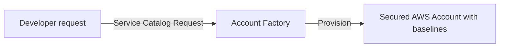

# Control Tower Account Factory

## 1. Overview & Real-World Analogy

**Real-World Analogy:** A cookie cutter machine: you push a button, and it stamps out a new cookie with the exact same shapes, security stamps, and frostings every time.

The Account Factory is a capability of AWS Control Tower that automates the provisioning of new AWS accounts with pre-configured security baselines, networking resources, and SSO access.

---

## 2. Architecture & Flow Diagram

---

## 3. Comparison & Decision Guidance

| Metric | Account Factory | Manual Organizations Create |
| :--- | :--- | :--- |
| **Baseline Applied?**| Yes (VPC, IAM, Config, CloudTrail configured) | No (Blank AWS account) |
| **Execution** | Self-service via AWS Service Catalog | API call / Organizations Console |

### When to use
- When designing high-scale, production-ready solutions on AWS.
- To enforce operational excellence and follow security best practices.

### When not to use
- For basic prototyping where native defaults are sufficient.

---

## 4. Key Performance, Cost & Security Considerations

### Performance Impact
Simplifies operational workflows by automating baseline setups in roughly 15-20 minutes.

### Cost Impact
Billed based on the standard AWS resources created in the target baseline (e.g. AWS Config, VPC resource consumption).

### Security Implications
Ensures new developer accounts match corporate security profiles, restricting network configurations.

---

## 5. Exam tips & Traps

:::tip
**Exam Clues:** account factory, baseline account creation, service catalog account template, automated setup

Use Account Factory inside Service Catalog to delegate account creation authority to project managers safely.
:::

:::warning
**Common Exam Traps:** Ensure you have sufficient service limit boundaries in AWS Organizations before running large batch account creations.
:::

---

## Prerequisites

- [AWS Control Tower](Governance & Compliance/AWS Control Tower.md)

## Recommended Next Topics

- [AWS Resource Access Manager](../Security, Identity & Compliance/Compliance & Governance/AWS Resource Access Manager.md)

## Related Topics

- [AWS Config Multi-Account Aggregators](config-aggregators.md)
