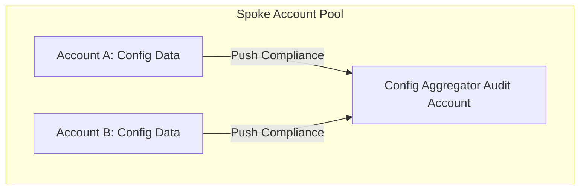

# AWS Config Multi-Account Aggregators

## 1. Overview & Real-World Analogy

**Real-World Analogy:** A central regional filing office: every local store branch logs their inventory daily (AWS Config) and ships reports to the head office desk for a total review.

An AWS Config aggregator collects configuration compliance data from multiple AWS accounts and Regions into a single security audit account, enabling enterprise-wide governance.

---

## 2. Architecture & Flow Diagram

---

## 3. Comparison & Decision Guidance

| Feature | Config Aggregator | CloudTrail Organization Trail |
| :--- | :--- | :--- |
| **Primary Data** | Compliance state and config history | API event log trails |
| **Focus** | Resource compliance monitoring | Security auditing of API calls |

### When to use
- When designing high-scale, production-ready solutions on AWS.
- To enforce operational excellence and follow security best practices.

### When not to use
- For basic prototyping where native defaults are sufficient.

---

## 4. Key Performance, Cost & Security Considerations

### Performance Impact
Asynchronous event collector has zero impact on runtime compute performance.

### Cost Impact
No fee for creating aggregators; you pay standard rates for Config rules evaluated in spoke accounts.

### Security Implications
Provides audit and compliance teams with a single pane of glass to identify compliance issues across accounts.

---

## 5. Exam tips & Traps

:::tip
**Exam Clues:** config aggregator, multi-account compliance collection, configuration aggregator dashboard

Configure Config Aggregators in the Security Audit account to view non-compliant resources across all organizational units (OUs).
:::

:::warning
**Common Exam Traps:** Aggregators do not authorize Config rules; they only collect compliance evaluation outcomes from local regions.
:::

---

## Prerequisites

- [AWS Config](Governance & Compliance/AWS Config.md)

## Recommended Next Topics

- [AWS Service Catalog](Governance & Compliance/AWS Service Catalog.md)

## Related Topics

- [Control Tower Account Factory](account-factory.md)
