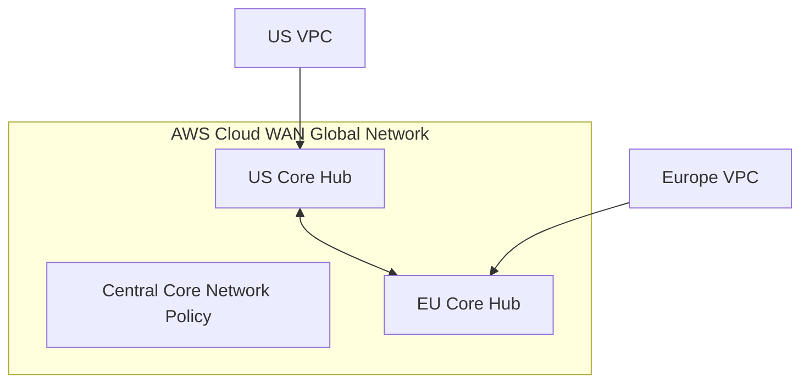

# AWS Cloud WAN

## 1. Overview & Real-World Analogy

**Real-World Analogy:** A centralized corporate railway network management system: you define a single layout schema policy, and new train tracks (VPCs/on-premise routes) automatically register and peer.

AWS Cloud WAN is a managed wide area network (WAN) service that connects on-premises branch offices, data centers, and VPCs across the AWS global infrastructure.

---

## 2. Architecture & Flow Diagram

---

## 3. Comparison & Decision Guidance

| Metric | AWS Cloud WAN | Transit Gateway Peering |
| :--- | :--- | :--- |
| **Routing Management** | Centralized Policy-Based | Manual, decentralized route table entries |
| **Global Reach** | Native multi-region backbone routing | Manual peer routing between regions |
| **Scale** | Global enterprise scale | Multi-region hubs (high overhead) |

### When to use
- When designing high-scale, production-ready solutions on AWS.
- To enforce operational excellence and follow security best practices.

### When not to use
- For basic prototyping where native defaults are sufficient.

---

## 4. Key Performance, Cost & Security Considerations

### Performance Impact
Leverages the AWS high-speed global fiber network to optimize multi-region traffic routing.

### Cost Impact
Charged per core network hub connection hour and data processing usage metrics.

### Security Implications
Enforces segmentation policies across core regions to isolate development and production traffic.

---

## 5. Exam tips & Traps

:::tip
**Exam Clues:** cloud wan, global network policy, core network hub, multi-region routing segmentation

Use Cloud WAN when managing multi-region, multi-account enterprise global networks, avoiding manual Transit Gateway peerings.
:::

:::warning
**Common Exam Traps:** Updating core policy documents requires a review and validation execution phase before deployment to prevent outages.
:::

---

## Prerequisites

- [Gateway Load Balancer](gateway-load-balancer.md)

## Recommended Next Topics

- [Transit Gateway Routing Deep Dive](transit-gateway-route-tables.md)

## Related Topics

- [Route 53 Resolvers (Hybrid DNS)](route53-resolver.md)
- [Gateway Load Balancer](gateway-load-balancer.md)
- [Transit Gateway Routing Deep Dive](transit-gateway-route-tables.md)
