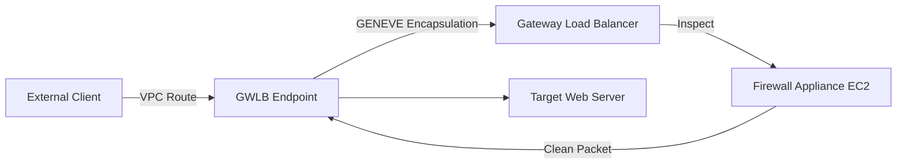

# Gateway Load Balancer

## 1. Overview & Real-World Analogy

**Real-World Analogy:** A security screening line at the airport: all baggage (network packets) is diverted to a team of inspectors (firewalls) before being returned to the original conveyor belt.

AWS Gateway Load Balancer (GWLB) makes it easy to deploy, scale, and manage virtual network appliances, such as firewalls, intrusion detection systems (IDS), and deep packet inspection systems.

---

## 2. Architecture & Flow Diagram

---

## 3. Comparison & Decision Guidance

| Load Balancer | Network Load Balancer (NLB) | Gateway Load Balancer (GWLB) |
| :--- | :--- | :--- |
| **Protocol** | Layer 4 TCP/UDP | Layer 3 IP packets (using GENEVE encapsulation) |
| **Target Workload** | High-throughput backend databases/web servers | Security inspection firewalls and IDS appliances |

### When to use
- When designing high-scale, production-ready solutions on AWS.
- To enforce operational excellence and follow security best practices.

### When not to use
- For basic prototyping where native defaults are sufficient.

---

## 4. Key Performance, Cost & Security Considerations

### Performance Impact
Uses GENEVE encapsulation to maintain source IP and destination IP headers during firewall routing loops.

### Cost Impact
Billed per Gateway Load Balancer instance hour and LCU data processing usage.

### Security Implications
Ensures centralized, inline inspection of all inbound and outbound traffic paths across accounts.

---

## 5. Exam tips & Traps

:::tip
**Exam Clues:** gateway load balancer, gwlb, geneve encapsulation, port 6081, virtual appliance, bump-in-the-wire

Look for GWLB in architectures requiring transparent third-party firewall inspection zones (bump-in-the-wire design).
:::

:::warning
**Common Exam Traps:** Verify that virtual security appliances are configured to decapsulate GENEVE packets on port 6081.
:::

---

## Prerequisites

- [AWS VPC Lattice](Traffic Management/AWS VPC Lattice.md)

## Recommended Next Topics

- [AWS Cloud WAN](cloud-wan.md)

## Related Topics

- [Route 53 Resolvers (Hybrid DNS)](route53-resolver.md)
- [AWS Cloud WAN](cloud-wan.md)
- [Transit Gateway Routing Deep Dive](transit-gateway-route-tables.md)
