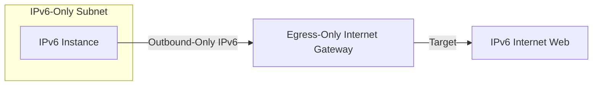

# IPv6 VPC Architectures

## 1. Overview & Real-World Analogy

**Real-World Analogy:** Upgrading a city mailing system from a short, congested phone extension code directory to a global unique zip code system where every mailbox has a distinct number.

AWS supports IPv6 configurations. This page details designing dual-stack and IPv6-only VPC architectures, routing tables, and using Egress-Only Internet Gateways.

---

## 2. Architecture & Flow Diagram

---

## 3. Comparison & Decision Guidance

| Gateway Type | Internet Gateway (IGW) | Egress-Only Internet Gateway (EIGW) |
| :--- | :--- | :--- |
| **Traffic Path** | Bi-directional (Inbound + Outbound) | Outbound-only |
| **IP Protocols** | IPv4 and IPv6 | IPv6 only |
| **NAT Required?**| Yes (for private IPv4 NAT) | No (IPv6 addresses are globally unique) |

### When to use
- When designing high-scale, production-ready solutions on AWS.
- To enforce operational excellence and follow security best practices.

### When not to use
- For basic prototyping where native defaults are sufficient.

---

## 4. Key Performance, Cost & Security Considerations

### Performance Impact
IPv6 routes bypass NAT gateways, eliminating performance choke points and NAT latency.

### Cost Impact
IPv6 addresses are free of charge. Egress-Only Internet Gateways are free, unlike NAT Gateways ($0.045/hour + data fees).

### Security Implications
Use Egress-Only Internet Gateways to block unsolicited inbound connections from the internet to your IPv6 resources.

---

## 5. Exam tips & Traps

:::tip
**Exam Clues:** ipv6 architecture, egress-only internet gateway, nat64 dns64, dual-stack subnet

Use NAT64 and DNS64 to enable legacy, IPv4-only external services to communicate with your new IPv6-only instances.
:::

:::warning
**Common Exam Traps:** An Egress-Only Internet Gateway is for IPv6 only; it cannot route or secure IPv4 traffic paths.
:::

---

## Prerequisites

- [Transit Gateway Appliance Mode](transit-gateway-appliance-mode.md)

## Recommended Next Topics

- [Amazon Cognito](../Security, Identity & Compliance/Identity & Access Management/Amazon Cognito.md)

## Related Topics

- [Route 53 Resolvers (Hybrid DNS)](route53-resolver.md)
- [Gateway Load Balancer](gateway-load-balancer.md)
- [AWS Cloud WAN](cloud-wan.md)
