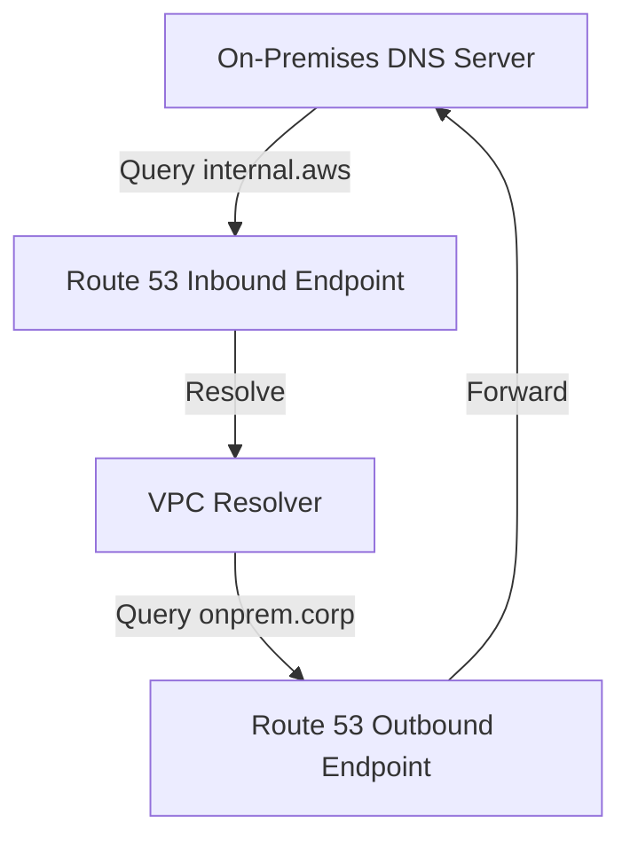

# Route 53 Resolvers (Hybrid DNS)

## 1. Overview & Real-World Analogy

**Real-World Analogy:** A corporate telephone switchboard operator: if you dial an internal corporate extension, they route the call to the office phone system; if you dial an external extension, they route it out.

AWS Route 53 Resolvers enable hybrid DNS resolution across VPCs and on-premises networks using Inbound and Outbound Endpoints.

---

## 2. Architecture & Flow Diagram

---

## 3. Comparison & Decision Guidance

| Endpoint Type | Traffic Direction | Target DNS Resolver |
| :--- | :--- | :--- |
| **Inbound Endpoint** | On-premises → AWS VPC | VPC local resolver (169.254.169.253) |
| **Outbound Endpoint** | AWS VPC → On-premises | On-premises local DNS server |

### When to use
- When designing high-scale, production-ready solutions on AWS.
- To enforce operational excellence and follow security best practices.

### When not to use
- For basic prototyping where native defaults are sufficient.

---

## 4. Key Performance, Cost & Security Considerations

### Performance Impact
Endpoints scale dynamically to handle high DNS query volumes, ensuring fast name resolution.

### Cost Impact
Billed per resolver endpoint network interface hour, plus query processing fees.

### Security Implications
Requires target IP mappings and security groups to permit DNS traffic over port 53.

---

## 5. Exam tips & Traps

:::tip
**Exam Clues:** route53 resolver, inbound resolver endpoint, outbound resolver endpoint, hybrid dns resolution

Configure Outbound Resolver Rules to forward requests for your corporate domain (e.g. `*.corp`) to on-premises IP addresses.
:::

:::warning
**Common Exam Traps:** Do not attempt to route DNS traffic without enabling active VPN or Direct Connect routes between networks.
:::

---

## Prerequisites

- [Global Traffic Management](CDN & DNS/Global Traffic Management.md)

## Recommended Next Topics

- [AWS PrivateLink](Hybrid Connectivity/AWS PrivateLink.md)

## Related Topics

- [Gateway Load Balancer](gateway-load-balancer.md)
- [AWS Cloud WAN](cloud-wan.md)
- [Transit Gateway Routing Deep Dive](transit-gateway-route-tables.md)
