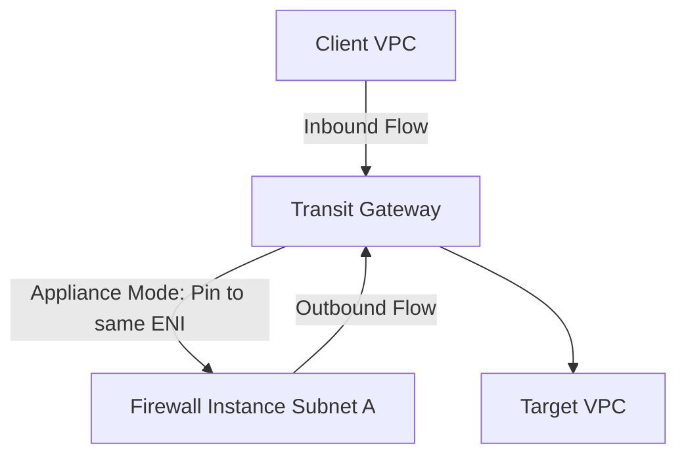

# Transit Gateway Appliance Mode

## 1. Overview & Real-World Analogy

**Real-World Analogy:** A single, central security line at the airport: all travelers going from gate A to gate B must walk through the same metal detector lane, preventing them from skipping checks.

Transit Gateway Appliance Mode ensures that stateful network appliances (such as firewalls) in a shared VPC inspect both direction paths of a network flow, preventing asymmetric routing.

---

## 2. Architecture & Flow Diagram

---

## 3. Comparison & Decision Guidance

| Mode | Appliance Mode Enabled | Appliance Mode Disabled |
| :--- | :--- | :--- |
| **Routing Flow** | Symmetric (source/destination use same firewall AZ ENI) | Asymmetric (return packets may route to a different firewall AZ ENI) |
| **Firewall State** | Works correctly (stateful tables validate packet) | Drops packet (firewall sees return packet without start handshake) |

### When to use
- When designing high-scale, production-ready solutions on AWS.
- To enforce operational excellence and follow security best practices.

### When not to use
- For basic prototyping where native defaults are sufficient.

---

## 4. Key Performance, Cost & Security Considerations

### Performance Impact
Ensures stateful firewall appliances do not drop valid return connections due to split routing paths.

### Cost Impact
No additional cost for enabling appliance mode on the TGW VPC attachment.

### Security Implications
Critical configuration to enable reliable, stateful security appliance inspection zones across accounts.

---

## 5. Exam tips & Traps

:::tip
**Exam Clues:** appliance mode, asymmetric routing, stateful firewall drop, return traffic destination, tgw attachment

Always enable Appliance Mode on the Transit Gateway VPC attachment pointing to the security/firewall VPC.
:::

:::warning
**Common Exam Traps:** If Appliance Mode is disabled, stateful packet filters will drop return traffic because they do not see the initial SYN handshake.
:::

---

## Prerequisites

- [Transit Gateway Routing Deep Dive](transit-gateway-route-tables.md)

## Recommended Next Topics

- [IPv6 VPC Architectures](ipv6-architectures.md)

## Related Topics

- [Route 53 Resolvers (Hybrid DNS)](route53-resolver.md)
- [Gateway Load Balancer](gateway-load-balancer.md)
- [AWS Cloud WAN](cloud-wan.md)
