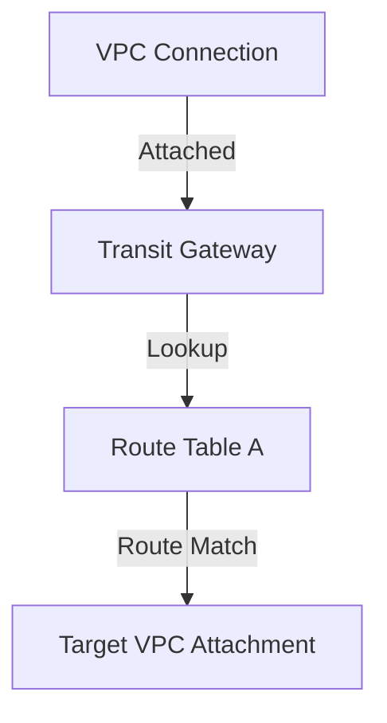

# Transit Gateway Routing Deep Dive

## 1. Overview & Real-World Analogy

**Real-World Analogy:** A corporate logistics sorting center: packages arrive from various warehouses (VPCs) and are sorted onto outgoing delivery trucks based on specific shipping manifests (route tables).

Transit Gateway (TGW) routes traffic between attached VPCs, VPNs, and Direct Connect connections using route tables, associations, propagations, and route filters.

---

## 2. Architecture & Flow Diagram

---

## 3. Comparison & Decision Guidance

| Route Term | Meaning | Use Case |
| :--- | :--- | :--- |
| **Association** | Links an attachment to a specific route table | Directs incoming traffic to lookup table |
| **Propagation** | Dynamically pushes routes from attachment to table | Automates route updates from VPC/BGP |
| **Static Route** | Manually written route entry | Directs traffic to firewall virtual appliances |

### When to use
- When designing high-scale, production-ready solutions on AWS.
- To enforce operational excellence and follow security best practices.

### When not to use
- For basic prototyping where native defaults are sufficient.

---

## 4. Key Performance, Cost & Security Considerations

### Performance Impact
TGW attachments support up to 50 Gbps network burst capacity per VPC, handling high-speed traffic routing.

### Cost Impact
Billed per Transit Gateway attachment hour, plus data processing costs per GB.

### Security Implications
Create separate route tables to isolate development, staging, and production VPC attachments (segmentation).

---

## 5. Exam tips & Traps

:::tip
**Exam Clues:** transit gateway routing, tgw association, propagation, static routing, route table segmentation

To block spoke-to-spoke VPC communications in a hub-and-spoke design, associate spokes with a route table containing no routes to other spokes.
:::

:::warning
**Common Exam Traps:** An attachment can be associated with only one TGW route table, but it can propagate routes to multiple TGW route tables.
:::

---

## Prerequisites

- [AWS Cloud WAN](cloud-wan.md)

## Recommended Next Topics

- [Transit Gateway Appliance Mode](transit-gateway-appliance-mode.md)

## Related Topics

- [Route 53 Resolvers (Hybrid DNS)](route53-resolver.md)
- [Gateway Load Balancer](gateway-load-balancer.md)
- [AWS Cloud WAN](cloud-wan.md)
