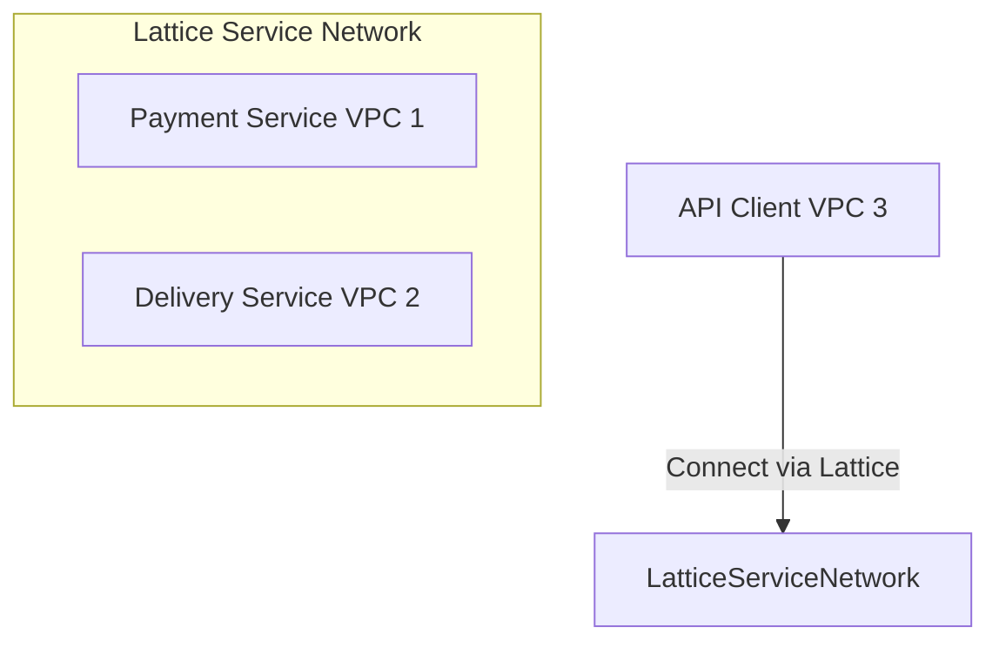

# Amazon VPC Lattice

## 1. Overview & Real-World Analogy

**Real-World Analogy:** An airport transit terminal that connects all gates (services) using a standardized shuttle line, regardless of which airline (VPC/Account) they run on.

Amazon VPC Lattice is a fully managed application networking service that makes it easy to connect, secure, and monitor microservices across multiple VPCs and AWS accounts.

---

## 2. Architecture & Flow Diagram

---

## 3. Comparison & Decision Guidance

| Feature | VPC Lattice | Transit Gateway | VPC Peering |
| :--- | :--- | :--- | :--- |
| **Layer** | Layer 7 (HTTP/HTTPS/gRPC) | Layer 3 (IP Routing) | Layer 3 (IP Routing) |
| **Setup** | Service-directory association | Complex route table mappings | Pairwise subnet peering |
| **Overlap CIDR**| Allowed | Blocked | Blocked |

### When to use
- When designing high-scale, production-ready solutions on AWS.
- To enforce operational excellence and follow security best practices.

### When not to use
- For basic prototyping where native defaults are sufficient.

---

## 4. Key Performance, Cost & Security Considerations

### Performance Impact
Integrates with AWS network routing, managing traffic routing at the API level with minimal latency overhead.

### Cost Impact
Billed per service configured, plus data processing fees and connection logs usage.

### Security Implications
Supports fine-grained Auth policies (AWS IAM auth, SigV4 authorization) and integrates with AWS Secrets Manager.

---

## 5. Exam tips & Traps

:::tip
**Exam Clues:** vpc lattice, service network, application networking, http grpc routing, sigv4 authentication

Use VPC Lattice to connect multi-account container microservices without managing complex IP routing matrices.
:::

:::warning
**Common Exam Traps:** VPC Lattice only supports HTTP, HTTPS, and gRPC. It cannot route raw TCP/UDP workloads like databases.
:::

---

## Prerequisites

- [AWS Transfer Family](../Migration & Transfer/File Transfer/AWS Transfer Family.md)

## Recommended Next Topics

- [AWS WAF (Web Application Firewall)](../Security, Identity & Compliance/waf.md)

## Related Topics

- [Route 53 Resolvers (Hybrid DNS)](route53-resolver.md)
- [Gateway Load Balancer](gateway-load-balancer.md)
- [AWS Cloud WAN](cloud-wan.md)
