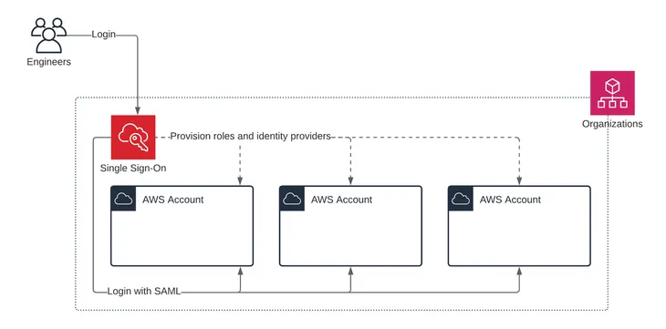

# AWS IAM Identity Center
## 1. Introduction

AWS IAM Identity Center provides a unified sign-on experience that consolidates access to multiple AWS accounts, business cloud applications, and even EC2 Windows Instances. By requiring only one set of credentials, it eliminates the overhead associated with managing multiple logins, thus simplifying the authentication process. This service is critical in modern cloud environments where organizations operate numerous AWS accounts within an AWS Organization and rely on a variety of external cloud applications. The single sign-on capability not only enhances security but also improves the user experience by providing seamless access to resources.

## 2. Core Concepts

### 2.1. Evolution from AWS SSO

The AWS IAM Identity Center service is the natural evolution of the AWS Single Sign-On service. While the underlying functionality remains consistent, the rebranding to IAM Identity Center underscores an expansion in its capabilities and integrations. The core principle of providing a single login for all associated resources is preserved, but with added support for a broader range of applications and enhanced security features. This evolution reflects AWS’s commitment to improving centralized identity management while maintaining compatibility with legacy setups.

### 2.2. Key Capabilities

At its core, AWS IAM Identity Center delivers several critical capabilities:

- **Unified Login Portal:** Users access all their AWS accounts, business cloud applications (such as Salesforce, Box, Microsoft 365, and any SAML 2.0-enabled application), and EC2 Windows Instances through one secure login.
- **Simplified Access Management:** The service streamlines user authentication, eliminating the need to repeatedly enter credentials across different AWS accounts and applications.
- **SAML 2.0 Integration:** By leveraging industry-standard SAML 2.0, the Identity Center supports seamless integration with a broad ecosystem of cloud applications, ensuring a consistent user experience.
- **Centralized Control:** IT administrators can manage access to multiple resources from a single location, significantly reducing the complexity of account and permission management across large organizations.

## 3. Identity Management

Effective identity management is a cornerstone of secure cloud operations. AWS IAM Identity Center supports robust identity management through its flexible integration options.

### 3.1. Built-In vs. Third-Party Identity Providers

AWS IAM Identity Center allows organizations to choose between two primary methods of storing and managing user identities:

- **Built-In Identity Store:** This native option enables administrators to create and manage users and groups directly within the Identity Center. It provides a straightforward approach for organizations that prefer to manage identities without external dependencies.
- **Third-Party Identity Providers:** For organizations that already have established identity management solutions, AWS IAM Identity Center can integrate with external providers such as Active Directory (both on-premises and cloud-based), OneLogin, Okta, and others. This integration facilitates centralized user management and extends existing security policies to cloud resources.

The choice between a built-in store and third-party identity providers depends on an organization’s existing infrastructure, compliance requirements, and scalability needs.

### 3.2. Integrating Active Directory (On-Premises/Cloud)
Active Directory (AD) remains one of the most widely used directory services for managing user identities and access permissions. AWS IAM Identity Center seamlessly integrates with AD, whether it is hosted on-premises or in the cloud. This integration enables organizations to leverage their existing AD infrastructure for user authentication and group management while extending its benefits to AWS resources. By connecting AD with the Identity Center, administrators can synchronize users and groups, ensuring consistency in access control policies across both on-premises systems and cloud environments. This integration is pivotal for enterprises looking to maintain a unified identity management framework without rearchitecting their existing setups.

### 3.3. Automatic User Provisioning via SCIM (Exam Tip)
For organizations utilizing external Identity Providers (IdPs) like Okta, Microsoft Azure AD (Entra ID), or PingOne, managing users manually is inefficient and insecure.
- **SCIM (System for Cross-domain Identity Management):** SCIM is an open standard protocol that automates the exchange of user identity information between your IdP and AWS IAM Identity Center.
- **Key Capabilities & Flow:**
    1. **Automatic Sync:** When enabled, any changes to users or groups in the external IdP (such as creation, attribute updates, or group membership changes) are pushed automatically to AWS IAM Identity Center via API endpoints.
    2. **Instant De-provisioning (Security Guardrail):** When an employee leaves the company and is disabled in the corporate directory, the IdP sends an API call via SCIM to instantly disable or delete their user record in AWS. This eliminates the security risk of "orphaned accounts."
- **Configuration:** Enabling SCIM in the IAM Identity Center console generates a unique **SCIM Endpoint URL** and a **Bearer Access Token**. These values must be configured inside the IdP application settings.

## 4. Access Workflow

The user access workflow in AWS IAM Identity Center is designed to provide a seamless and secure experience:

1. **User Authentication:** The process begins at the dedicated login page of the AWS IAM Identity Center. Users enter their credentials, which may be verified against either the built-in identity store or an integrated third-party provider.
2. **Centralized Dashboard:** Upon successful authentication, users are presented with a centralized dashboard. This portal displays the list of AWS accounts, business applications, and EC2 Windows Instances available for access.
3. **Account Selection and Role Assumption:** Users select the AWS account or application they wish to access. Behind the scenes, the system automatically assigns an IAM role based on predefined permission sets, ensuring that users receive the appropriate level of access without requiring additional login steps.
4. **Seamless Transition:** The user is redirected to the selected resource (e.g., the AWS Management Console for a specific account) with their permissions in place, all without the need to re-enter credentials.

This streamlined flow not only enhances the user experience by reducing friction but also strengthens security by centralizing authentication and access control.

## 5. Managing Permissions

Central to AWS IAM Identity Center is its permission management framework. This framework revolves around the concept of “permission sets”:

- **Permission Sets:** These are collections of IAM policies that define the specific access rights a user or group has across AWS resources. Rather than managing individual permissions per resource, administrators can create permission sets that encapsulate a predefined set of capabilities.
- **Association with Users and Groups:** Permission sets are assigned to users or groups, thereby granting them the corresponding IAM roles in the targeted AWS accounts. For instance, an administrator might create a permission set that grants full administrative access to a development environment and another that provides read-only access to a production environment.
- **Automated Role Creation:** Once a permission set is associated with an AWS account, the system automatically creates the corresponding IAM role. This role assumption process is transparent to the user, who simply logs in via the IAM Identity Center and is granted the appropriate access level.
- **Fine-Grained Permissions:** AWS IAM Identity Center supports attribute-based access control (ABAC), which allows administrators to fine-tune access by leveraging user attributes. Attributes such as department, role, cost center, or geographic location can be used to dynamically adjust permissions, reducing the need for manual updates when user attributes change.

This centralized permission management system simplifies the administrative workload and ensures that access rights remain consistent and secure across the organization.

## 6. Multi-Account and Application Access

Organizations with complex AWS environments often operate multiple accounts segmented by business units, development stages, or geographic regions. AWS IAM Identity Center is designed to efficiently manage access in such scenarios:

- **Multi-Account Management:** By integrating with AWS Organizations, the Identity Center allows administrators to define permission sets that apply across multiple accounts. For example, developers in a company may be granted full administrative access to a development organizational unit (OU) while receiving read-only access in a production OU.
- **Application Assignments:** Beyond AWS accounts, the service extends single sign-on to a wide array of business applications. Administrators can specify which users or groups are allowed to access specific applications. The system then provides the necessary URLs, certificates, and metadata to facilitate seamless SSO to these applications.
- **Attribute-Based Access Control (ABAC):** With ABAC, fine-grained access decisions can be made based on user-specific attributes stored within the Identity Center. This approach allows organizations to manage permissions dynamically. For instance, changes to a user’s cost center or job title can automatically adjust their access rights across AWS accounts and connected applications, ensuring that permissions remain aligned with the user’s current role.
- **Automated Role Assumption:** When a user logs in, they automatically assume the corresponding IAM role in the chosen AWS account, reflecting the permission sets assigned to them. This dynamic role assignment is essential in environments where users may need access to multiple accounts without the overhead of managing separate credentials for each one.

By centralizing multi-account and application access, AWS IAM Identity Center ensures that security policies are consistently enforced, and user experiences remain uniform across diverse systems.

## 7. Conclusion

By centralizing user authentication and access control, AWS IAM Identity Center not only streamlines operational workflows but also enhances security and compliance across an organization’s digital ecosystem. Organizations operating across multiple AWS accounts and diverse application landscapes will find that the service’s capabilities significantly reduce administrative overhead while ensuring that access rights are tightly controlled and dynamically managed. This centralized approach to identity management is a key enabler for secure and efficient cloud operations in today’s fast-paced digital environment.

---

## Prerequisites

- [AWS Directory Services](AWS Directory Services.md)

## Recommended Next Topics

- [AWS Identity and Access Management (IAM)](AWS Identity and Access Management.md)

## Related Topics

- [Amazon Cognito](Amazon Cognito.md)
- [AWS Directory Services](AWS Directory Services.md)
- [AWS Identity and Access Management (IAM)](AWS Identity and Access Management.md)
