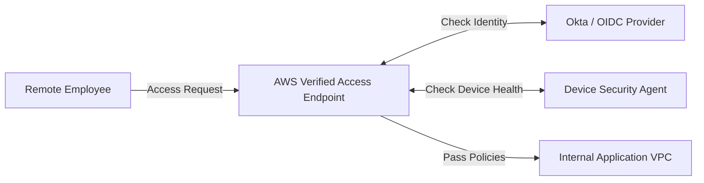

# AWS Verified Access

:::note
**Real-World Analogy:** A corporate VPN replacement: you log in once using your enterprise portal account (OIDC/Okta), and the gateway checks your device health before letting you read files.
:::

AWS Verified Access provides secure, VPN-less access to corporate applications. Built using AWS Zero Trust principles, it evaluates each access request in real-time based on user identity and device posture, ensuring that only authorized users can access specific applications.

## Architecture Flow Diagram

---

## Key Components

- **Verified Access Endpoint:** The entry point for your application (e.g., Load Balancer, ENI).
- **Verified Access Group:** A grouping of applications with similar security requirements.
- **Trust Provider:** An identity provider (IdP) or device management system that provides information about the user or device (e.g., IAM Identity Center, Okta, CrowdStrike).
- **Verified Access Policy:** A set of rules (written in Cedar policy language) that define who can access the application under what conditions.

## Benefits

- **VPN-less Experience:** Users can access internal applications from anywhere without needing a VPN client.
- **Zero Trust Security:** Every request is verified, moving away from "perimeter-based" security.
- **Improved User Experience:** Simplifies access for employees and reduces IT overhead.
- **Centralized Management:** Manage access policies for multiple applications from a single location.

## How it Works

1. A user attempts to access an internal application.
2. Verified Access intercepts the request and evaluates it against the defined policy.
3. It checks user identity from the Trust Provider and device posture from the device management system.
4. If the conditions are met, the request is forwarded to the application endpoint.

## Exam Tips (SAP-C02)

- **VPN Replacement:** If the requirement is to provide secure access to internal apps without the complexity of a VPN, Verified Access is the answer.
- **Zero Trust:** Often associated with scenarios requiring real-time verification of both user and device state.
- **Policy Language:** Uses **Cedar**, which is also used by Amazon Verified Permissions.
- **Compliance:** Helps in meeting compliance requirements by providing detailed logs of all access requests.

## Comparison & Decision Guidance

| Connection Type | AWS Verified Access | Corporate Client VPN |
| :--- | :--- | :--- |
| **Agent Required?**| No (Browser-based) | Yes (Client VPN Software) |
| **Trust Model** | Zero Trust (Checks identity + device state per call) | Per-session Network Trust (Access to subnet CIDR) |
| **Scale** | Fully managed scale | Requires sizing VPN servers |

### When to use
- When designing high-scale, production-ready solutions on AWS.
- To enforce operational excellence and follow security best practices.

### When not to use
- For basic prototyping where native defaults are sufficient.

---

---

## Exam Tips & Traps

:::tip
**Exam Clues:** verified access, zero trust client, vpn-less access, device health check, oidc authentication

Look for "Zero Trust app access", "VPN-less corporate app access", or identity-based application routes in the exam.
:::

:::warning
**Common Exam Traps:** AVA requires integration with an external OIDC-compliant Identity Provider (IdP); you cannot manage users inside AVA itself.
:::

---

## Prerequisites

- [Amazon Verified Permissions](Amazon Verified Permissions.md)

## Recommended Next Topics

- [AWS Active Directory Integration](../active-directory-integration.md)

## Related Topics

- [Amazon Cognito](Amazon Cognito.md)
- [AWS Directory Services](AWS Directory Services.md)
- [AWS IAM Identity Center](AWS IAM Identity Center.md)
