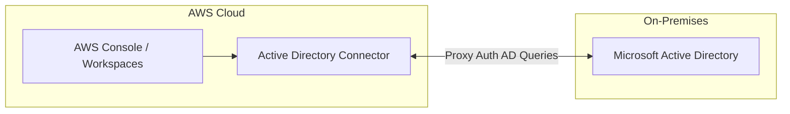

# AWS Active Directory Integration

## 1. Overview & Real-World Analogy

**Real-World Analogy:** Establishing a diplomatic passport treaty: you keep your passport system at home (On-premises AD) but AWS trust stamps it, allowing citizens to enter the border without getting a new ID.

AWS Active Directory integration enables you to connect AWS applications and resources to your existing Microsoft Active Directory, using Active Directory Connector, AWS Managed Microsoft AD, or Trust Relationships.

---

## 2. Architecture & Flow Diagram

---

## 3. Comparison & Decision Guidance

| Method | AD Connector | Managed Microsoft AD | trust relationship |
| :--- | :--- | :--- | :--- |
| **Directory Service**| Direct proxy wrapper | Fully functional AWS-hosted AD | Two-way forest trust link |
| **Database Sync?** | No database sync (real-time auth proxy) | Syncs local users to cloud database | Real-time delegation trust |
| **Best For** | On-premises auth proxy | Cloud-native workloads | Enterprise migrations |

### When to use
- When designing high-scale, production-ready solutions on AWS.
- To enforce operational excellence and follow security best practices.

### When not to use
- For basic prototyping where native defaults are sufficient.

---

## 4. Key Performance, Cost & Security Considerations

### Performance Impact
Reduces directory lookup times by caching credentials locally in cloud configurations.

### Cost Impact
AD Connector is highly cost-effective; Managed AD charges hourly rates based on directory sizes.

### Security Implications
Maintains password policies and authorization controls on-premises, avoiding credential replication.

---

## 5. Exam tips & Traps

:::tip
**Exam Clues:** active directory integration, ad connector, managed microsoft ad, forest trust, federation AD

Use AD Connector when you only need to authenticate AWS users against an on-premises directory without copying data.
:::

:::warning
**Common Exam Traps:** AD Connector requires active VPN/Direct Connect routing paths; if connection drops, cloud authentication fails.
:::

---

## Prerequisites

- [AWS Verified Access](Identity & Access Management/AWS Verified Access.md)

## Recommended Next Topics

- [AWS Certificate Manager](Data Protection & Encryption/AWS Certificate Manager.md)

## Related Topics

- [Amazon Macie](macie.md)
- [AWS Shield Advanced](shield-advanced.md)
