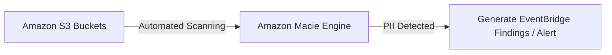

# Amazon Macie

## 1. Overview & Real-World Analogy

**Real-World Analogy:** A compliance auditor who opens every box in your storage warehouse (S3) to check if anyone stored confidential customer documents (PII) like credit cards.

Amazon Macie is a fully managed data security and data privacy service that uses machine learning and pattern matching to discover and protect sensitive data in Amazon S3.

---

## 2. Architecture & Flow Diagram

---

## 3. Comparison & Decision Guidance

| Search Scope | Macie | GuardDuty |
| :--- | :--- | :--- |
| **Primary Target** | S3 object content data (PII, credentials) | AWS account access logs (behavior) |
| **Technology** | Regular expressions and machine learning | Threat intelligence and logs |

### When to use
- When designing high-scale, production-ready solutions on AWS.
- To enforce operational excellence and follow security best practices.

### When not to use
- For basic prototyping where native defaults are sufficient.

---

## 4. Key Performance, Cost & Security Considerations

### Performance Impact
Performs asynchronous background object analysis, causing zero request latency impact to S3 operations.

### Cost Impact
Billed per GB of data processed in S3 bucket scans, and per bucket analyzed.

### Security Implications
Essential compliance tool to locate customer credit cards, SSNs, and private keys stored in public buckets.

---

## 5. Exam tips & Traps

:::tip
**Exam Clues:** macie, pii discovery, s3 content analysis, personal data detection, credentials check

Target Macie scans at specific paths and files using size or type exclusions to optimize scanning budgets.
:::

:::warning
**Common Exam Traps:** Macie cannot scan encrypted S3 objects unless its service role has decrypt permissions on the KMS customer managed keys.
:::

---

## Prerequisites

- [AWS Macie](Data Protection & Encryption/AWS Macie.md)

## Recommended Next Topics

- [AWS Firewall Manager](Network Security/AWS Firewall Manager.md)

## Related Topics

- [AWS Active Directory Integration](active-directory-integration.md)
- [AWS Shield Advanced](shield-advanced.md)
- [AWS WAF (Web Application Firewall)](waf.md)
