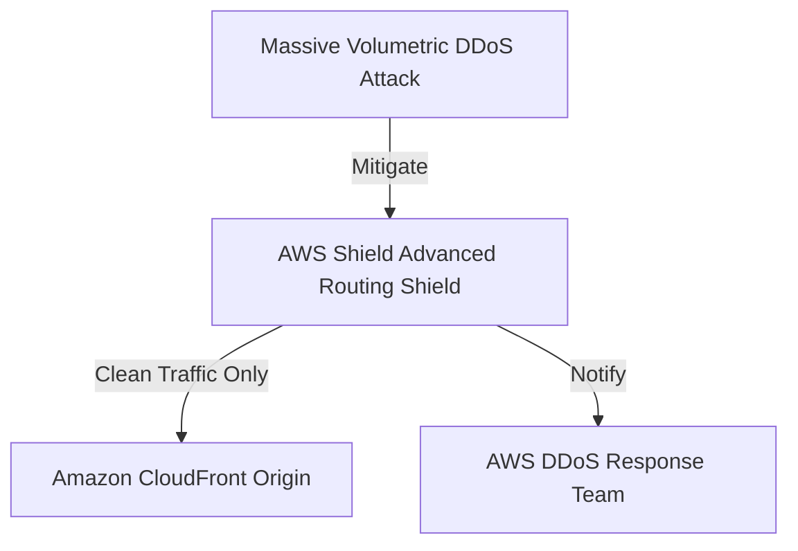

# AWS Shield Advanced

## 1. Overview & Real-World Analogy

**Real-World Analogy:** An insurance policy with dedicated security responders: the basic coverage keeps standard rain out (Shield Standard), while the premium plan provides structural protection during a massive hurricane (Shield Advanced).

AWS Shield is a managed Distributed Denial of Service (DDoS) protection service. Shield Standard is enabled by default. Shield Advanced provides additional protection, mitigation, and financial coverage for scaling costs.

---

## 2. Architecture & Flow Diagram

---

## 3. Comparison & Decision Guidance

| Feature | Shield Standard | Shield Advanced |
| :--- | :--- | :--- |
| **Cost** | Free (Included) | $3,000/month per account flat subscription fee |
| **SRT Support?**| No | Yes (24/7 direct access to DDoS Response Team) |
| **Cost Protection**| No | Yes (Covers scaling bill spikes from DDoS attacks) |

### When to use
- When designing high-scale, production-ready solutions on AWS.
- To enforce operational excellence and follow security best practices.

### When not to use
- For basic prototyping where native defaults are sufficient.

---

## 4. Key Performance, Cost & Security Considerations

### Performance Impact
Performs packet validation at the AWS border network layer, preventing attack traffic from reaching compute nodes.

### Cost Impact
Subscription costs $3,000/month, plus data transfer fees. Includes cost protection for ELB, CloudFront, and Route 53 scaling fees.

### Security Implications
Protects against Layer 3, 4, and 7 volumetric and application-layer DDoS attacks.

---

## 5. Exam tips & Traps

:::tip
**Exam Clues:** shield advanced, ddos response team srt, volumetric attack mitigation, billing protection ddos

Look for "Shield Advanced" when requirements mention 24/7 DDoS support, financial protection against scaling bills, or volumetric attacks.
:::

:::warning
**Common Exam Traps:** Do not subscribe to Shield Advanced for small-scale applications, as the $3,000 monthly flat subscription fee is prohibitive.
:::

---

## Prerequisites

- [Amazon Inspector](Security Monitoring & Threat Detection/Amazon Inspector.md)

## Recommended Next Topics

- [AWS Organizations](../Management & Governance/Governance & Compliance/AWS Organizations.md)

## Related Topics

- [AWS Active Directory Integration](active-directory-integration.md)
- [Amazon Macie](macie.md)
