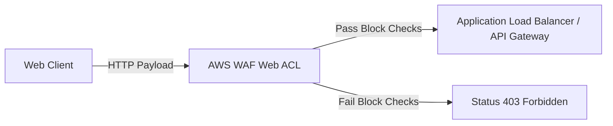

# AWS WAF (Web Application Firewall)

## 1. Overview & Real-World Analogy

**Real-World Analogy:** A security guard checking bags at a concert entrance: they look for specific banned objects like SQL injections, cross-site scripts, or bot patterns before letting people enter.

AWS WAF is a web application firewall that helps protect web applications and APIs against common web exploits and bots that may affect availability, compromise security, or consume excessive resources.

---

## 2. Architecture & Flow Diagram

---

## 3. Comparison & Decision Guidance

| Layer | AWS WAF | Security Groups | AWS Network Firewall |
| :--- | :--- | :--- | :--- |
| **Layer Scope** | Layer 7 (HTTP payload, URL, headers) | Layer 3-4 (IP, Port) | Layer 3-7 (Full network flow) |
| **Remediation** | Blocks, challenges (CAPTCHA), logs | Blocks IP routing | Block rules, deep packet drop |

### When to use
- When designing high-scale, production-ready solutions on AWS.
- To enforce operational excellence and follow security best practices.

### When not to use
- For basic prototyping where native defaults are sufficient.

---

## 4. Key Performance, Cost & Security Considerations

### Performance Impact
Adds minimal sub-millisecond latency overhead to HTTP request streams.

### Cost Impact
Billed per Web ACL configured, per rule group added, and per million requests inspected.

### Security Implications
Protects against OWASP Top 10 exploits, SQL injection (SQLi), Cross-Site Scripting (XSS), and automated bot traffic.

---

## 5. Exam tips & Traps

:::tip
**Exam Clues:** waf, web acl, owasp top 10, sqli xss protection, rate-based rule block, cloudfront waf

Associate WAF with Amazon CloudFront distribution edge points to block threats before they reach your AWS origin infrastructure.
:::

:::warning
**Common Exam Traps:** AWS WAF cannot inspect encrypted network traffic unless it is attached to an AWS service that terminates SSL/TLS (CloudFront, ALB).
:::

---

## Prerequisites

- [Amazon VPC Lattice](../Networking & Content Delivery/vpc-lattice.md)

## Recommended Next Topics

- [AWS Storage Gateway](../Storage/Backup & Disaster Recovery/AWS Storage Gateway.md)

## Related Topics

- [AWS Active Directory Integration](active-directory-integration.md)
- [Amazon Macie](macie.md)
- [AWS Shield Advanced](shield-advanced.md)
