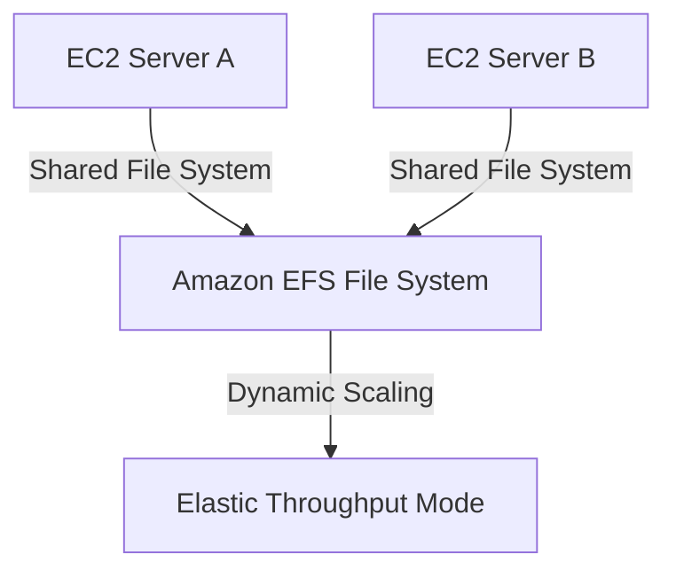

# EFS Performance & Throughput Modes

## 1. Overview & Real-World Analogy

**Real-World Analogy:** A library check-out system: General Purpose is a fast desk for standard student requests; Max I/O is a distributed multi-lane gate that handles massive lines of visitors but takes slightly longer to process each ticket.

Amazon EFS provides elastic, shared file storage. It offers two performance modes: General Purpose (lowest latency) and Max I/O (highest scale). It also offers three throughput modes: Elastic (pay-per-use scaling), Provisioned, and Bursting.

---

## 2. Architecture & Flow Diagram

---

## 3. Comparison & Decision Guidance

| Feature | General Purpose | Max I/O |
| :--- | :--- | :--- |
| **Primary Use Case** | Web servers, CI/CD, standard app directories | Large-scale parallel processing (Big Data, analytics) |
| **IOPS limit** | 35,000 IOPS | Unlimited scale-out IOPS |
| **File Latency** | Low latency | Higher file operation latency |

### When to use
- When designing high-scale, production-ready solutions on AWS.
- To enforce operational excellence and follow security best practices.

### When not to use
- For basic prototyping where native defaults are sufficient.

---

## 4. Key Performance, Cost & Security Considerations

### Performance Impact
Use Elastic Throughput mode to automatically scale throughput capacity to meet peaks up to 3 GiB/s, ideal for unpredictable workloads.

### Cost Impact
Elastic Throughput is billed per GB read/written. Provisioned is charged per MB/s provisioned. Use Lifecycle Management to transition cold files to EFS Infrequent Access (IA) to save up to 92%.

### Security Implications
Encrypt data in transit using TLS, and encrypt data at rest via KMS CMK. Enforce file access using IAM authorization policies.

---

## 5. Exam tips & Traps

:::tip
**Exam Clues:** efs performance, general purpose latency, max i/o scale, provisioned throughput, elastic throughput, lifecycle management

Choose General Purpose performance mode for almost all architectures unless you actively hit the 35k IOPS ceiling.
:::

:::warning
**Common Exam Traps:** EFS does not support Windows hosts natively over SMB; EFS is strictly optimized for Linux client mounts over NFSv4.
:::

---

## Prerequisites

- [Amazon Elastic File System (EFS)](Object, Block, & File Storage/Amazon Elastic File System.md)

## Recommended Next Topics

- [Amazon FSx](Object, Block, & File Storage/Amazon FSx.md)

## Related Topics

- [FSx for Windows File Server](fsx-windows.md)
- [FSx for Lustre](fsx-lustre.md)
- [FSx for NetApp ONTAP](fsx-ontap.md)
