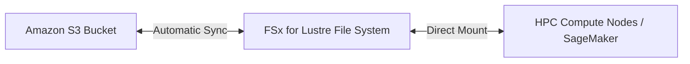

# FSx for Lustre

## 1. Overview & Real-World Analogy

**Real-World Analogy:** A super-fast, high-octane conveyor belt that loads data from S3 storage directly into high-powered processing engines (GPUs) for massive compute jobs, then puts results back.

Amazon FSx for Lustre is a fully managed, high-performance file system optimized for compute-intensive workloads, such as machine learning, high-performance computing (HPC), and video processing.

---

## 2. Architecture & Flow Diagram

---

## 3. Comparison & Decision Guidance

| Feature | Scratch Deployment | Persistent Deployment |
| :--- | :--- | :--- |
| **Data Durability** | Non-replicated (temporary storage) | Replicated across AZ (long-term) |
| **Cost** | Extremely low cost | Higher, covers replica overhead |
| **Primary Use Case** | Short analysis runs | Long-term modeling runs |

### When to use
- When designing high-scale, production-ready solutions on AWS.
- To enforce operational excellence and follow security best practices.

### When not to use
- For basic prototyping where native defaults are sufficient.

---

## 4. Key Performance, Cost & Security Considerations

### Performance Impact
Delivers sub-millisecond latencies and throughput of hundreds of gigabytes per second, with millions of IOPS scaling dynamically.

### Cost Impact
Scratch deployment is highly cost-effective for transient workloads. Set up automatic sync with S3 to minimize runtime disk usage.

### Security Implications
Fully integrated with AWS Key Management Service (KMS) for data encryption at rest, and respects VPC network route tables.

---

## 5. Exam tips & Traps

:::tip
**Exam Clues:** fsx for lustre, scratch vs persistent, high performance computing, s3 sync integration, hpc files

Use FSx for Lustre to load S3 dataset files into a high-speed file system, run GPU computing, and output logs back to S3.
:::

:::warning
**Common Exam Traps:** Do not use Scratch storage for persistent, long-lived data storage, as hardware failures in scratch storage will result in unrecoverable data loss.
:::

---

## Prerequisites

- [FSx for Windows File Server](fsx-windows.md)

## Recommended Next Topics

- [FSx for NetApp ONTAP](fsx-ontap.md)

## Related Topics

- [EFS Performance & Throughput Modes](efs-performance-modes.md)
- [FSx for Windows File Server](fsx-windows.md)
- [FSx for NetApp ONTAP](fsx-ontap.md)
