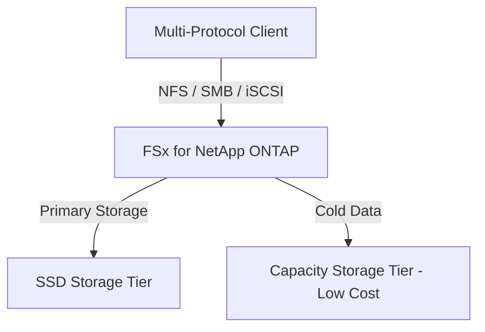

# FSx for NetApp ONTAP

## 1. Overview & Real-World Analogy

**Real-World Analogy:** A luxury multi-tool Swiss Army knife: it supports Windows folders (SMB), Linux folders (NFS), and raw database disks (iSCSI) all in one file system with advanced space-saving tech.

Amazon FSx for NetApp ONTAP is a fully managed service that provides popular NetApp ONTAP storage features, including multiprotocol access, snapshots, and data compression/deduplication.

---

## 2. Architecture & Flow Diagram

---

## 3. Comparison & Decision Guidance

| Protocol | FSx ONTAP | Amazon EFS |
| :--- | :--- | :--- |
| **Multi-protocol** | Yes (NFS, SMB, iSCSI simultaneously) | No (NFS only) |
| **Data Compression**| Yes (deduplication/compression) | No |
| **Tiering** | Auto tiering (SSD to Capacity) | IA lifecycle tiering |

### When to use
- When designing high-scale, production-ready solutions on AWS.
- To enforce operational excellence and follow security best practices.

### When not to use
- For basic prototyping where native defaults are sufficient.

---

## 4. Key Performance, Cost & Security Considerations

### Performance Impact
Uses SSD storage for performance-critical data, automatically tiering cold data to a capacity tier to save storage capacity.

### Cost Impact
Data compression and deduplication features can reduce net storage usage by up to 50% to optimize monthly spend.

### Security Implications
Supports SVM (Storage Virtual Machines) configuration, active directory integration, and VPC security groups.

---

## 5. Exam tips & Traps

:::tip
**Exam Clues:** fsx for netapp ontap, iscsi protocol, deduplication, compression, svm, multiprotocol storage

Use FSx for NetApp ONTAP to migrate on-premises NetApp workloads to AWS without rewriting storage controller integration scripts.
:::

:::warning
**Common Exam Traps:** Multiprotocol access requires careful management of user mappings between Active Directory and UNIX permissions.
:::

---

## Prerequisites

- [FSx for Lustre](fsx-lustre.md)

## Recommended Next Topics

- [FSx for OpenZFS](fsx-openzfs.md)

## Related Topics

- [EFS Performance & Throughput Modes](efs-performance-modes.md)
- [FSx for Windows File Server](fsx-windows.md)
- [FSx for Lustre](fsx-lustre.md)
