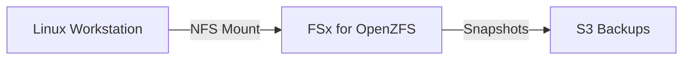

# FSx for OpenZFS

## 1. Overview & Real-World Analogy

**Real-World Analogy:** A high-speed drag racer: built on the open-source OpenZFS system to provide ultra-high IOPS and throughput with microsecond latency for Linux systems.

Amazon FSx for OpenZFS provides fully managed shared file storage built on the OpenZFS file system. It is designed to deliver high throughput and low latencies for Linux clients.

---

## 2. Architecture & Flow Diagram

---

## 3. Comparison & Decision Guidance

| Metric | Custom OpenZFS | Amazon EFS |
| :--- | :--- | :--- |
| **Latency** | Microsecond latency (&lt;1ms) | Millisecond latency (~1-3ms) |
| **File system** | OpenZFS | Standard NFSv4 |
| **Throughput** | Up to 12.5 GB/s | Up to 3 GiB/s |

### When to use
- When designing high-scale, production-ready solutions on AWS.
- To enforce operational excellence and follow security best practices.

### When not to use
- For basic prototyping where native defaults are sufficient.

---

## 4. Key Performance, Cost & Security Considerations

### Performance Impact
Delivers up to 1 million IOPS and high throughput rates, making it suitable for media editing and high-speed financial modeling.

### Cost Impact
Supports ZFS data compression, which dynamically reduces data footprint to optimize billing charges.

### Security Implications
Encrypts all data at rest via KMS customer managed keys, and supports security groups for VPC network control.

---

## 5. Exam tips & Traps

:::tip
**Exam Clues:** fsx for openzfs, microsecond latency, nfs file system, zfs compression, linux shared files

Use FSx for OpenZFS when you need higher performance scaling than standard EFS can provide for Linux-heavy application pools.
:::

:::warning
**Common Exam Traps:** OpenZFS does not support Windows Active Directory security boundaries natively; access is managed via NFS permissions.
:::

---

## Prerequisites

- [FSx for NetApp ONTAP](fsx-ontap.md)

## Recommended Next Topics

- [AWS Virtual Private Cloud (VPC)](../Networking & Content Delivery/Virtual Networking & Connectivity/Amazon VPC.md)

## Related Topics

- [EFS Performance & Throughput Modes](efs-performance-modes.md)
- [FSx for Windows File Server](fsx-windows.md)
- [FSx for Lustre](fsx-lustre.md)
