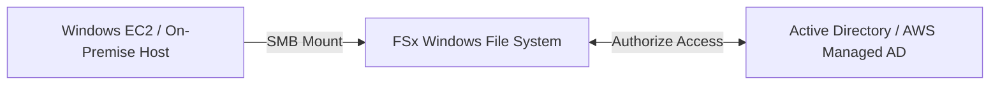

# FSx for Windows File Server

## 1. Overview & Real-World Analogy

**Real-World Analogy:** A shared server storage folder in a legacy Windows enterprise office: all employees log in using Windows Active Directory accounts and share files over standard SMB folders.

Amazon FSx for Windows File Server provides fully managed, highly reliable shared file storage built on Windows Server, fully compatible with the SMB protocol and Microsoft Active Directory.

---

## 2. Architecture & Flow Diagram

---

## 3. Comparison & Decision Guidance

| Metric | FSx for Windows | Amazon EFS |
| :--- | :--- | :--- |
| **Protocol** | SMB (Server Message Block) | NFS (Network File System) |
| **Target Clients** | Windows, Windows Server | Linux |
| **AD Integration** | Native integration (ACLs) | IAM-based file permissions |

### When to use
- When designing high-scale, production-ready solutions on AWS.
- To enforce operational excellence and follow security best practices.

### When not to use
- For basic prototyping where native defaults are sufficient.

---

## 4. Key Performance, Cost & Security Considerations

### Performance Impact
Supports SSD storage for sub-millisecond latencies and HDD storage for cost-effective backups. Throughput can scale to 2 GB/s.

### Cost Impact
Billed per GB/month of storage capacity and per MB/s of throughput capacity. Multi-AZ configurations double capacity costs.

### Security Implications
Integrates natively with Windows ACLs (Access Control Lists) for file-level permissions, and encrypts all data in transit using SMB encryption.

---

## 5. Exam tips & Traps

:::tip
**Exam Clues:** fsx for windows, active directory integration, smb protocol, windows acl, multi-az windows

Use FSx for Windows to migrate legacy enterprise applications (e.g. IIS web farms, SQL Server clusters) without changing file systems.
:::

:::warning
**Common Exam Traps:** Do not use single-AZ deployments for production; always use Multi-AZ to ensure automatic failover and data replication across availability zones.
:::

---

## Prerequisites

- [Amazon FSx](Object, Block, & File Storage/Amazon FSx.md)

## Recommended Next Topics

- [FSx for Lustre](fsx-lustre.md)

## Related Topics

- [EFS Performance & Throughput Modes](efs-performance-modes.md)
- [FSx for Lustre](fsx-lustre.md)
- [FSx for NetApp ONTAP](fsx-ontap.md)
