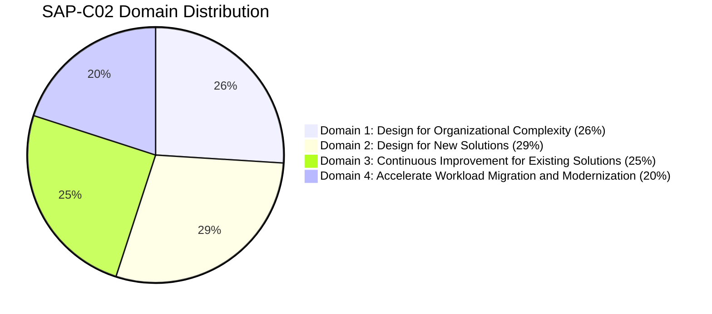
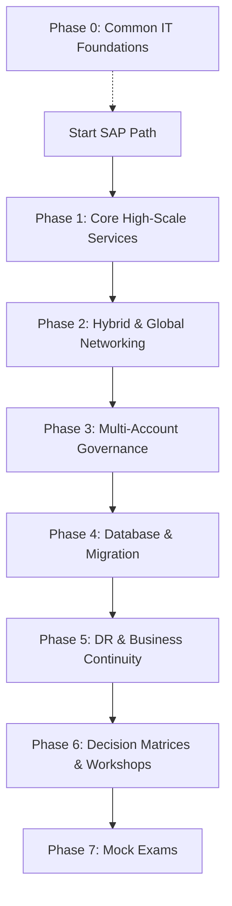

# AWS Certified Solutions Architect – Professional (SAP-C02) Study Plan & Roadmap

*A comprehensive, consolidated guide designed to prepare you for the AWS Certified Solutions Architect – Professional exam. This structured plan guides you from foundational high-scale AWS services through global networking, multi-account governance, database scaling, migration strategies, disaster recovery, decision frameworks, workshops, and practice mock exams.*

:::info
💡 **Prerequisite (Phase 0):** If you are new to IT, systems, networks, databases, or programming, it is highly recommended to complete the shared [IT Foundations Bridge Roadmap (Phase 0)](../00-it-foundation/beginner-roadmap.md) before starting this track.
:::

---

## 🏆 SAP-C02 Exam Overview & Syllabus Coverage

Before beginning, familiarize yourself with the official exam domain weighting and format:

| Parameter | Details |
| :--- | :--- |
| **Exam Code** | SAP-C02 |
| **Level** | Professional |
| **Duration** | 180 Minutes |
| **Number of Questions** | 75 (Multiple Choice or Multiple Response) |
| **Passing Score** | 750 / 1000 |
| **Cost** | $300 USD |

---

## 🚀 Recommended Study Sequence

Follow this progressive study path to master enterprise cloud designs:

---

## 📅 Step-by-Step Study Phases

### Phase 1: High-Scale Compute & Storage (15 Hours)
Analyze professional scaling strategies, caching layers, and high-performance block/file systems.

*   **Virtual Machines & Infrastructure:**
    *   [AWS Outposts](./Compute/Virtual%20Machines%20&%20Infrastructure/AWS%20Outposts.md) — On-premises hybrid cloud deployments.
    *   [AWS Wavelength](./Compute/Virtual%20Machines%20&%20Infrastructure/AWS%20Wavelength.md) — 5G edge computing integrations.
    *   **Amazon EC2:**
        *   [Amazon EC2](./Compute/Virtual%20Machines%20&%20Infrastructure/EC2/Amazon%20EC2.md) — Enterprise compute platforms.
        *   [Amazon EC2 - Auto Scaling](./Compute/Virtual%20Machines%20&%20Infrastructure/EC2/Amazon%20EC2%20-%20Auto%20Scaling.md) — Scaling groups, warm pools, launch templates.
        *   [Amazon EC2 - Fleets](./Compute/Virtual%20Machines%20&%20Infrastructure/EC2/Amazon%20EC2%20-%20Fleets.md) — EC2 Fleet configuration logic.
        *   [Amazon EC2 - Monitoring](./Compute/Virtual%20Machines%20&%20Infrastructure/EC2/Amazon%20EC2%20-%20Monitoring.md) — Detailed monitoring and scaling alerts.
        *   [Amazon EC2 - Networking](./Compute/Virtual%20Machines%20&%20Infrastructure/EC2/Amazon%20EC2%20-%20Networking.md) — ENI, ENA, SR-IOV configurations.
        *   [Amazon EC2 - Security](./Compute/Virtual%20Machines%20&%20Infrastructure/EC2/Amazon%20EC2%20-%20Security.md) — Metadata service (IMDSv2), key pairs, security groups.
    *   [EC2 Image Builder](./Compute/Virtual%20Machines%20&%20Infrastructure/EC2%20Image%20Builder.md) — Automated AMI generation pipelines.
*   **Advanced Compute Patterns:**
    *   [EC2 Placement Groups](./Compute/placement-groups.md) — Cluster, Spread, and Partition placement options.
    *   [Dedicated Hosts](./Compute/dedicated-hosts.md) — Physical licensing requirements.
    *   [Capacity Reservations](./Compute/capacity-reservations.md) — Guaranteed compute space.
    *   [Spot Fleet](./Compute/spot-fleet.md) — Cost-optimized spot provisioning pools.
    *   [Launch Templates](./Compute/launch-templates.md) — Golden image configurations.
    *   [Warm Pools](./Compute/warm-pools.md) — Accelerated scale-out times for ASGs.
*   **Serverless & Managed Compute:**
    *   [AWS Lambda](./Compute/Serverless%20&%20Managed%20Compute/AWS%20Lambda.md) — Concurrency models and configurations.
    *   [AWS Elastic Beanstalk](./Compute/Serverless%20&%20Managed%20Compute/AWS%20Elastic%20Beanstalk.md) — Multi-environment deployment types.
    *   [AWS App Runner](./Compute/Serverless%20&%20Managed%20Compute/AWS%20App%20Runner.md) — Managed containerized compute.
*   **Scaling & Batch Processing:**
    *   [AWS Auto Scaling](./Compute/Scaling%20&%20Batch%20Processing/AWS%20Auto%20Scaling.md) — Dynamic predictive scaling.
    *   [AWS Batch](./Compute/Scaling%20&%20Batch%20Processing/AWS%20Batch.md) — Multi-node parallel processing jobs.
*   **Simplified Compute:**
    *   [Amazon Lightsail](./Compute/Simplified%20Compute/Amazon%20Lightsail.md) — Virtual private server templates.
*   **Object, Block, & File Storage:**
    *   [Amazon S3](./Storage/Object,%20Block,%20&%20File%20Storage/Amazon%20S3.md) — Storage classes, versioning, object locks.
    *   [Amazon Elastic Block Storage (EBS)](./Storage/Object,%20Block,%20&%20File%20Storage/Amazon%20Elastic%20Block%20Storage.md) — Provisioned IOPS, Fast Snapshot Restore.
    *   [Amazon Elastic File System (EFS)](./Storage/Object,%20Block,%20&%20File%20Storage/Amazon%20Elastic%20File%20System.md) — Serverless shared file mounts.
    *   [EFS Performance Modes](./Storage/efs-performance-modes.md) — General Purpose vs. Max I/O and Throughput modes.
    *   [Amazon FSx](./Storage/Object,%20Block,%20&%20File%20Storage/Amazon%20FSx.md) — High performance third-party file structures.
    *   [FSx for Windows File Server](./Storage/fsx-windows.md) — Native Windows shared storage.
    *   [FSx for Lustre](./Storage/fsx-lustre.md) — High performance compute batch storage.
    *   [FSx for NetApp ONTAP](./Storage/fsx-ontap.md) — Advanced data management capabilities.
    *   [FSx for OpenZFS](./Storage/fsx-openzfs.md) — Highly scalable storage integrations.

---

### Phase 2: Hybrid & Global Networking (20 Hours)
The core of modern enterprise architecture on AWS.

*   **Virtual Networking & Connectivity:**
    *   [Amazon VPC](./Networking%20&%20Content%20Delivery/Virtual%20Networking%20&%20Connectivity/Amazon%20VPC.md) — Subnets, gateway endpoints, NAT.
    *   [AWS Direct Connect](./Networking%20&%20Content%20Delivery/Virtual%20Networking%20&%20Connectivity/AWS%20Direct%20Connect.md) — Virtual interfaces (VIFs), MACsec, backup links.
    *   [AWS Local Zones](./Networking%20&%20Content%20Delivery/Virtual%20Networking%20&%20Connectivity/AWS%20Local%20Zones.md) — Ultra-low latency edge deployments.
    *   [AWS Transit Gateway](./Networking%20&%20Content%20Delivery/Virtual%20Networking%20&%20Connectivity/AWS%20Transit%20Gateway.md) — Centralized routing hub.
    *   [AWS VPN](./Networking%20&%20Content%20Delivery/Virtual%20Networking%20&%20Connectivity/AWS%20VPN.md) — Customer gateways and virtual private gateways.
*   **CDN & DNS:**
    *   [Amazon CloudFront](./Networking%20&%20Content%20Delivery/CDN%20&%20DNS/Amazon%20CloudFront.md) — Origin shield, SSL termination, caching profiles.
    *   [AWS Route 53](./Networking%20&%20Content%20Delivery/CDN%20&%20DNS/AWS%20Route%2053.md) — Routing policies (latency, geolocation, failover).
    *   [Global Traffic Management](./Networking%20&%20Content%20Delivery/CDN%20&%20DNS/Global%20Traffic%20Management.md) — CloudFront vs. Global Accelerator.
    *   [Route 53 Resolver](./Networking%20&%20Content%20Delivery/route53-resolver.md) — Hybrid DNS endpoints.
*   **Hybrid Connectivity & Traffic Management:**
    *   [AWS PrivateLink](./Networking%20&%20Content%20Delivery/Hybrid%20Connectivity/AWS%20PrivateLink.md) — Safe VPC endpoint routing.
    *   [Hybrid Connectivity & RAM](./Networking%20&%20Content%20Delivery/Hybrid%20Connectivity/Hybrid%20Connectivity%20&%20RAM.md) — Shared networking configurations.
    *   [AWS Elastic Load Balancing](./Networking%20&%20Content%20Delivery/Traffic%20Management/AWS%20Elastic%20Load%20Balancing.md) — ALB, NLB, GWLB routing architectures.
    *   [AWS VPC Lattice](./Networking%20&%20Content%20Delivery/Traffic%20Management/AWS%20VPC%20Lattice.md) — Service-to-service service mesh connections.
    *   [Gateway Load Balancer (GWLB)](./Networking%20&%20Content%20Delivery/gateway-load-balancer.md) — Layer 3 security appliances routing.
    *   [AWS Cloud WAN](./Networking%20&%20Content%20Delivery/cloud-wan.md) — Global core networks.
    *   [Transit Gateway Route Tables](./Networking%20&%20Content%20Delivery/transit-gateway-route-tables.md) — Association and propagation controls.
    *   [Transit Gateway Appliance Mode](./Networking%20&%20Content%20Delivery/transit-gateway-appliance-mode.md) — Stateful packet analysis flows.
    *   [IPv6 Architectures](./Networking%20&%20Content%20Delivery/ipv6-architectures.md) — Dual-stack vs. IPv6-only VPC architectures.

:::info
**Milestone Checkpoint 1:** You must be able to design a hub-and-spoke hybrid network that connects a 3-tier VPC structure to an on-premises datacenter using a Direct Connect gateway, Transit Gateway, and redundant VPN attachments.
:::

---

### Phase 3: Multi-Account Governance, Security & Compliance (20 Hours)
Organize and secure hundreds of AWS accounts dynamically.

*   **Identity & Access Management:**
    *   [Amazon Cognito](./Security,%20Identity%20&%20Compliance/Identity%20&%20Access%20Management/Amazon%20Cognito.md) — User Pools vs. Identity Pools.
    *   [AWS Directory Services](./Security,%20Identity%20&%20Compliance/Identity%20&%20Access%20Management/AWS%20Directory%20Services.md) — Active Directory connectors.
    *   [AWS IAM Identity Center](./Security,%20Identity%20&%20Compliance/Identity%20&%20Access%20Management/AWS%20IAM%20Identity%20Center.md) — Centralized AWS account single sign-on (SSO).
    *   [AWS Identity and Access Management](./Security,%20Identity%20&%20Compliance/Identity%20&%20Access%20Management/AWS%20Identity%20and%20Access%20Management.md) — Permission boundaries, evaluations.
    *   [Amazon Verified Permissions](./Security,%20Identity%20&%20Compliance/Identity%20&%20Access%20Management/Amazon%20Verified%20Permissions.md) — Cedar-based granular authorization policy engines.
    *   [AWS Verified Access](./Security,%20Identity%20&%20Compliance/Identity%20&%20Access%20Management/AWS%20Verified%20Access.md) — Zero-trust application ingress connections.
    *   [Active Directory Integration](./Security,%20Identity%20&%20Compliance/active-directory-integration.md) — SAML and AD FS federations.
*   **Data Protection & Encryption:**
    *   [AWS Certificate Manager](./Security,%20Identity%20&%20Compliance/Data%20Protection%20&%20Encryption/AWS%20Certificate%20Manager.md) — Public/private certificates rotation.
    *   [AWS CloudHSM](./Security,%20Identity%20&%20Compliance/Data%20Protection%20&%20Encryption/AWS%20CloudHSM.md) — Dedicated hardware security modules.
    *   [AWS Key Management Service](./Security,%20Identity%20&%20Compliance/Data%20Protection%20&%20Encryption/AWS%20Key%20Management%20Service.md) — Key rotation, envelope encryption.
    *   [AWS Secrets Manager](./Security,%20Identity%20&%20Compliance/Data%20Protection%20&%20Encryption/AWS%20Secrets%20Manager.md) — Automated database credentials rotation.
    *   [Amazon Macie](./Security,%20Identity%20&%20Compliance/Data%20Protection%20&%20Encryption/AWS%20Macie.md) — PII threat alerts and security compliance mapping.
    *   [Amazon Macie Advanced](./Security,%20Identity%20&%20Compliance/macie.md) — Scanning configurations and criteria.
*   **Threat Detection & Incident Response:**
    *   [AWS Firewall Manager](./Security,%20Identity%20&%20Compliance/Network%20Security/AWS%20Firewall%20Manager.md) — Centralized rule sets.
    *   [AWS Network Firewall](./Security,%20Identity%20&%20Compliance/Network%20Security/AWS%20Network%20Firewall.md) — Stateful traffic inspection.
    *   [AWS Shield](./Security,%20Identity%20&%20Compliance/Network%20Security/AWS%20Shield.md) & [WAF](./Security,%20Identity%20&%20Compliance/Network%20Security/AWS%20WAF.md) — Layer 7 and DDoS protections.
    *   [Amazon GuardDuty](./Security,%20Identity%20&%20Compliance/Security%20Monitoring%20&%20Threat%20Detection/Amazon%20GuardDuty.md) — Machine learning-driven threat findings.
    *   [AWS Security Hub](./Security,%20Identity%20&%20Compliance/Security%20Monitoring%20&%20Threat%20Detection/AWS%20Security%20Hub.md) — Compliance standards mapping.
    *   [Amazon Detective](./Security,%20Identity%20&%20Compliance/Security%20Monitoring%20&%20Threat%20Detection/Amazon%20Detective.md) — Graph analytics root cause investigations.
    *   [Amazon Inspector](./Security,%20Identity%20&%20Compliance/Security%20Monitoring%20&%20Threat%20Detection/Amazon%20Inspector.md) — Continuous vulnerability scanning of EC2/ECR/Lambda.
    *   [AWS Shield Advanced](./Security,%20Identity%20&%20Compliance/shield-advanced.md) — Cost protection, proactive mitigation response teams.
*   **Compliance, Governance & Monitoring:**
    *   [AWS Organizations & SCPs](./Management%20&%20Governance/Governance%20&%20Compliance/AWS%20Organizations.md) — Organization structure.
    *   [AWS Control Tower](./Management%20&%20Governance/Governance%20&%20Compliance/AWS%20Control%20Tower.md) — Automated Landing Zone deployments.
    *   [AWS Account Factory](./Management%20&%20Governance/account-factory.md) — Automated account provisioning hooks.
    *   [AWS RAM Resource Sharing](./Security,%20Identity%20&%20Compliance/Compliance%20&%20Governance/AWS%20Resource%20Access%20Manager.md) — Cross-account network and resource sharing.
    *   [AWS Config](./Management%20&%20Governance/Governance%20&%20Compliance/AWS%20Config.md) — Automated config rules and compliance alerts.
    *   [AWS Config Aggregators](./Management%20&%20Governance/config-aggregators.md) — Multi-account centralized audit aggregation.
    *   [AWS Service Catalog](./Management%20&%20Governance/Governance%20&%20Compliance/AWS%20Service%20Catalog.md) — Portfolio template approvals.
    *   [AWS Service Quotas](./Management%20&%20Governance/Governance%20&%20Compliance/AWS%20Service%20Quotas.md) — Programmatic request increases.
    *   [AWS Well-Architected Tool](./Management%20&%20Governance/Governance%20&%20Compliance/AWS%20Well-Architected%20Tool.md) — Audit execution check.
    *   [AWS Artifact](./Security,%20Identity%20&%20Compliance/Compliance%20&%20Governance/AWS%20Artifact.md) — Compliance document retrievals.
    *   [AWS Audit Manager](./Security,%20Identity%20&%20Compliance/Compliance%20&%20Governance/AWS%20Audit%20Manager.md) — Dynamic audit evidence gathering.
    *   [Amazon CloudWatch](./Management%20&%20Governance/Monitoring%20&%20Observability/Amazon%20CloudWatch.md) — Synthetics, custom metrics, alarms.
    *   [AWS CloudTrail](./Management%20&%20Governance/Monitoring%20&%20Observability/AWS%20CloudTrail.md) — API event logs logging.
    *   [AWS Personal Health Dashboard](./Management%20&%20Governance/Monitoring%20&%20Observability/AWS%20Personal%20Health%20Dashboard.md) — Impending resource failures warnings.
*   **Infrastructure Automation & Operations:**
    *   [AWS CloudFormation](./Management%20&%20Governance/Infrastructure%20Automation/AWS%20CloudFormation.md) — StackSets, drift detection.
    *   [AWS Cloud Development Kit](./Management%20&%20Governance/Infrastructure%20Automation/AWS%20Cloud%20Development%20Kit.md) — Type-safe infrastructure builds.
    *   [AWS Compute Optimizer](./Management%20&%20Governance/Operations%20&%20Optimization/AWS%20Compute%20Optimizer.md) — Under-utilized EC2 resize recommendations.
    *   [AWS Systems Manager](./Management%20&%20Governance/Operations%20&%20Optimization/AWS%20Systems%20Manager.md) — Parameter Store, Session Manager, Patch Manager.
    *   [AWS Trusted Advisor](./Management%20&%20Governance/Operations%20&%20Optimization/AWS%20Trusted%20Advisor.md) — Limits, security, and cost checks.
    *   [Cost Optimization Tools](./Management%20&%20Governance/Cost%20Management/Cost%20Optimization%20Tools.md) — Cost optimization overview.

:::info
**Milestone Checkpoint 2:** Explain the difference between preventive guardrails (SCPs) and detective guardrails (AWS Config). Sketch a structure showing centralized log aggregation and security event routing to a designated security auditing account.
:::

---

### Phase 4: Database Scaling & Migration (15 Hours)
Move high-scale relational/NoSQL datastores and workloads to AWS.

*   **Relational & Data Warehouse:**
    *   [Amazon Aurora](./Database/Relational%20&%20Data%20Warehouse/Amazon%20Aurora.md) — High availability replication models.
    *   [Aurora Serverless](./Database/aurora-serverless.md) — Serverless database compute.
    *   [Aurora Database Cloning](./Database/aurora-cloning.md) — Copy-on-write fast database clones.
    *   [Aurora Backtracking](./Database/aurora-backtracking.md) — Instant database time rollbacks.
    *   [Amazon RDS](./Database/Relational%20&%20Data%20Warehouse/Amazon%20RDS.md) — Managed RDS databases.
    *   [RDS Proxy](./Database/rds-proxy.md) — DB connection pooling.
    *   [Amazon Redshift](./Database/Relational%20&%20Data%20Warehouse/Amazon%20Redshift.md) — Enterprise data warehousing.
*   **NoSQL & Specialized Databases:**
    *   [Amazon DocumentDB](./Database/NoSQL%20Databases/Amazon%20DocumentDB.md) — MongoDB compatibility.
    *   [Amazon DynamoDB](./Database/NoSQL%20Databases/Amazon%20DynamoDB.md) — Global tables, partition keys, keys management.
    *   [DynamoDB Accelerator (DAX)](./Database/dax.md) — DynamoDB microsecond read caches.
    *   [Amazon Keyspaces](./Database/NoSQL%20Databases/Amazon%20Keyspaces.md) — Managed Apache Cassandra datastores.
    *   [Amazon ElastiCache](./Database/Specialized%20&%20In-Memory/Amazon%20ElastiCache.md) — Redis vs. Memcached engines caching.
    *   [Amazon Neptune](./Database/Specialized%20&%20In-Memory/Amazon%20Neptune.md) — High performance graph database.
    *   [Amazon Timestream](./Database/Specialized%20&%20In-Memory/Amazon%20Timestream.md) — Serverless time-series analysis database.
    *   [Amazon MemoryDB for Redis](./Database/memorydb.md) — Durable Redis-compatible transactional database.
*   **Application Integration:**
    *   [AWS AppSync](./Application%20Integration/API%20&%20Workflow%20Integration/AWS%20AppSync.md) — Managed GraphQL.
    *   [AWS Step Functions](./Application%20Integration/API%20&%20Workflow%20Integration/AWS%20Step%20Functions.md) — Distributed application coordination engines.
    *   [Amazon EventBridge](./Application%20Integration/Messaging%20&%20Eventing/Amazon%20EventBridge.md) — Event-driven schemas.
    *   [Amazon MQ](./Application%20Integration/Messaging%20&%20Eventing/Amazon%20MQ.md) — ActiveMQ/RabbitMQ broker setups.
    *   [Amazon MSK (Managed Kafka)](./Application%20Integration/amazon-msk.md) — Centralized Apache Kafka clusters.
    *   [Amazon AppFlow](./Application%20Integration/appflow.md) — SaaS integrations.
    *   [Amazon SNS](./Application%20Integration/Messaging%20&%20Eventing/Amazon%20SNS.md) — Pub/sub messaging.
    *   [Amazon SQS](./Application%20Integration/Messaging%20&%20Eventing/Amazon%20SQS.md) — Message queues.
*   **Cloud Financial Management:**
    *   [AWS Cost Allocation Tags](./Cloud%20Financial%20Management/Cost%20Allocation%20&%20Savings/AWS%20Cost%20Allocation%20Tags.md) — Cost allocation tags.
    *   [Savings Plans](./Cloud%20Financial%20Management/Cost%20Allocation%20&%20Savings/Savings%20Plans.md) — Dynamic savings plans.
    *   [Cost and Usage Reports (CUR)](./Cloud%20Financial%20Management/cost-and-usage-reports.md) — Raw billing CSV extracts.
    *   [Savings Plans Modeling](./Cloud%20Financial%20Management/savings-plans-modeling.md) — Estimations.
    *   [Reserved Instance Strategy](./Cloud%20Financial%20Management/reserved-instance-strategy.md) — Purchase queues.
    *   [Chargeback & Showback Systems](./Cloud%20Financial%20Management/chargeback-showback.md) — Cost structures division.
    *   [AWS Budgets](./Cloud%20Financial%20Management/Cost%20Monitoring%20&%20Budgeting/AWS%20Budgets.md) — Budget alerts.
    *   [AWS Cost Explorer](./Cloud%20Financial%20Management/Cost%20Monitoring%20&%20Budgeting/AWS%20Cost%20Explorer.md) — Visualization of cost history patterns.
*   **Workload Containers & Development Tools:**
    *   [Amazon ECS](./Containers/Container%20Orchestration/Amazon%20ECS.md) & [EKS](./Containers/Container%20Orchestration/Amazon%20EKS.md) — Container orchestration.
    *   [EKS Architecture Deep Dive](./Containers/eks-architecture.md) — EKS pods architectures.
    *   [EKS Pod Networking](./Containers/eks-networking.md) — VPC CNI configurations.
    *   [EKS IAM & Security](./Containers/eks-security.md) — IRSA security structures.
    *   [AWS App Mesh](./Containers/app-mesh.md) — Service-to-service communication configs.
    *   [Kubernetes Ingress Controllers](./Containers/ingress-controllers.md) — Ingress integrations.
    *   [Amazon ECR](./Containers/Container%20Registry/Amazon%20ECR.md) — Secure image registry.
    *   [Amazon CodeGuru](./Developer%20Tools/CICD%20&%20Code%20Quality/Amazon%20CodeGuru.md) — Automated profiling reviews.
    *   [AWS CodeSuite CICD Tools](./Developer%20Tools/CICD%20&%20Code%20Quality/AWS%20CodeBuild,%20AWS%20CodeDeploy,%20AWS%20CodePipeline,%20AWS%20CodeArtifact.md) — CodeCommit/Build/Deploy/Pipeline tools.
    *   [AWS Fault Injection Simulator](./Developer%20Tools/Observability%20&%20Testing/AWS%20Fault%20Injection%20Simulator.md) — Chaos engineering test scenarios.
    *   [AWS X-Ray](./Developer%20Tools/Observability%20&%20Testing/AWS%20X-Ray.md) — Trace insights.
*   **Web, Mobile & End User Computing:**
    *   [Amazon API Gateway](./Frontend%20Web%20&%20Mobile/API%20Management/Amazon%20API%20Gateway.md) — REST API routing.
    *   [AWS Amplify](./Frontend%20Web%20&%20Mobile/Development%20Platforms/AWS%20Amplify.md) — Serverless full-stack web builds.
    *   [AWS Device Farm](./Frontend%20Web%20&%20Mobile/Development%20Platforms/AWS%20Device%20Farm.md) — Multi-device web testing.
    *   [Amazon Pinpoint](./Frontend%20Web%20&%20Mobile/User%20Engagement/Amazon%20Pinpoint.md) — Targeted push notifications.
    *   [Amazon AppStream 2.0](./End%20User%20Computing/Amazon%20AppStream%202.0.md) — App streaming endpoints.
    *   [Amazon WorkSpaces](./End%20User%20Computing/Amazon%20WorkSpaces.md) — Virtual desktop environments.
*   **Migration & Data Transfer:**
    *   [AWS Application Discovery Service](./Migration%20&%20Transfer/Migration%20Tools/AWS%20Application%20Discovery%20Service.md) — Inventory collection.
    *   [AWS Application Migration Service (MGN)](./Migration%20&%20Transfer/Migration%20Tools/AWS%20Application%20Migration%20Service.md) — Server block-level rehosting replication.
    *   [AWS Database Migration Service](./Migration%20&%20Transfer/Migration%20Tools/AWS%20Database%20Migration%20Service.md) — Database replication (DMS + SCT).
    *   [AWS DataSync](./Migration%20&%20Transfer/Migration%20Tools/AWS%20DataSync.md) — Automated high speed directory synchronization.
    *   [AWS Migration Evaluator](./Migration%20&%20Transfer/Migration%20Tools/AWS%20Migration%20Evaluator.md) — TCO projections.
    *   [AWS Migration Hub](./Migration%20&%20Transfer/Migration%20Tools/AWS%20Migration%20Hub.md) — Single migration dashboard tracking.
    *   [Migration Strategies](./Migration%20&%20Transfer/Migration%20Tools/Migration%20Strategies.md) — Detailed mapping of the 6 R's.
    *   [AWS Snow Family](./Migration%20&%20Transfer/Physical%20&%20Offline%20Migration/AWS%20Snow%20Family.md) — Snowball, snowcone offline appliances.

---

### Phase 5: Business Continuity & Disaster Recovery (10 Hours)
Configure highly resilient global environments.

*   **DR Strategies & Backup:**
    *   [Disaster Recovery Strategies](./Storage/Backup%20&%20Disaster%20Recovery/Disaster%20Recovery%20Strategies.md) — Active-Active, Warm Standby, Pilot Light, Backup/Restore.
    *   [AWS Elastic Disaster Recovery (DRS)](./Storage/Backup%20&%20Disaster%20Recovery/AWS%20Elastic%20Disaster%20Recovery.md) — Continuous block replication to a staging area.
*   **Centralized Enterprise Backups:**
    *   [AWS Backup](./Storage/Backup%20&%20Disaster%20Recovery/AWS%20Backup.md) — Automated cross-account and cross-region backups.
*   **Advanced Analytics & Specialized Topics:**
    *   [AWS Data Exchange](./Analytics/Data%20Integration%20&%20Management/AWS%20Data%20Exchange.md) — Third-party data subscriptions.
    *   [AWS Glue](./Analytics/Data%20Integration%20&%20Management/AWS%20Glue.md) — Serverless ETL pipelines.
    *   [AWS Lake Formation](./Analytics/Data%20Integration%20&%20Management/AWS%20Lake%20Formation.md) — Secure data lakes.
    *   [Amazon Athena](./Analytics/Interactive%20Query%20&%20Batch%20Processing/Amazon%20Athena.md) — Query S3 directly using SQL.
    *   [Amazon EMR](./Analytics/Interactive%20Query%20&%20Batch%20Processing/Amazon%20EMR.md) — Managed Hadoop/Spark clusters.
    *   [Amazon Data Firehose](./Analytics/Streaming%20Data%20&%20Real-Time%20Analytics/Amazon%20Data%20Firehose.md) — Direct streaming ingestion.
    *   [Amazon Kinesis Data Streams](./Analytics/Streaming%20Data%20&%20Real-Time%20Analytics/Amazon%20Kinesis%20Data%20Streams.md) — Sharded low latency real-time data queues.
    *   [Amazon Managed Service for Apache Flink](./Analytics/Streaming%20Data%20&%20Real-Time%20Analytics/Amazon%20Managed%20Service%20for%20Apache%20Flink.md) — Real-time stream processing.
    *   [Amazon Managed Streaming for Apache Kafka](./Analytics/Streaming%20Data%20&%20Real-Time%20Analytics/Amazon%20Managed%20Streaming%20for%20Apache%20Kafka.md) — MSK streaming.
    *   [Amazon OpenSearch](./Analytics/opensearch.md) — Elasticsearch log analytics.
    *   [Amazon OpenSearch Serverless](./Analytics/Visualization%20&%20Search/Amazon%20OpenSearch%20Serverless.md) — Serverless OpenSearch cluster.
    *   [Amazon QuickSight](./Analytics/Visualization%20&%20Search/Amazon%20QuickSight.md) — Central business intelligence dashboards.
    *   [Amazon Bedrock](./Machine%20Learning/Generative%20AI/Amazon%20Bedrock.md) — Serverless GenAI and Foundation Models access.
    *   [Amazon Q](./Machine%20Learning/Generative%20AI/Amazon%20Q.md) — Conversational AI work assistant.
    *   [Amazon Rekognition](./Machine%20Learning/Computer%20Vision%20&%20Document%20Processing/Amazon%20Rekognition.md) — Real-time image and video analysis.
    *   [Amazon Textract](./Machine%20Learning/Computer%20Vision%20&%20Document%20Processing/Amazon%20Textract.md) — AI-driven document layout extraction.
    *   [Amazon SageMaker](./Machine%20Learning/ML%20Platform/Amazon%20SageMaker.md) — End-to-end ML model creation.
    *   [Amazon Comprehend](./Machine%20Learning/Natural%20Language%20&%20Speech/Amazon%20Comprehend.md) — Text analytics.
    *   [Amazon Lex](./Machine%20Learning/Natural%20Language%20&%20Speech/Amazon%20Lex.md) — Conversational chatbots.
    *   [Amazon Transcribe](./Machine%20Learning/Natural%20Language%20&%20Speech/Amazon%20Transcribe.md) — Speech-to-text.
    *   [Amazon Translate](./Machine%20Learning/Natural%20Language%20&%20Speech/Amazon%20Translate.md) — Multi-lingual translations.
    *   [Amazon Kendra](./Machine%20Learning/Search%20&%20Personalization/Amazon%20Kendra.md) — Intelligent enterprise search.
    *   [Amazon Personalize](./Machine%20Learning/Search%20&%20Personalization/Amazon%20Personalize.md) — Real-time recommendation models.
    *   [Amazon Polly](./Machine%20Learning/Speech%20Synthesis/Amazon%20Polly.md) — Text-to-speech engine.
    *   [Amazon Connect](./Business%20Applications/Contact%20Center%20&%20Email/Amazon%20Connect.md) — Omnichannel contact centers.
    *   [Amazon SES](./Business%20Applications/Contact%20Center%20&%20Email/Amazon%20SES.md) — Bulk marketing email dispatch.
    *   [AWS Alexa for Business](./Business%20Applications/Voice%20&%20Collaboration/AWS%20Alexa%20for%20Business.md) — Smart conference rooms.
    *   [AWS IoT Services](./Internet%20of%20Things/AWS%20IoT%20Services.md) — Core MQTT device management.
    *   [Amazon Kinesis Video Streams](./Media%20Services/Amazon%20Kinesis%20Video%20Streams.md) — Direct camera video streaming ingestion.
    *   [Amazon Managed Blockchain](./Blockchain/Amazon%20Managed%20Blockchain.md) — Hyperledger Fabric networks.

---

### Phase 6: Decision Matrices & Guided Workshops (10 Hours)
Compare architectural choices and study real-world scenario implementations.

*   **Decision Frameworks:**
    *   Compare options in [Decision Frameworks](../03-architecture-decision-frameworks/alb-vs-nlb-vs-gwlb.md).
*   **Architecture Workshops:**
    *   [Enterprise Landing Zone](../04-architecture-workshops/enterprise-landing-zone.md)
    *   [Hybrid Enterprise Network](../04-architecture-workshops/hybrid-enterprise-network.md)
    *   [Multi-Region DR Workshop](../04-architecture-workshops/multi-region-dr.md)

---

### Phase 7: Practice & Exam Strategy (10 Hours)
Before sitting the official exam, validate your readiness with three full-length practice tests under timed conditions:

*   **Exam Strategy Guide:**
    *   [Decomposing SAP-C02 Questions](../05-exam-strategy/intro.md)
*   **SAP-C02 Practice Mock Exams:**
    *   **[SAP-C02 Practice Mock Exams Overview](./Practice%20Exams/SAP-C02%20Mock%20Exam.md)**
    *   **🏆 Mock Exam 1 (75 Questions):**
        *   [Part 1: Questions 1 - 25](./Practice%20Exams/SAP-C02%20Mock%20Exam%20-%20Part%201.md) (Domain 1 & 2)
        *   [Part 2: Questions 26 - 50](./Practice%20Exams/SAP-C02%20Mock%20Exam%20-%20Part%202.md) (Domain 2 & 3)
        *   [Part 3: Questions 51 - 75](./Practice%20Exams/SAP-C02%20Mock%20Exam%20-%20Part%203.md) (Domain 3 & 4)
    *   **🏆 Mock Exam 2 (75 Questions):**
        *   [Part 1: Questions 1 - 25](./Practice%20Exams/SAP-C02%20Mock%20Exam%202%20-%20Part%201.md) (Domain 1 & 2)
        *   [Part 2: Questions 26 - 50](./Practice%20Exams/SAP-C02%20Mock%20Exam%202%20-%20Part%202.md) (Domain 2 & 3)
        *   [Part 3: Questions 51 - 75](./Practice%20Exams/SAP-C02%20Mock%20Exam%202%20-%20Part%203.md) (Domain 3 & 4)
    *   **🌶️ Mock Exam 3 (75 Questions - Advanced Difficulty):**
        *   [Part 1: Questions 1 - 25](./Practice%20Exams/SAP-C02%20Mock%20Exam%203%20-%20Part%201.md) (Domain 1 & 2)
        *   [Part 2: Questions 26 - 50](./Practice%20Exams/SAP-C02%20Mock%20Exam%203%20-%20Part%202.md) (Domain 2 & 3)
        *   [Part 3: Questions 51 - 75](./Practice%20Exams/SAP-C02%20Mock%20Exam%203%20-%20Part%203.md) (Domain 3 & 4)

---

## Recommended Next Topics
- [AWS Well-Architected Framework](well-architected-framework.md)

---

## Prerequisites

- [🎯 Reinforcement Practice Questions - All 7 Tests Incorrect Areas](../01-solutions-architect-associate/exam-reviews/REINFORCEMENT-QUESTIONS-ALL-TESTS.md)

## Recommended Next Topics

- [AWS Well-Architected Framework](well-architected-framework.md)

## Related Topics

- [AWS Well-Architected Framework](well-architected-framework.md)
- [AWS Well-Architected Framework](well-architected-framework.md)
- [AWS Well-Architected Framework](well-architected-framework.md)
