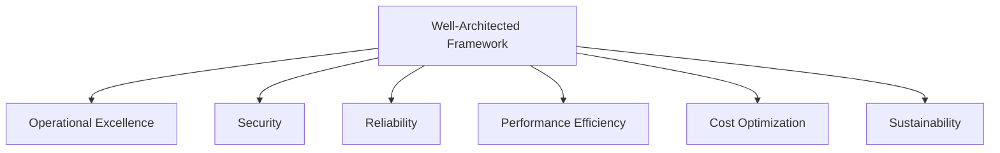

# AWS Well-Architected Framework

## 1. Overview & Real-World Analogy

**Real-World Analogy:** A building inspection checklist: checking the structural integrity, safety escapes, lock standards, maintenance costs, and materials efficiency.

The AWS Well-Architected Framework helps cloud architects build secure, high-performing, resilient, and efficient infrastructure for their applications, structured around six pillars.

---

## 2. Architecture & Flow Diagram

---

## 3. Comparison & Decision Guidance

| Pillar | Core Objective | Key AWS Service |
| :--- | :--- | :--- |
| **Operational Excellence** | Running and monitoring systems | CloudWatch, Systems Manager |
| **Security** | Protecting data and assets | IAM, KMS, Shield, GuardDuty |
| **Reliability** | Recovering from failures | Auto Scaling, Multi-AZ RDS |
| **Performance Efficiency** | Using compute resources efficiently | DynamoDB, ElastiCache, Auto Scaling |
| **Cost Optimization** | Avoiding unnecessary costs | Cost Explorer, Savings Plans |
| **Sustainability** | Minimizing environmental impact | Serverless architectures, instance sizing |

### When to use
- When designing high-scale, production-ready solutions on AWS.
- To enforce operational excellence and follow security best practices.

### When not to use
- For basic prototyping where native defaults are sufficient.

---

## 4. Key Performance, Cost & Security Considerations

### Performance Impact
Helps design workloads that scale dynamically and utilize serverless compute to match user demand patterns.

### Cost Impact
Provides design principles to optimize workloads and avoid over-provisioning infrastructure.

### Security Implications
Establishes a baseline for identity access, data encryption, and incident response procedures.

---

## 5. Exam tips & Traps

:::tip
> **Exam Clues:** well-architected framework, operational excellence, security pillar, reliability disaster recovery, cost optimization, sustainability

Review the six pillars carefully; exam scenarios will test your ability to trade off pillars (e.g. trading off cost to improve reliability).
:::

:::warning
> **Common Exam Traps:** Do not view the Well-Architected Tool as a validator that configures resources; it is an assessment checklist tool.
:::

---

## Prerequisites

- [AWS Certified Solutions Architect – Professional (SAP-C02) Study Plan & Roadmap](sap-roadmap.md)

## Recommended Next Topics

- [AWS Outposts](Compute/Virtual Machines & Infrastructure/AWS Outposts.md)

## Related Topics

- [AWS Certified Solutions Architect – Professional (SAP-C02) Study Plan & Roadmap](sap-roadmap.md)
