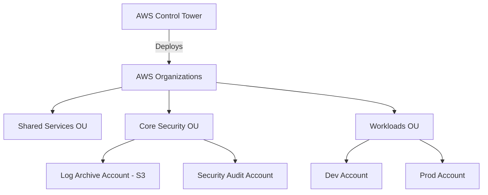

# Workshop 1: Enterprise Landing Zone

## 1. Scenario & Objectives

You are the Lead Cloud Architect at an enterprise with 100+ developers. You must design and deploy a multi-account AWS Landing Zone that enforces baseline security guardrails, centralizes logging, manages identities via Single Sign-On, and automates account creation.

---

## 2. Target Architecture

---

## 3. Step-by-Step Implementation Guide

1. **Initialize Control Tower:** Log into the Management account, navigate to the AWS Control Tower console, and execute the Landing Zone setup. Configure the Core OU name to "Security" and the custom log archive retention parameters.
2. **Configure Security Hub & GuardDuty:** In the Audit account, enable Amazon GuardDuty and AWS Security Hub. Set the Audit account as the delegated administrator for the entire organization to aggregate finding databases.
3. **Set Up IAM Identity Center (SSO):** Map IAM Identity Center to your enterprise identity directory (OIDC or Okta). Create permission sets: "AdministratorAccess" (billing/admin) and "ViewOnlyAccess" (audit).
4. **Deploy Service Control Policies (SCPs):** Attach an SCP to the Workloads OU that prevents member accounts from disabling CloudTrail logs or modifying Control Tower resource groups.
5. **Launch Account Factory:** Go to Service Catalog, select the Account Factory product, specify parameters for the new "Billing-Dev" account, and execute deployment.

---

## 4. Verification & Testing

- Log into the newly created "Billing-Dev" account and attempt to disable CloudTrail. Verify that the operation is blocked with an AccessDenied error from the SCP.
- Check the central Log Archive S3 bucket and confirm that audit logs from the dev account are streaming into the log prefix.

---

## 5. Cleanup Instructions

- Decommission accounts created by Account Factory by executing account closure rules in the AWS Organizations console.
- Terminate Control Tower configurations if a complete decommissioning is required, deleting baseline log archive buckets.

---

## Prerequisites

- None (Start of Workshops track)

## Recommended Next Topics

- [Workshop 3](hybrid-enterprise-network.md)

## Related Topics

- [Workshop 3](hybrid-enterprise-network.md)
- [Workshop 4](multi-region-dr.md)
- [Workshop 2](global-saas-platform.md)
