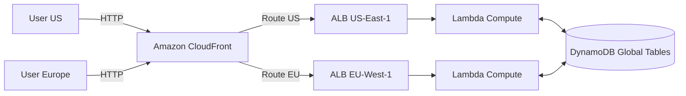

# Workshop 2: Global SaaS Platform

## 1. Scenario & Objectives

You are designing a high-throughput, global Software-as-a-Service (SaaS) web application. The platform must serve users in the US and Europe with low network latency, survive the failure of an entire AWS Region, and maintain consistent database records globally.

---

## 2. Target Architecture

---

## 3. Step-by-Step Implementation Guide

1. **Create DynamoDB Global Table:** Provision a DynamoDB table named "SaaS-Metadata" in us-east-1. Add replica regions in eu-west-1. Enable DynamoDB Streams and configure PITR backups.
2. **Build Serverless Compute APIs:** Deploy matching Lambda functions and API Gateway REST endpoints in both us-east-1 and eu-west-1, linking them to local DynamoDB table partitions.
3. **Configure Application Load Balancers:** Deploy ALBs in both regions pointing to your compute container pools (ECS/Fargate) to balance active server runs.
4. **Deploy Amazon CloudFront Distribution:** Create a global CloudFront distribution. Configure origin groups pointing to both the US ALB and Europe ALB. Set up failover routing policies using CloudFront origin failover rules.
5. **Configure Route 53 Geoproximity Rules:** Route DNS records to CloudFront, enabling health-check based regional failover.

---

## 4. Verification & Testing

- Perform a curl request to the CloudFront distribution from a US-located proxy and verify the headers confirm routing through the us-east-1 ALB.
- Terminate all ECS tasks in us-east-1 and verify that subsequent requests failover automatically to the eu-west-1 endpoint within 10 seconds.

---

## 5. Cleanup Instructions

- Delete the CloudFront distribution.
- Terminate the ALBs and associated EC2 target groups in both regions.
- Delete the DynamoDB Global Table, confirming deletion of replica regions.

---

## Prerequisites

- [Workshop 4](multi-region-dr.md)

## Recommended Next Topics

- [Workshop 6](iot-platform.md)

## Related Topics

- [Workshop 1](enterprise-landing-zone.md)
- [Workshop 3](hybrid-enterprise-network.md)
- [Workshop 4](multi-region-dr.md)
