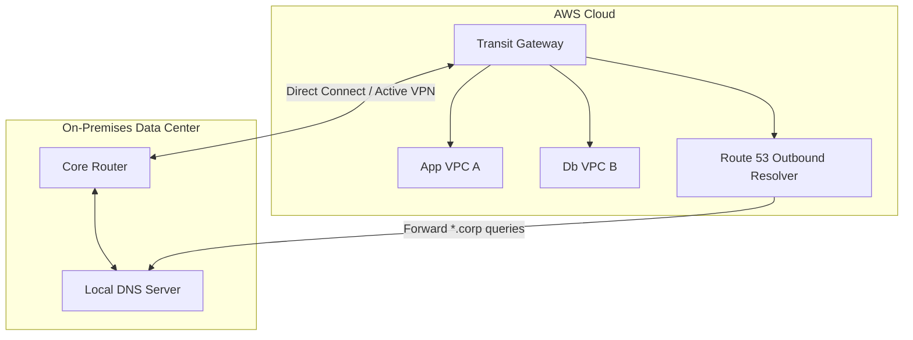

# Workshop 3: Hybrid Enterprise Network

## 1. Scenario & Objectives

Your company is migrating core business servers to AWS. You must connect on-premises data centers to multiple AWS VPCs across accounts, enabling DNS resolution of local corp names from the cloud and ensuring high-availability network connections.

---

## 2. Target Architecture

---

## 3. Step-by-Step Implementation Guide

1. **Deploy AWS Transit Gateway:** Create a Transit Gateway (TGW) in your network account. Attach the App VPC and Database VPC to the TGW, ensuring subnets have correct route tables.
2. **Configure Direct Connect & VPN Backup:** Set up an AWS Direct Connect (DX) link to your local data center router. Provision a site-to-site VPN connection over the internet as an active backup route. Configure BGP routing to advertise paths.
3. **Configure TGW Route Tables:** Set up a central TGW route table. Enable route propagation so that TGW dynamically learns local on-premises IP networks.
4. **Deploy Route 53 Resolver Endpoints:** In your shared VPC, create a Route 53 Inbound Endpoint and an Outbound Endpoint. Assign static IP addresses from the subnet range.
5. **Configure DNS Forwarding Rules:** Create an outbound resolver rule for the domain "corp.internal" pointing to the IP addresses of your on-premises DNS servers. Associate this rule with all VPCs.

---

## 4. Verification & Testing

- Run a nslookup query from an EC2 instance inside the App VPC for a local server: `nslookup database.corp.internal`. Verify that the outbound resolver forwards the request and returns the correct local IP.
- Simulate a DX link outage by dropping BGP sessions. Verify that traffic automatically switches to the backup VPN connection route within 15 seconds.

---

## 5. Cleanup Instructions

- Delete the DNS resolver rules and endpoints.
- Delete the Transit Gateway attachments and terminate the Transit Gateway instance.
- Terminate the VPN connection and release Direct Connect virtual interfaces.

---

## Prerequisites

- [Workshop 1](enterprise-landing-zone.md)

## Recommended Next Topics

- [Workshop 4](multi-region-dr.md)

## Related Topics

- [Workshop 1](enterprise-landing-zone.md)
- [Workshop 4](multi-region-dr.md)
- [Workshop 1](enterprise-landing-zone.md)
