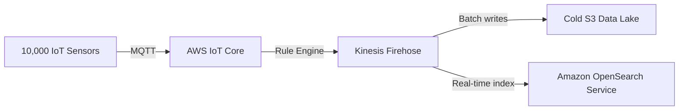

# Workshop 6: IoT Platform

## 1. Scenario & Objectives

You must design a streaming telemetry platform for 10,000 IoT temperature sensors. The platform must ingest millions of metric events per minute, index them for real-time dashboards, and store historical data in a cold data lake.

---

## 2. Target Architecture

---

## 3. Step-by-Step Implementation Guide

1. **Configure IoT Core Registry:** Create an IoT Core Thing group named "TempSensors". Generate device certificates and policies for MQTT connection authorization.
2. **Deploy Kinesis Data Firehose:** Provision a Kinesis Data Firehose delivery stream. Configure S3 as the destination target for cold storage logs.
3. **Set Up OpenSearch Cluster:** Deploy an Amazon OpenSearch cluster. Add a secondary output configuration in Kinesis Firehose to index incoming telemetry files.
4. **Configure IoT SQL Rule:** Write an IoT Rule matching MQTT topics: `SELECT temperature, timestamp, device_id FROM 'sensors/#'`. Set the rule action to write records directly to the Kinesis Firehose stream.
5. **Simulate IoT Telemetry Traffic:** Run a local Python script simulating multiple MQTT clients publishing telemetry logs.

---

## 4. Verification & Testing

- Verify that the IoT rule execution metrics register successful publishes.
- Open the OpenSearch Dashboard interface and confirm that temperature records are indexed in real-time.
- Check the cold S3 bucket to verify that Kinesis Firehose partitions data folders chronologically.

---

## 5. Cleanup Instructions

- Terminate the OpenSearch cluster.
- Delete the Kinesis Firehose delivery stream.
- Delete the IoT Core rules and disable active device certificates.

---

## Prerequisites

- [Workshop 2](global-saas-platform.md)

## Recommended Next Topics

- [Workshop 5](media-streaming-platform.md)

## Related Topics

- [Workshop 1](enterprise-landing-zone.md)
- [Workshop 3](hybrid-enterprise-network.md)
- [Workshop 4](multi-region-dr.md)
