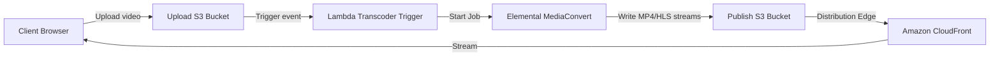

# Workshop 5: Media Streaming Platform

## 1. Scenario & Objectives

You are building a high-speed video-on-demand (VOD) streaming application. The platform must process raw video uploads, transcode them into multiple resolution formats (1080p, 720p, 480p), and deliver them to users worldwide with minimum latency.

---

## 2. Target Architecture

---

## 3. Step-by-Step Implementation Guide

1. **Set Up S3 Buckets:** Create two S3 buckets: "vod-uploads-source" and "vod-delivery-publish". Enable versioning and KMS encryption.
2. **Configure MediaConvert Job Template:** Go to AWS Elemental MediaConvert, create a custom job template specifying output groups for Apple HLS (HTTP Live Streaming) at 1080p, 720p, and 480p.
3. **Write Lambda Orchestrator:** Write a Lambda function triggered by S3 `ObjectCreated` events on the source bucket. The function parses the file path and submits a job to MediaConvert using the template.
4. **Deploy Amazon CloudFront:** Create a CloudFront distribution with "vod-delivery-publish" as the S3 origin. Configure origin access control (OAC) to secure media files.
5. **Set Up HLS Player Client:** Configure a web-based video player to stream media directly using the CloudFront HLS master playlist URL.

---

## 4. Verification & Testing

- Upload a raw MP4 video named "test-sample.mp4" to the source S3 bucket.
- Monitor the MediaConvert console and verify the job status transitions to "COMPLETE".
- Verify that HLS segment files (.ts) and playlists (.m3u8) appear in the publish S3 bucket, and play the video via the CloudFront stream link.

---

## 5. Cleanup Instructions

- Delete the CloudFront distribution.
- Empty and delete both the upload and publish S3 buckets.
- Remove active MediaConvert job templates.

---

## Prerequisites

- [Workshop 6](iot-platform.md)

## Recommended Next Topics

- [AWS Certification 05-exam-strategy](../05-exam-strategy/intro.md)

## Related Topics

- [Workshop 1](enterprise-landing-zone.md)
- [Workshop 3](hybrid-enterprise-network.md)
- [Workshop 4](multi-region-dr.md)
